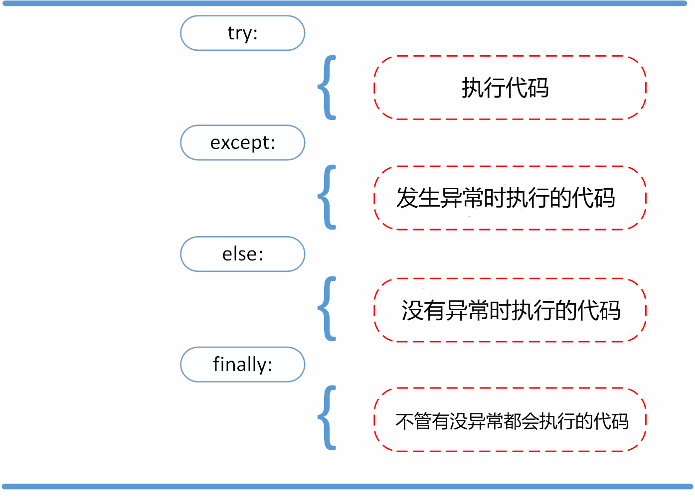

[toc]

# 变量

\# 整数转成浮点数	float(a) 

\# 浮点型转成字符串 (输出字符串时不会看到引号哟)	str(b)

\# 字符串转成布尔型 (有内容的字符串都会变成True)	bool(c)

\# 布尔型转成整数 (True会转成1，False会转成0)		int(d)

\# 将整数变成对应的字符 (97刚好对应字符表中的字母a)		chr(97)

\# 将字符转成整数 (Python中字符和字符串表示法相同)		ord('a')

**关键字 keyword.kwlist**

'False', 'None', 'True', 'and', 'as', 'assert', 'async', 'await', 'break', 'class', 'continue', 'def', 'del', 'elif', 'else', 'except', 'finally', 'for', 'from', 'global', 'if', 'import', 'in', 'is', 'lambda', 'nonlocal', 'not', 'or', 'pass', 'raise', 'return', 'try', 'while', 'with', 'yield'

# 运算符

| **运算符**                    | **描述**                             |
| ----------------------------- | ------------------------------------ |
| [] [:]                        | 下标，切片                           |
| **                            | 指数                                 |
| ~ + -                         | 按位取反, 正负号                     |
| */ %//                      | 乘，除，模，整除                     |
| + -                           | 加，减                               |
| >> <<                         | 右移，左移                           |
| &                             | 按位与                               |
| ^ \|                          | 按位异或，按位或                     |
| <= < > >=                     | 小于等于，小于，大于，大于等于       |
| == !=                         | 等于，不等于                         |
| is is not                     | 身份运算符                           |
| in not in                     | 成员运算符                           |
| not and or                    | 逻辑运算符，优先级not > and >or      |
| = += -= *=/= %=//= **= &= `                        |= ^= >>= <<=` ||
| :=                            | 海象运算符，可在表达式内部为变量赋值 |

%.1f 一位小数浮点数	%d 整数		%s 字符串

```python
print('%.1f华氏度 = %.1f摄氏度' % (f, c)) 
print(f'{f:.1f}华氏度 = {c:.1f}摄氏度') 
radius = float(input('请输入圆的半径: ')) 
```

| **函数** | **说明**                                                     |
| -------- | ------------------------------------------------------------ |
| abs      | 返回一个数的绝对值，例如：abs(-1.3)会返回1.3。               |
| bin      | 把一个整数转换成以'0b'开头的二进制字符串，例如：bin(123)会返回'0b1111011'。 |
| chr      | 将Unicode编码转换成对应的字符，例如：chr(8364)会返回'€'。    |
| hex      | 将一个整数转换成以'0x'开头的十六进制字符串，例如：hex(123)会返回'0x7b'。 |
| input    | 从输入中读取一行，返回读到的字符串。                         |
| len      | 获取字符串、列表等的长度。                                   |
| max      | 返回多个参数或一个可迭代对象中的最大值，例如：max(12, 95, 37)会返回95。 |
| min      | 返回多个参数或一个可迭代对象中的最小值，例如：min(12, 95, 37)会返回12。 |
| oct      | 把一个整数转换成以'0o'开头的八进制字符串，例如：oct(123)会返回'0o173'。 |
| open     | 打开一个文件并返回文件对象（后面会讲）。                     |
| ord      | 将字符转换成对应的Unicode编码，例如：ord('€')会返回8364。    |
| pow      | 求幂运算，例如：pow(2, 3)会返回8；pow(2, 0.5)会返回1.4142135623730951。 |
| print    | 打印输出。                                                   |
| range    | 构造一个范围序列，例如：range(100)会产生0到99的整数序列。    |
| round    | 按照指定的精度对数值进行四舍五入，例如：round(1.23456, 4)会返回1.2346。 |
| sum      | 对一个序列中的项从左到右进行求和运算，例如：sum(range(1, 101))会返回5050。 |
| type     | 返回对象的类型，例如：type(10)会返回int；而 type('hello')会返回str。 |

**多行语句**

如果语句很长，我们可以使用反斜杠(\)来实现多行语句

```python
total = item_one + \ 
        item_two + \
        item_three  
```

在 [], {}, 或 () 中的多行语句，不需要使用反斜杠(\)，例如：

```python
total = ['item_one', 'item_two', 'item_three',
        'item_four', 'item_five']
```

# 判断

在Python中，要构造分支结构可以使用if、elif和else关键字

```python
if username == 'admin':
    print('身份验证成功!')
else:
    print('身份验证失败!')
```

优先级：not > and > or

可以用(bool)...and...or...来改写

```python
print((username == 'admin') and '身份验证成功!' or '身份验证失败!') 
```

如果要构造出更多的分支，可以使用if...elif...else...结构或者嵌套的if...else...结构

# 循环

```python
for i in range(1, 10):
	for j in range(1, i + 1):
    	print(f'{i}*{j}={i * j}', end='\t') 
```

range(101)：可以用来产生0到100范围的整数，需要注意的是取不到101。

range(1, 101)：可以用来产生1到100范围的整数，相当于前面是闭区间后面是开区间。

range(1, 101, 2)：可以用来产生1到100的奇数，其中2是步长，即每次数值递增的值。

range(100, 0, -2)：可以用来产生100到1的偶数，其中-2是步长，即每次数字递减的值。

如果明确的知道循环执行的次数，我们推荐使用for-in循环

如果要构造不知道具体循环次数的循环结构，我们推荐使用while循环

break 只能终止它所在的那个循环

continue 它可以用来放弃本次循环后续的代码直接让循环进入下一轮

pass 不做任何事情，一般用做占位语句

```
for i in my_list:
	if i == target:        
		break    
	process(i) 
else:    
	raise ValueError("no found")
```

# 字符

**运算**

拼接 +	用,拼接字符串列表 ','.join([s])		重复3次 *3	

成员运算 in/not in	索引 s[i]	切片 s[i:j:k]	长度 len(s)	比较 >=

遍历 for ch in s		查找 s.find('i')		索引位置 s.index('i')

首字母大写 s.capitalize()		所有首字母大写 s.title	所有字符大写 s.upper

开头 s.startswith('i')		结尾 s.endswith('i')

是否数字 s.isdigit()		是否字母 s.isalpha()		是否数字和字母 s.isalnum()

https://docs.python.org/zh-cn/3/library/stdtypes.html#string-methods

**转义字符**

| **转义字符** | **描述**                  |
| ------------ | ------------------------- |
| \n           | 换行                      |
| \t           | 水平制表符                |
| \'           | 单引号                    |
| \"           | 双引号                    |
| \\           | 反斜杠                    |
| \uXXXX       | XXXX表示一个4位的16进制数 |

**使用r可以让反斜杠不发生转义：如 r"this is a line with \n" 则\n会显示，并不是换行**

**字符串格式化**

| **变量值** | **占位符** | **格式化结果** | **说明**               |
| ---------- | ---------- | -------------- | ---------------------- |
| 3.1415926  | {:.2f}     | '3.14'         | 保留小数点后两位       |
| 3.1415926  | {:+.2f}    | '+3.14'        | 带符号保留小数点后两位 |
| -1         | {:+.2f}    | '-1.00'        | 带符号保留小数点后两位 |
| 3.1415926  | {:.0f}     | '3'            | 不带小数               |
| 123        | {:0>10d}   | 0000000123     | 左边补0，补够10位      |
| 123        | {:x<10d}   | 123xxxxxxx     | 右边补x ，补够10位     |
| 123        | {:>10d}    | ' 123'         | 左边补空格，补够10位   |
| 123        | {:<10d}    | '123 '         | 右边补空格，补够10位   |
| 123456789  | {:,}       | '123,456,789'  | 逗号分隔格式           |
| 0.123      | {:.2%}     | '12.30%'       | 百分比格式             |
| 123456789  | {:.2e}     | '1.23e+08'     | 科学计数法格式         |

```
print(f'{name}的成绩 ===>{scores:.2f}')
'tea for too'.replace('too', 'two')    # 字符串替换
```

# 列表 list[]

**运算**

拼接 +	重复3次 *3	

成员运算 in/not in	索引 s[i]	切片 s[i:j:k]	长度 len(s)	比较 >=

遍历 for ch in s		索引位置 s.index('i',n)	查找出现次数 s.count('i')

排序 s.sort()		反转 s.reverse()

```python
items.append('i')    # 使用append方法在列表尾部添加元素
items.insert(2, 'i')    # 使用insert方法在列表指定索引位置插入元素
items.remove('i')    # 删除指定的元素（仅删除第一个）
items.pop(0)    # 删除指定索引位置的元素，返回删除的元素
items.pop(len(items) - 1) 
items.clear()    # 清空列表中的元素
```

**切片**

运算符是[i:j:k]，其中i是开始索引，索引对应的字符可以取到；j是结束索引，索引对应的字符不能取到；k是步长，默认值为1，表示从前向后获取相邻字符的连续切片，所以:k部分可以省略

```python
  def fib(n): # 通过yield将普通函数改造成生成器函数，fib(n)即生成一个n个元素的列表    
  	a, b = 0, 1    
	for _ in range(n):        
		a, b = b, a + b        
		yield a
```

```python
scores = [[0] * len(courses) for _ in range(len(names))]  #生成嵌套列表（生成式） 
b = [i[0] for i in s]    #二元列表取第一列
```

**生成式**

```python
\# 创建一个由'hello world'中除空格和元音字母外的字符构成的列表
items2 = [x for x in 'hello world' if x not in ' aeiou']
# 创建一个二元组列表 items3 = [(x, y) for x in [1,2,3] for y in [3,1,4] if x != y] 
# 转置行列 
matrix = [[1, 2, 3, 4],[5, 6, 7, 8],[9, 10, 11, 12]] 
transposed_matrix= [[row[i] for row in matrix] for i in range(4)] 
'''transposed_matrix=[[1, 5, 9], [2, 6, 10], [3, 7, 11], [4, 8, 12]]'''
```

# 元祖（不可变）tuple()

```python
a, b, *c = range(1, 10) # 元祖解包 
print(a, b, c) # 1 2 [3, 4, 5, 6, 7, 8, 9] 
a = (1,) # 单元素元祖末尾需加逗号 
a, b, c = [1, 10, 100] # 列表解包 
print(a, b, c) # 1 10 100 
a, *b, c = 'hello' # 字符串解包 
print(a, b, c) # h ['e', 'l', 'l'] o 
L = [('Italy', 'Rome'), ('France', 'Paris')] # 列表转换为字典 
dict(iter(L)) # {'Italy': 'Rome', 'US': 'Washington DC'}  
```

# 集合（无序，无重复）set()

**运算**

成员运算 in/not in	比较（子集/包含） >=

交集① s1 & s2		交集② s1.intersection(s2)	判断是否有交集 s1.isdisjoint(s2)

并集① s1 | s2		并集② s1.union(s2)

差集① s1 - s2		差集② s1.difference(s2)

对称差① s1 ^ s2	对称差② s1.symmetric_difference(s2)	对称差③ (s1 | s2) - (s1 & s2)

```
set1.add(55)    # 通过add方法添加元素 set1.update({1, 10, 100, 1000})    # 通过update方法添加元素 set1.discard(99)    # 通过discard方法删除指定元素 if 10 in set1:    # 通过remove方法删除指定元素，元素不在集合中会引发KeyError异常    set1.remove(10) print(set1.pop())    # pop方法可以从集合中随机删除一个元素并返回该元素 set1.clear()    # clear方法可以清空整个集合              
```

**空集合/不可变集合**

```python
set1.add(55)    # 通过add方法添加元素
set1.update({1, 10, 100, 1000})    # 通过update方法添加元素
set1.discard(99)    # 通过discard方法删除指定元素
if 10 in set1:    # 通过remove方法删除指定元素，元素不在集合中会引发KeyError异常
    set1.remove(10)
print(set1.pop())    # pop方法可以从集合中随机删除一个元素并返回该元素
set1.clear()    # clear方法可以清空整个集合
```

# 字典（无序）dict{}

```python
s = {'i':'x1','j':'y1'}    #{}字面量语法
s = dict(i='x1', j='y1')    #内置函数dict
```

**运算**

成员运算 in/not in	键值对数量 len(s)

```python
s.get(key, α)    # 按照键值key取值，如果取不到返回None或设定的默认值α
s[key]    # 按照键值key取值，如果取不到会报错
s.keys()      # 获取字典中所有的键
s.values()    # 获取字典中所有的值
s.items()     # 获取字典中所有的键值对
for key, value in s.items():    # 对字典中所有的键值对进行循环遍历
del s['i']    # 删除对应的键值，如果没有则报KeyError异常
s2 = s1.pop(i)    # 删除对应的键值对并返回该值，如果没有则报KeyError异常
key, value = s.popitem() # 删除字典中最后一组键值对并返回对应的二元组，
# 如果字典中没有元素，调用该方法将引发KeyError异常
```

```python
s[key] = α    # 相同的键会用新值覆盖掉旧值，不同的键会添加到字典中
s.update(key, α)    # 相同的键会用新值覆盖掉旧值，不同的键会添加到字典中

# setdefault可以更新字典中的键对应的值或向字典中存入新的键值对
# setdefault方法的第一个参数是键，第二个参数是键对应的值
# 如果这个键在字典中存在，更新这个键之后会返回原来与这个键对应的值
# 如果这个键在字典中不存在，方法将返回第二个参数的值，默认为None
r = s.setdefault(key, {'name': '方启鹤', 'sex': True})
```

**生成式**

```python
s = {x: x ** 3 for x in range(1, 6)}    #生成式语法，x的3次方
s2 = {key: value for key, value in s1.items() if value > α}    #生成式遍历
```

# 面向对象

- 单一职责原则 （SRP）- 一个类只做该做的事情（类的设计要高内聚）
- 开闭原则 （OCP）- 软件实体应该对扩展开发对修改关闭
- 依赖倒转原则（DIP）- 面向抽象编程（在弱类型语言中已经被弱化）
- 里氏替换原则（LSP） - 任何时候可以用子类对象替换掉父类对象
- 接口隔离原则（ISP）- 接口要小而专不要大而全（Python中没有接口的概念）
- 合成聚合复用原则（CARP） - 优先使用强关联关系而不是继承关系复用代码
- 最少知识原则（迪米特法则，LoD）- 不要给没有必然联系的对象发消息

**类**

```python
class c1:
    __slots__ = ('x', 'y')    # 限制动态添加对象，如c1.z或o1.z
    def __init__(self, x, y):    # 实例化时自动初始化，为对象绑定x和y两个属性
        self.x = x    # 公有对象x
        self.__x = x    # 私有对象x，无法通过外部访问c1.__x或o1.__x
        self._y = y    # 受保护对象y，它仅仅是提示成员受保护，但可以被更改
    def study(self, course_name):    ### 对于类的属性，调用时需加self.
        print('%s正在学习%s.' % (self.x, course_name))
            
    @staticmethod    # 判断三条边长能否构成三角形(静态方法)，不需要引用形参self
    def is_valid(a, b, c):
        return a + b > c and b + c > a and a + c > b
    @classmethod    # 判断三条边长能否构成三角形(类方法)
    def is_valid(cls, a, b, c):
        return a + b > c and b + c > a and a + c > b
    @abstractmethod #抽象方法：只有声明没有实现的方法，可以让子类去重写这个方法
    def get_salary(self):
        """结算月薪"""
        pass        
    
    def s1(self, z1, z2):    # 定义带参函数....
    def s2(self):    # 定义不带参函数....
    def __repr__(self):    # 在打印对象的时候只能看到我们自定义返回的信息
        return f'{self.x}: {self.y}'    #返回对象
class c2(c1):    # 继承父类c1
    def __init__(self, x, y, z):
        super().__init__(x, y, z)    # 调用父类c1初始化方法
    super().study(course_name)    # 调用父类c1的study函数    
class c3(c1):    # 完全继承父类c1
    pass        
class c4(c1,c11):    # 多重继承父类c1,c11
    def __init__(self,n,a,w,g,t):
        c1.__init__(self,n,a,w,g)
        c11.__init__(self,n,t)    
o1 = c1(α, β)    #创建o1对象，α,β对应x,y，c1属性即为α和β
o1.s1(i1, i2)    o1.s2()    #“对象.方法”调用方法，只需要传入二参
c1.s1(o1, i1, i2)    c1.s2(o1)    # “类.方法”调用方法，一参是消息对象，二参是i
print(o1)    print(o1.x)    #打印对象
o1.z = γ    # 动态添加对象γ
```

**@property 装饰器**

被 @property 装饰的方法是获取属性值的方法，被装饰方法的名字会被用做 属性名。

被 @属性名.setter 装饰的方法是设置属性值的方法。

被 @属性名.deleter 装饰的方法是删除属性值的方法。

```python
class Student:
    def __init__(self):
        self._age = None
    @property
    def age(self):
        print('获取属性时执行的代码')
        return self._age
    @age.setter
    def age(self, age):
        print('设置属性时执行的代码')
        self._age = age
    @age.deleter
    def age(self):
        print('删除属性时执行的代码')
        del self._age
student = Student()
# 设置属性
student.age = 18
"""设置属性时执行的代码"""<无需括号>
# 获取属性
print('学生年龄为：' + str(student.age))
"""获取属性时执行的代码 学生年龄为：18"""
# 删除属性
del student.age
"""删除属性时执行的代码"""
```

**线程安全的单例装饰器**

```python
from functools import wraps
from threading import RLock
def singleton(cls):
    """线程安全的单例装饰器"""
    instances = {}
    locker = RLock()
    @wraps(cls)
    def wrapper(*args, **kwargs):
        if cls not in instances:
            with locker:
                if cls not in instances:
                    instances[cls] = cls(*args, **kwargs)
        return instances[cls]
    return wrapper
```

**运算符重载**

我们可以对类的代码稍作修改，使得两个对象可以直接用<进行大小的比较。这里用到技术叫运算符重载，Python中要实现对<运算符的重载，需要在类中添加一个名为__lt__的魔术方法。很显然，魔术方法__lt__中的lt是英文单词“less than”的缩写，以此类推，魔术方法__gt__对应>运算符，魔术方法__le__对应<=运算符，__ge__对应>=运算符，__eq__对应==运算符，__ne__对应!=运算符。

```python
def __lt__(self, other):    # 花色相同比较点数的大小
    if self.suite == other.suite:
        return self.face < other.face    # 花色不同比较花色对应的值
    return self.suite.value < other.suite.value
```

```python
class Vector:
   def __init__(self, a, b):
      self.a = a
      self.b = b
   def __str__(self):
      return 'Vector (%d, %d)' % (self.a, self.b)
   def __add__(self,other):
      return Vector(self.a + other.a, self.b + other.b)
v1 = Vector(2,10)
v2 = Vector(5,-2)
print (v1 + v2)
```

**枚举**

定义枚举类型其实就是定义符号常量，如SPADE、HEART等。每个符号常量都有与之对应的值，这样表示黑桃就可以不用数字0，而是用Suite.SPADE；同理，表示方块可以不用数字3， 而是用Suite.DIAMOND。

```python
from enum import Enum
class Suite(Enum):    """花色(枚举)"""
    SPADE, HEART, CLUB, DIAMOND = range(4)
```

# 函数

def func(x, y, z) -> str:

str表示函数返回值为str类型

位置参数 func(a, b, c)    关键字参数 func(x=a, y=b, z=c)    命名关键字函数 func(*, a, b, c)

- 如果你希望形参名称对用户来说不可用，则使用仅限位置形参。 这适用于形参名称没有实际意义，以及当你希望强制规定调用时的参数顺序，或是需要同时收受一些位置形参和任意关键字形参等情况。

- 当形参名称有实际意义，以及显式指定形参名称可使函数定义更易理解，或者当你想要防止用户过于依赖传入参数的位置时，则使用仅限关键字形参。

- 对于 API 来说，使用仅限位置形参可以防止形参名称在未来被修改时造成破坏性的 API 变动。

```python
def c1(*args):    # 可接受0或n个位置/关键字参数，参数变成一个元组 → (a,b,c)
def c2(**kwargs):   # 可接受0或n个关键字参数，参数变成一个字典 → 关键字x:实参值a
def c3(*args, **kwargs): # 可同时使用位置参数和关键字参数
    for arg in args:
        print(arg)
    for kw in kwargs:
        print(kw,':',kwargs[kw]])
c3(1, 2, 3, 4, k=1, t=2, o=3)    # (1,2,3,4) {'k': 1, 't': 2, 'o': 3}
def f(pos1, pos2,/, pos_or_kwd, *, kwd1, kwd2):
'''  -----------    ----------     ----------
        |               |                |
        |       位置函数或关键词函数     |
        |                        只能是关键词函数
  只能是位置函数'''
```

```python
    for _ in range(code_len):    # 产生0到字符串长度减1范围的随机数作为索引
        code += ALL_CHARS[random.randint(0,len(ALL_CHARS)-1)]
def generate_code(code_len=4):    # 随机取出指定数量字符，再将选中字符拼接起来
    return ''.join(random.choices(ALL_CHARS, k=code_len))
```

**函数导入**

```python
# 在module1.py中：# __name__是Python中一个隐含的变量它代表了模块的名字
# 只有被Python解释器直接执行的模块的名字才是__main__
def c100():
    ...
if __name__ == '__main__':
    print('call c100()')
    c100()
```

```python
from module1 import c100 as c1    # 导入函数c1 
# 导入module1时 不会执行模块中if条件代码 因为模块的名字是module1而不是__main__
from modname import *    # 把一个模块的所有内容全都导入到当前的命名空间
```

内置的函数 dir() 可以找到模块内定义的所有名称。以一个字符串列表的形式返回:

```python
dir(modname)
```

**高阶函数**

```python
from operator import add, mul
def c1(*args, init_value, op, **kwargs):
    result = init_value
    for arg in a:
        result = op(result, arg)
    for value in b.values():
        result = op(result, value)
    return result
print(c1(1, 2, 3, init_value=0, op=add, x=4, y=5))      # 15
print(c1(1, 2, x=3, y=4, z=5, init_value=1, op=mul))    # 120
```

**装饰器**

```python
import time
# 定义装饰器函数，它的参数是被装饰的函数
def record_time(func):    # 定义一个带装饰功能（记录被装饰函数的执行时间）的函数
    def wrapper(*args, **kwargs):    # 使用*args和**kwargs接收所有参数
        start = time.time()    # 在执行被装饰的函数之前记录开始时间
        result = func(*args, **kwargs)    # 执行被装饰的函数并获取返回值
        end = time.time()    # 在执行被装饰的函数之后记录结束时间
        print(f'{func.__name__}执行时间: {end - start:.3f}秒')
        return result
    return wrapper    # 返回带装饰功能的wrapper函数
    
@record_time    #语法糖，将download带入record_time中执行
def download(filename):
    print(f'开始下载{filename}.')
    time.sleep(random.randint(2, 6))
    print(f'{filename}下载完成.')
    
download('MySQL从删库到跑路.avi')
```

```python
class RecordTime:
# 定义装饰器函数，它的参数是被装饰的类
    def __call__(self, func):
        @wraps(func)
        def wrapper(*args, **kwargs):
            start = time.time()
            result = func(*args, **kwargs)
            end = time.time()
            print(f'{func.__name__}执行时间: {end - start:.3f}秒')
            return result
        return wrapper
# 使用装饰器语法糖添加装饰器
@RecordTime()
def download(filename):
    print(f'开始下载{filename}.')
    time.sleep(random.randint(2, 6))
    print(f'{filename}下载完成.')
def upload(filename):
    print(f'开始上传{filename}.')
    time.sleep(random.randint(4, 8))
    print(f'{filename}上传完成.')
# 直接创建对象并调用对象传入被装饰的函数
upload = RecordTime()(upload)
download('MySQL从删库到跑路.avi')
upload('Python从入门到住院.pdf')
```

# 迭代器与生成器

**迭代器**

迭代器是一个可以记住遍历的位置的对象。

迭代器对象从集合的第一个元素开始访问，直到所有的元素被访问完结束。迭代器只能往前不会后退。

```python
li = [11, 22, 33, 44, 55]
li_iter = iter(li)
next(li_iter) #11
next(li_iter) #22
```

```python
'''for _ in list1:
    xxx
即可用下列取代 '''
iterator = list1.__iter__()
while True:
    try:
        num = iterator.__next__()
    except StopIteration:
        break
    else:
        xxx
```

**合并迭代器**

```python
import itertools
class Fib(object):
    """菲波那切数列迭代器"""    
    def __init__(self, num):
        self.num = num
        self.a, self.b = 0, 1
        self.idx = 0   
    def __iter__(self):
        return self
# 如果想要一个对象为可迭代的对象，即可以使用for，那么必须实现__iter__方法
    def __next__(self):
        if self.idx < self.num:
            self.a, self.b = self.b, self.a + self.b
            self.idx += 1
            return self.a
        else:
            raise StopIteration()
fib = Fib(5)
for i in fib:
    print(i)
```

**生成器**

生成器是一个返回迭代器的函数，只能用于迭代操作，更简单点理解生成器就是语法简化版的迭代器。

yield 和 return 最大的区别在于，到达 yield 的时候生成器的执行状态会挂起并保留局部变量。在下一次调用生成器 __next__() 方法的时候，函数会恢复执行。

```python
def Fib(num):
    """菲波那切数列生成器"""
    a, b = 0, 1
    for _ in range(num):
        a, b = b, a + b
        yield a
    return 'ok'    
fib = Fib(5)
while True:
    try:
        ret = next(fib)
        print(ret)
    except Exception as ret:
    # 想要得到return的值需要 在except跑出结果的值
        print(ret.value)
        break
```

```python
def calc_avg():
    """流式计算平均值"""
    total, counter = 0, 0
    avg_value = None
    while True:
        value = yield avg_value
        total, counter = total + value, counter + 1
        avg_value = total/ counter
gen = calc_avg()
print(next(gen)) 
# print(gen.send(None))
# 这里是两步：①next(gen)或gen.send(None)初始化生成器；
# ②打印 yield返回的初始avg_value即None
print(gen.send(10)) # 10作为avg_value输入，经过一轮循环再yield跳出返回结果
print(gen.send(20))
print(gen.send(30))
```

# 多进程、多线程

**多进程**

```python
from multiprocessing import Process
from os import getpid
from random import randint
from time import time, sleep
def main():
    start = time()
    p1 = Process(target=download_task, args=('Python从入门到住院.pdf', ))
    p1.start()
    p2 = Process(target=download_task, args=('Peking Hot.avi', ))
    p2.start()
    p1.join()
    p2.join()
    end = time()
    print('总共耗费了%.2f秒.' % (end - start))
if __name__ == '__main__':
    main()
```

subprocess模块中的类和函数来创建和启动子进程，然后通过管道来和子进程通信

**多线程**

```python
from random import randint
from threading import Thread
from time import time, sleep
def main():
    start = time()
    t1 = Thread(target=download, args=('Python从入门到住院.pdf',))
    t1.start()
    t2 = Thread(target=download, args=('Peking Hot.avi',))
    t2.start()
    t1.join()
    t2.join()
    end = time()
    print('总共耗费了%.3f秒' % (end - start))
```

**自定义线程**

```python
from random import randint
from threading import Thread
from time import time, sleep
class DownloadTask(Thread):
    def __init__(self, filename):
        super().__init__()
        self._filename = filename
    def run(self):
        print('开始下载%s...' % self._filename)
        time_to_download = randint(5, 10)
        sleep(time_to_download)
        print('%s下载完成! 耗费了%d秒' % (self._filename, time_to_download))
def main():
    start = time()
    t1 = DownloadTask('Python从入门到住院.pdf')
    t1.start()
    t2 = DownloadTask('Peking Hot.avi')
    t2.start()
    t1.join()
    t2.join()
    end = time()
    print('总共耗费了%.2f秒.' % (end - start))
if __name__ == '__main__':
    main()
```

# 异常处理

```python
BaseException
 +-- SystemExit
 +-- KeyboardInterrupt
 +-- GeneratorExit
 +-- Exception
      +-- StopIteration
      +-- StopAsyncIteration
      +-- ArithmeticError
      |    +-- FloatingPointError
      |    +-- OverflowError
      |    +-- ZeroDivisionError
      +-- AssertionError
      +-- AttributeError
      +-- BufferError
      +-- EOFError
      +-- ImportError
      |    +-- ModuleNotFoundError
      +-- LookupError
      |    +-- IndexError
      |    +-- KeyError
      +-- MemoryError
      +-- NameError
      |    +-- UnboundLocalError
      +-- OSError
      |    +-- BlockingIOError
      |    +-- ChildProcessError
      |    +-- ConnectionError
      |    |    +-- BrokenPipeError
      |    |    +-- ConnectionAbortedError
      |    |    +-- ConnectionRefusedError
      |    |    +-- ConnectionResetError
      |    +-- FileExistsError
      |    +-- FileNotFoundError
      |    +-- InterruptedError
      |    +-- IsADirectoryError
      |    +-- NotADirectoryError
      |    +-- PermissionError
      |    +-- ProcessLookupError
      |    +-- TimeoutError
      +-- ReferenceError
      +-- RuntimeError
      |    +-- NotImplementedError
      |    +-- RecursionError
      +-- SyntaxError
      |    +-- IndentationError
      |         +-- TabError
      +-- SystemError
      +-- TypeError
      +-- ValueError
      |    +-- UnicodeError
      |         +-- UnicodeDecodeError
      |         +-- UnicodeEncodeError
      |         +-- UnicodeTranslateError
      +-- Warning
           +-- DeprecationWarning
           +-- PendingDeprecationWarning
           +-- RuntimeWarning
           +-- SyntaxWarning
           +-- UserWarning
           +-- FutureWarning
           +-- ImportWarning
           +-- UnicodeWarning
           +-- BytesWarning
           +-- ResourceWarning
```

**try/except...else...finally**



**raise**


# 图形用户界面GUI

Python默认的GUI开发模块是tkinter，如果真的需要使用Python开发GUI应用，wxPython、PyQt、PyGTK等模块都是不错的选择

**文件读写**

'r' 读取 （默认）	'w' 写入（会先截断之前的内容）	'x' 写入，如果文件已经存在会产生异常

'a' 追加，将内容写入到已有文件的末尾		'b' 二进制模式		't' 文本模式（默认）

'+' 更新（既可以读又可以写）

**os.path - 路径操作相关模块**

dirname(path)：返回路径path的目录名称。

exists(path)：如果path指向一个已存在的路径或已打开的文件描述符，返回 True。

getatime(path)/ getmtime(path)/ getctime(path)：返回path的最后访问时间/最后修改时间/创建时间。

getsize(path)：返回path的大小，以字节为单位。如果该文件不存在或不可访问，则抛出OSError异常。

isfile(path)：如果path是普通文件，则返回 True。

isdir(path)：如果path是目录（文件夹），则返回True。

join(path, *paths)：合理地拼接一个或多个路径部分。返回值是path和paths所有值的连接，每个非空部分后面都紧跟一个目录分隔符 (os.sep)，除了最后一部分。这意味着如果最后一部分为空，则结果将以分隔符结尾。如果参数中某个部分是绝对路径，则绝对路径前的路径都将被丢弃，并从绝对路径部分开始连接。

splitext(path)：将路径path拆分为一对，即(root, ext)，使得root + ext == path，其中ext为空或以英文句点开头，且最多包含一个句点。

```python
import os
os.getcwd()      # 返回当前的工作目录
os.chdir('/server/accesslogs')   # 修改当前的工作目录
os.system('mkdir today')   # 执行系统命令 mkdir 
```

```python
lines = ['标题：《致橡树》', '作者：舒婷', '时间：1977年3月']
file = open('tmp.txt', 'a', encoding='utf-8')    # # 文件打开后不会被关闭
for line in lines:
    file.write(f'\n{line}')    # 写入文本
file.close()
file = open('tmp.text', 'r')    # 读取文本
print(file.read())
```

```python
try:    # 复制图片
    with open('guido.jpg', 'rb') as file1, \
        open('吉多.jpg', 'wb') as file2:    # 文件打开后会被关闭
        data = file1.read(512)
        while data:
            file2.write(data)
            data = file1.read()
except FileNotFoundError:
    print('指定的文件无法打开.')
except IOError:
    print('读写文件时出现错误.')
print('程序执行结束.')
```

**CSV文件**

```python
import csv
with open('scores.csv', 'w') as file:
    writer = csv.writer(file)
    writer.writerow(['姓名', '语文', '数学', '英语'])
with open('scores.csv', 'r') as file:
    reader = csv.reader(file, delimiter='|')
    for line in reader:
        print(reader.line_num, end='\t')
        for elem in line:
            print(elem, end='\t')
        print()
```

# 图像处理

```python
from PIL import Image
image1 = Image.open('guido.jpg')
image1.format    # 图片格式
width1, height1 = image1.size    # 图片大小
print(image1.mode)    # 图片模式（RGB）
print(image1.show)    # 显示图像
image1.crop((80, 20, 310, 360)).show()    # 指定剪裁区域剪裁图像
image1.thumbnail((128, 128))    # 生成略缩图
image2=image1.resize((int(width/ 1.5), int(height/ 1.5)))
image1.paste(image2, (172, 40))    # image2贴到image1上
image1.rotate(45).show()    # 旋转图像
i2=i1.transpose(Image.FLIP_LEFT_RIGHT) #水平翻转 Image.FLIP_TOP_BOTTOM #垂直翻转
image1.filter(ImageFilter.CONTOUR).show()    # 图片滤镜
```

**绘制图像**

```python
import random
from PIL import Image, ImageDraw, ImageFont
def random_color():    # 生成随机颜色
    red = random.randint(0, 255)
    green = random.randint(0, 255)
    blue = random.randint(0, 255)
    return red, green, blue
width, height = 800, 600    # 创建一个800*600的图像，背景色为白色
image = Image.new(mode='RGB', size=(width, height), color=(255, 255, 255))
# 创建一个ImageDraw对象
drawer = ImageDraw.Draw(image)
# 通过指定字体和大小获得ImageFont对象
font = ImageFont.truetype('Kongxin.ttf', 32)
drawer.text((300, 50), 'Hello, world!', fill=(255, 0, 0), font=font)  # 绘制文字
drawer.line((0, 0, width, height), fill=(0, 0, 255), width=2)    # 绘制对角直线
xy=width//2-60, height//2-60, width//2+60, height//2+60    # 绘制矩形
drawer.rectangle(xy, outline=(255, 0, 0), width=2)    # 绘制椭圆
for i in range(4):
    left, top, right, bottom = 150 + i * 120, 220, 310 + i * 120, 380
    drawer.ellipse((left, top, right, bottom), outline=random_color(), width=8)
image.show()    # 显示图像
image.save('result.png')    # 保存图像
```

# 网络资源

**JSON**

```python
import json
my_dict = {'X'}
json_str = json.dumps(my_dict)    # 通过dumps函数将字典处理成JSON字符串
with open('data.json', 'w') as file:    # 写入JSON
    json.dump(my_dict, file)
with open('data.json', 'r') as file:    # 读取JSON
    my_dict = json.load(file)
    print(type(my_dict))
```

**调取API**

```python
import requests, json, urllib.request
from PIL import Image
from io import BytesIO
resp = requests.get(
    'http://api.tianapi.com/guonei/?key=5d1ec825cc34d4702ccb66d30768d8d9&num=10')
def main():
    if resp.status_code == 200:
        data_model = json.loads(resp.text)    # 把str转化为字典
# data_model = resp.json()   # 将API页面的json转化为字典，若API页面不为json则报错
        for news in data_model['newslist']:
            print(news['title'])
            print(news['url'])
            img1 = urllib.request.urlopen(news['picUrl'])
            bytes_io = BytesIO()
            bytes_io.write(img1.read())  # 写入bytes，把它当作文件读取
            img = Image.open(bytes_io)  # 读取'图片'文件
            img.show()
            print('-' * 60)
if __name__ == '__main__':
    main()
```

**正则表达式**

Python提供了re模块来支持正则表达式相关操作，下面是re模块中的核心函数

| **函数**                                     | **说明**                                                     |
| -------------------------------------------- | ------------------------------------------------------------ |
| compile(pattern, flags=0)                    | 编译正则表达式返回正则表达式对象                             |
| match(pattern, string, flags=0)              | 用正则表达式匹配字符串 成功返回匹配对象 否则返回None         |
| search(pattern, string, flags=0)             | 搜索字符串中第一次出现正则表达式的模式 成功返回匹配对象 否则返回None |
| split(pattern, string, maxsplit=0, flags=0)  | 用正则表达式指定的模式分隔符拆分字符串 返回列表              |
| sub(pattern, repl, string, count=0, flags=0) | 用指定的字符串替换原字符串中与正则表达式匹配的模式 可以用count指定替换的次数 |
| fullmatch(pattern, string, flags=0)          | match函数的完全匹配（从字符串开头到结尾）版本                |
| findall(pattern, string, flags=0)            | 查找字符串所有与正则表达式匹配的模式 返回字符串列表          |
| finditer(pattern, string, flags=0)           | 查找字符串所有与正则表达式匹配的模式 返回一个迭代器          |
| purge()                                      | 清除隐式编译的正则表达式的缓存                               |
| re.I/ re.IGNORECASE                          | 忽略大小写匹配标记                                           |
| re.M/ re.MULTILINE                           | 多行匹配标记                                                 |

```python
import re    # 验证输入用户名和QQ号是否有效并给出对应的提示信息
username = input('请输入用户名: ')
m1 = re.match(r'^[0-9a-zA-Z_]{6,20}$', username)
m2 = re.fullmatch(r'[0-9a-zA-Z_]{6,20}', username)
if not m1:
    print('请输入有效的用户名.')
```

```python
import re    # 从一段文字中提取出国内手机号码
pattern = re.compile(r'(?<=\D)1[34578]\d{9}(?=\D)')    
sentence = '''重要的事情说8130123456789遍，我的手机号是13512346789这个。'''
# 方法一：查找所有匹配并保存到一个列表中
tels_list = re.findall(pattern, sentence)
for tel in tels_list:
    print(tel)
# 方法二：通过迭代器取出匹配对象并获得匹配的内容
for temp in pattern.finditer(sentence):
    print(temp.group())
# 方法三：通过search函数指定搜索位置找出所有匹配
m = pattern.search(sentence)
while m:
    print(m.group())
```

```python
import re    # 替换字符串中的不良内容
sentence = 'Oh, shit! 你丫是傻叉吗? Fuck you.'
purified = re.sub('fuck|shit','*', sentence, flags=re.IGNORECASE)
print(purified)
```

```python
import re    # 拆分长字符串
poem = '窗前明月光，疑是地上霜。举头望明月，低头思故乡。'
sentences_list = re.split(r'[，。, .]', poem)
sentences_list = [sentence for sentence in sentences_list if sentence]
for sentence in sentences_list:
    print(sentence)
```

# 爬虫

https://zhuanlan.zhihu.com/p/33542626

- 下载数据 - urllib/ requests/ aiohttp/ httpx/ Selenium/ Scrapy。
- 解析数据 - re/ lxml/ beautifulsoup4/ pyquery。
- 缓存和持久化 - mysqlclient/ sqlalchemy/ peewee/ redis/ pymongo。
- 生成数字签名 - hashlib。
- 序列化和压缩 - pickle/ json/ zlib。
- 调度器 - multiprocessing/ threading/ concurrent.futures。

**正则表达式法**

```python
import random, time, re, requests    # 正则表达式解析
for page in range(1, 11):
    resp = requests.get(
        url=f'https://movie.douban.com/top250?start={(page - 1) * 25}',
        # 如果不设置HTTP请求头中的User-Agent，豆瓣会检测出爬虫程序而阻止我们的请求
        # User-Agent可以设置为浏览器的标识（可以在浏览器的开发者工具查看HTTP请求头找到）
        # 由于豆瓣网允许百度爬虫获取它的数据，因此直接将我们的爬虫伪装成百度的爬虫
        headers={
            'User-Agent': 'Mozilla/5.0 (Macintosh; Intel Mac OS X 10_14_6) '
                          'AppleWebKit/537.36 (KHTML, like Gecko) '
                          'Chrome/83.0.4103.97 Safari/537.36',
            'Accept': 'text/html,application/xhtml+xml,application/xml;'
                      'q=0.9,image/webp,image/apng,*/*;'
                      'q=0.8,application/signed-exchange;v=b3;q=0.9',
            'Accept-Language': 'zh-CN,zh;q=0.9,en;q=0.8',
        },)
    # 创建正则表达式对象，通过捕获组捕获span标签中的电影标题
    pattern = re.compile(r'\<span class="title"\>([^&]*?)\<\/span\>')
    # 通过正则表达式获取class属性为title且标签内容不以&符号开头的span标签
    results = pattern.findall(resp.text)
    # 循环变量列表中所有的电影标题
    for result in results:
        print(result)
    # 随机休眠1-3秒，避免获取页面过于频繁
    time.sleep(random.randint(1, 3))
```

**Xpath解析法**

```python
# https://www.runoob.com/xpath/xpath-tutorial.html
import random, time, requests    # XPath解析
from lxml import etree
for page in range(1, 11):
    resp = requests.get(
        url=f'https://movie.douban.com/top250?start={(page - 1) * 25}',
        headers={'User-Agent': 'BaiduSpider'})
    tree = etree.HTML(resp.text)
    # 通过XPath语法从页面中提取需要的数据
    # 可通过Chrome浏览器中F12调试工具右键选择查看元素的完整的XPath★★★
    spans = tree.xpath('/html/body/div[3]/div[1]/div/div[1]/ol/li[2]/div/div[2]/div[1]/a/span[1]')
    for span in spans:
        print(span.text)
    time.sleep(random.randint(1, 3))
```

**CSS选择器(BeautifulSoup)解析**

```python
https://www.crummy.com/software/BeautifulSoup/bs4/doc.zh/
import random, time, bs4, requests    # CSS选择器解析
for page in range(1, 11):
    resp = requests.get(
        url=f'https://movie.douban.com/top250?start={(page - 1) * 25}',
        headers={'User-Agent': 'BaiduSpider'})
    soup = bs4.BeautifulSoup(resp.text, 'lxml')
    # 通过CSS选择器从页面中提取需要的数据
    spans = soup.select('div.info > div.hd > a > span:nth-child(1)')
    for span in spans:
        print(span.text)
    time.sleep(random.randint(1, 3))
```

**CSS选择器(BeautifulSoup)+Selenium动态解析**

自动化测试工具Selenium，它提供了浏览器自动化的API接口，这样就可以通过操控浏览器来获取动态内容

Selenium的[官方网站](https://www.selenium.dev/)找到浏览器驱动的下载链接并下载需要的驱动，在Linux或macOS系统下可以通过下面的命令来设置PATH环境变量

```bash
pip install selenium
export PATH=$PATH:/Users/Hao/Downloads/Tools/chromedriver/
```

```python
from bs4 import BeautifulSoup
from selenium import webdriver
from selenium.webdriver.common.keys import Keys
def main():
    driver = webdriver.Chrome()
    driver.get('https://v.taobao.com/v/content/live?catetype=704&from=taonvlang')
    soup = BeautifulSoup(driver.page_source, 'lxml')
    for img_tag in soup.body.select('img[src]'):
        print(img_tag.attrs['src'])
if __name__ == '__main__':
    main()
```

# 文档测试

**help()函数**

help() 函数来获取指定成员（甚至是该模块）的帮助信息

```python
def display(add):
    '''
    这是一个函数
    '''
    print(add)
class my_cla:
    '''
    这是一个类
    '''
    def say(self,add):
        '''
        这是一个类实例方法
        '''
        print(add)
help(display)
help(my_cla.say)
```

**doctest模块**

在函数、类或类方法的说明性文档中，以>>>作为开始的内容就表示一行测试代码，并且接下来的一行则明确该测试代码的输出结果

```python
import doctest
def display(add):
    '''
    这是一个函数
    >>> display("http://c.biancheng.net/python/")
    http://c.biancheng.net/python/
    '''
    print(add)
class my_cla:
    '''
    这是一个类
    >>> myClass = my_cla()
    >>> myClass.say("http://c.biancheng.net")
    abc
    '''
    def say(self,add):
        '''
        这是一个类实例方法
        '''
        print(add)
doctest.testmod()
```

# 数据结构和算法

算法：解决问题的方法和步骤

评价算法的好坏：渐近时间复杂度和渐近空间复杂度。

渐近时间复杂度的大O标记：

 \- 常量时间复杂度 - 布隆过滤器/ 哈希存储

 \- 对数时间复杂度 - 折半查找（二分查找）

 \- 线性时间复杂度 - 顺序查找/ 计数排序

 \- 对数线性时间复杂度 - 高级排序算法（归并排序、快速排序）

 \- 平方时间复杂度 - 简单排序算法（选择排序、插入排序、冒泡排序）

 \- 立方时间复杂度 - Floyd算法/ 矩阵乘法运算

 \- 几何级数时间复杂度 - 汉诺塔

 \- 阶乘时间复杂度 - 旅行经销商问题 - NPC

# 插件

Auto Rename Tag

Bracket Pair Colorizer

Better Comments

Bookmarks

Code Spell Checker

Code Runner

Indent-Rainbow

Error Lens

GitLens

One Dark Pro

Path Intellisense

Prettier

Python Docstring Generator

Pylance

stylelint

kite

TabNine

TODO Highlight

Visual Studio IntelliCode

AiXcoder Code Completer

View In Browser

vscode-icons

vscode-fileheader

# Conda

\#安装 conda install ...

# pip

**Linux**

pip3 list

\#安装 pip3 install ujson -i https://pypi.doubanio.com/simple

\#更新 pip3 install -U ujson -i https://pypi.doubanio.com/simple

pip3 install pillow -i https://pypi.doubanio.com/simple

pip3 install --upgrade pip

```bash
# Linux更新所有pip包
# -*- coding: utf-8 -*-
import pip
import time
from pip._internal.utils.misc import get_installed_distributions
from subprocess import call

for dist in get_installed_distributions():
    print(dist.project_name)
print('----------')

for dist in get_installed_distributions():
    print("updating:", dist.project_name, "\t")#print log
    print(time.asctime( time.localtime(time.time()) ))#print log
    call("pip3 install --upgrade -i https://pypi.tuna.tsinghua.edu.cn/simple " + dist.project_name, shell=True)#调用更新命令
```

**Windows**

\#安装 pip install pygame -i https://pypi.doubanio.com/simple

\#更新 python -m pip install -U pip -i https://pypi.doubanio.com/simple

\#更换pypi源

```bash
pip install pip -U
pip config set global.index-url https://pypi.tuna.tsinghua.edu.cn/simple
```

```python
# Windows更新所有pip包
import subprocess
import os

command = "pip list --outdated -i https://pypi.tuna.tsinghua.edu.cn/simple"

print('正在获取需要升级的模块信息，请稍后...')
print('Getting the information of outdated modules, wait a moment...')
print()

outdatelist = subprocess.Popen(
    command, stdout=subprocess.PIPE, stderr=subprocess.PIPE, shell=True).stdout.readlines()
updatelist = []

#print(outdatelist)
for i in outdatelist:
    i = str(i, encoding='utf-8')
    print(i, end='')
    i = i[:i.find(' ')]
    updatelist.append(i)
    #print('\n', i, len(i))

updatelist = updatelist[2:]
#print(updatelist)

c = 1
total = len(updatelist)
if updatelist:
    for x in updatelist:
        print('\n', c, '/', total, ' upgrading ', x, sep='')
        c += 1
        tempcmd = "pip install -i https://pypi.tuna.tsinghua.edu.cn/simple --upgrade " + x
        os.system(tempcmd)
    print("所有模块都已更新完毕！！")
    print('All modules have been updated.')
else:
    print("没有模块需要更新！！")
    print('All modules is updated.')
print('请按回车键以退出程序。')
print('Press enter key to quit.')
input()
```

一、说明

面对网络上纷繁复杂的资料，自己真是眼花缭乱，学得毫无章法，东一榔头西一棒子，这样不仅知识不能成为体系，自己的学习进度也不容易掌握，收效甚微。突然有个想法，就是把自己这几天收藏的资料整理出文章出来，方便自己有章可依，逐步走上 Python 小牛的境界……

PS:附上一些 Python 相关的好文：

1．萧大的编程入门指南｜ http://zhuanlan.zhihu.com/xiao-jing-mo/19959253

知乎获赞无数的编程指南，介绍的不光是一门语言的入门，也是关于编程的入门，谈到了作为一名程序员，应该掌握的一些计算机知识。

2．Python 编码风格指南中译版（ Google SOC ）｜ http://www.elias.cn/Python/PythonStyleGuide

3．PythonTab 中文网｜ http://www.pythontab.com/

——————

二、Python 社区

1．Python Tip 社区｜ http://www.pythontip.com/coding/code_oj

强烈推荐 Python Tip, 有刷题挑战赛，同时，也有很多在线教程！练手实操必备！

2．啄木鸟社区｜ http://wiki.woodpecker.org.cn/

3．编程指南社区 http://cocode.cc/

三、入门阶段

介绍一些入门的资料，对于有编程经验的同学来讲，入门资料学习并不是很费力。

1．简明教程｜ http://itlab.idcquan.com/linux/manual/python_chinese/index.html

入门教程里，简明教程算是细节介绍相对详细的了，知识面也覆盖得挺全，入门资料的好选择。

2．笨办法学 Python

坚持看完了，尽管最后几章没去实现（主要是和我现在的需求不一致，不想花精力在那个上面）。有所收获吧，但是，确实是入门的，知识不全面，入门够用，风格特别，采用问答形式，学习过程挺有趣。

3．Python｜ Codecademy ｜ https://www.codecademy.com/zh/learn/python

在线挑战，还没用过，貌似现在对英文资料心里还有种抵触，必须克服！！！

4．实验楼 python 研发工程师｜ https://www.shiyanlou.com/jobs/python

包含了 Linux/Vim/Git/SQL/Python/Django/Flask 等学习课程。

5．老齐的零基础学 Python（第二版）｜ http://wiki.jikexueyuan.com/project/start-learning-python/

github 版本，教程内容覆盖很全，也有实战项目介绍。

6．廖雪峰 Python2.7 教程｜ http://www.liaoxuefeng.com/

现在已经有 Python3 的教程了

7．Vamei 的 Python 快速教程｜ http://www.cnblogs.com/vamei/archive/2012/09/13/2682778.html

话说，我还加入了博主的粉丝群，后来加入了微信群，逗比一枚啊，现在好像去新加坡深造去了！博客文章还是很详细的~

总结到这儿我已经有乱花渐欲迷人眼的感觉了！光是入门就这么多资料，看得过来吗？看完得到猴年马月啊！所以必须痛下决心，选择自己觉得好的就 OK！青菜萝卜，各有所爱，别人觉得好的，可能在你这儿就是看着不舒服！好吧，自己就选择简明，笨办法，Crossin，还有，Codecademy!Ok, 暂时就这样了！

四、充实阶段

入门之后，对于这个语言的细节需要更进一步的了解，那么提升阶段必不可少。同时，对于计算机基础不好的同学，了解计算机及编程相关背景知识也很关键。

1．《Python 基础教程》｜ http://book.douban.com/subject/4866934/

根据自己学习 Javascript 的经验，一本好的教材真是获益匪浅，它能让你明白很多底层的东西。比如红宝书《JS 高级程序设计》中关于闭包、原型链的讲解就非常详细！好吧，扯远了，因此，学习 Python 也是一样，光是靠博客、在线文章是不能深入了解它的，选择一门经典教材是你深入了解一门语言的必经之路！当然，也有推荐《Python 核心编程（第二版）》｜ http://book.douban.com/subject/3112503/ 的，但是自己只买了《Python 基础教程》因此，不做评价了，选中一本经典就可以了！何况自己离吃透它，还有很远的距离的！

2．MIT 计算机科学及编程导论｜ http://v.163.com/special/opencourse/ bianchengdaolun.html

3．Harvard:计算机科学 cs50｜ http://v.163.com/special/opencourse/cs50.html

2 和 3 属于计算机入门课，之所以放到这儿，是因为介绍了计算机领域中相关的知识点，了解数据结构相关知识。其中，MIT 的导论课老师的知识点是基于 Python 的，在学习时也能巩固 Python。编程入门指南｜http:// zhuanlan.zhihu.com/ xiao-jing-mo/19959253 中强烈推荐的两门公开课。（PS：网易真是良心，这两门课都有中英字幕的视频！）

4．Crossin 的编程教室

除了 Python 教程之外，还有小程序，练手很好！在第一阶段入门之后，来这里做应用小程序，会找到成就感！除此之外，还有 Git 等其他教程。是个不错的入门练手的地方。

五、升华阶段

有了扎实的基础，那么方向的选择显得尤为重要了。是数据分析，是 Web 开发，还是游戏开发。下面暂时分为这三个方面整理一下：

5.1 数据分析

1．《利用 Python 进行数据分析》｜ http://book.douban.com/subject/25779298/

这本书是一本大而全的利用 Python 数据分析的书，数据分析入门肯定够够的，写得也很详细。书的作者就是开发了用于数据分析的著名开源 Python 库——Pandas 的作者！

2．Scientific-Python-Lectures ｜ http://nbviewer.ipython.org/github/jrjohansson/scientific-python-lectures/tree/master/

英文资料，对 Python 数据分析中要用到的一些库，Pandas,NumPy,Matplotlib 等等做了简要介绍。iPython Notebook 形式的资料，示例代码都很全。

3．Matplotlib Tutorial( 译)｜ http://reverland.org/python/2012/09/07/matplotlib-tutorial/#scatter-plots

Python 制图的入门资料，强烈推荐！在线版的资料，作者排版也很舒服，示例代码也有，推荐！

5.2 Web 开发

1．自强学堂 Django 基础教程｜ http://www.ziqiangxuetang.com/django/django-tutorial.html

很详细的一个 Django 教程，作者很详细地介绍了每一步。有问题，作者回复也很详细，推荐！同时，自强学堂上也有很多其他教程，是个不错的网站，收藏！

2．Django 搭建简易博客教程｜ https://andrew-liu.gitbooks.io/django-blog/content/

建议和 1 结合看，1 的介绍相对更详细一点。

3．欢迎进入 Flask 大型教程项目｜ http://www.pythondoc.com/flask-mega-tutorial/

4．Flask 指南｜ http://www.pythondoc.com/flask/index.html

5.3 游戏开发

1．用 Python 和 Pygame 写游戏-从入门到精通｜ http://eyehere.net/2011/python-pygame-novice-professional-index/

六、计算机素养

1．《深入理解计算机系统》｜ http://book.douban.com/subject/5333562/

七、Python 面试题

1．聊聊 Python 面试那些事儿｜ http://www.dongwm.com/

另外，http://www.jianshu.com/p/aec7fc39292c 是作者在简书上整理的一篇文章《Python 入门资料大全（更新 ing）》，希望有所帮助。发现好东西。

启蒙

「学编程应该学哪门语言？」这经常是初学者问的第一个问题，但这是一个错误的问题，你最先考虑的问题应该是「哪些东西构成了编程学习的基础」？

编程知识的金字塔底部有三个关键的部分：

算法思想：例如怎样找出一组数中最大的那个数？首先你得有一个 maxSoFar 变量，之后对于每个数……

语法：我怎样用某种编程语言表达这些算法，让计算机能够理解。

系统基础：为什么 while(1) 时线程永远无法结束？为什么 int *foo() { int x = 0 ; return &x; } 是不可行的？

启蒙阶段的初学者若选择 C 语言作为第一门语言会很困难并且枯燥，这是因为他们被迫要同时学习这三个部分，在能做出东西前要花费很多时间。

因此，为了尽量最小化「语法」与「系统基础」这两部分，建议使用 Python 作为学习的第一门语言，虽然 Python 对初学者很友好，但这并不意味着它只是一个「玩具」，在大型项目中你也能见到它强大而灵活的身影。熟悉 Python 后，学习 C 语言是便是一个不错的选择了：学习 C 语言会帮助你以靠近底层的视角思考问题，并且在后期帮助你理解操作系统层级的一些原理，如果你只想成为一个普通（平庸）的开发者你可以不学习它。

下面给出了一个可供参考的启蒙阶段导引，完成后你会在头脑中构建起一个整体框架，帮助你进行自顶向下的探索。

\1. 完成 Learn Python The Hard Way ｜ http://learnpythonthehardway.org/book/ 或者《「笨办法」学 Python（第 3 版））｜ http://book.douban.com/subject/26264642/

\2. 完成 MIT 计算机导论课｜https://www.edx.org/course/introduction-computer-science-mitx-6-00-1x-6#.VNL-zlWUdQ0 （如果你英语不过关：麻省理工学院公开课：计算机科学及编程导论｜ http://www.xuetangx.com/courses/MITx/6_00_1x/2014_T2/about ）。MOOC 是学习编程的一个有效途径。虽然该课程的教学语言为 Python，但作为一门优秀的导论课，它强调学习计算机科学领域里的重要概念和范式，而不仅仅是教你特定的语言。如果你不是科班生，这能让你在自学时开阔眼界；课程内容：计算概念，Python 编程语言，一些简单的数据结构与算法，测试与调试。支线任务：完成《Python 核心编程》｜ http://book.douban.com/subject/3112503/

\3. 完成 Harvard CS 50｜ https://www.edx.org/course/introduction-computer-science-harvardx-cs50x#.VNyhfFWUdQ1 （如果你英语不过关：完成哈佛大学公开课：计算机科学 cs50｜ http://v.163.com/special/opencourse/cs50.html ）。同样是导论课，但这门课与 MIT 的导论课互补。教学语言涉及 C, PHP, JavaScript + SQL, HTML + CSS，内容的广度与深度十分合理，还能够了解到最新的一些科技成果，可以很好激发学习计算机的兴趣。支线任务：

阅读《编码的奥秘》｜ http://book.douban.com/subject/1024570/

完成《C 语言编程》｜ http://book.douban.com/subject/1786294/

[可选] 如果你的目标是成为一名 Hacker：阅读 Hacker's Delight ｜ http://book.douban.com/subject/1784887/

PS：如果教育对象还是一个孩子，以下的资源会很有帮助（年龄供参考）：

5-8 岁：Turtle Academy ｜ http://turtleacademy.com/

8-12 岁：Python for Kids ｜ http://jasonrbriggs.com/python-for-kids/

12 岁以上：MIT Scratch ｜ http://scratch.mit.edu/ （不要小看 Scratch，有人用它写 3D 渲染的光线追踪系统）或 Khan Academy ｜ https://www.khanacademy.org/computing/computer-programming

入门

结束启蒙阶段后，初学者积累了一定的代码量，对编程也有了一定的了解。这时你可能想去学一门具体的技术，诸如 Web 开发，Android 开发，iOS 开发什么的，你可以去尝试做一些尽可能简单的东西，给自己一些正反馈，补充自己的推动力。但记住别深入，这些技术有无数的细节，将来会有时间去学习；同样的，这时候也别过于深入特定的框架和语言，现在是学习计算机科学通用基础知识的时候，不要试图去抄近路直接学你现在想学的东西，这是注定会失败的。

那么入门阶段具体该做些什么呢？这时候你需要做的是反思自己曾经写过的程序，去思考程序为什么(Why)要这样设计？，思考怎样(How)写出更好的程序？试图去探寻理解编程的本质：利用计算机解决问题。

设想 ：

X = 用于思考解决方案的时间，即「解决问题」部分

Y = 用于实现代码的时间，即「利用计算机」部分」

编程能力 = F(X, Y) （X>Y）

要想提高编程能力，就得优化 X，Y 与函数 F(X, Y)，很少有书的内容能同时着重集中在这三点上，但有一本书做到了—— Structure and Interpretation of Computer Programs(SICP) 《计算机程序的构造和解释》｜ http:// mitpress.mit.edu/sicp/full-text/book/ book.html ，它为你指明了这三个变量的方向。在阅读 SICP 之前，你也许能通过调用几个函数解决一个简单问题。但阅读完 SICP 之后，你会学会如何将问题抽象并且分解，从而处理更复杂更庞大的问题，这是编程能力巨大的飞跃，这会在本质上改变你思考问题以及用代码解决问题的方式。此外，SICP 的教学语言为 Scheme，可以让你初步了解函数式编程。更重要的是，他的语法十分简单，你可以很快学会它，从而把更多的时间用于学习书中的编程思想以及复杂问题的解决之道上。

Peter Norvig 曾经写过一篇非常精彩的 SICP书评｜ http://www.amazon.com/review/R403HR4VL71K8/ref=cm_cr_rdp_perm ，其中有这样一段：

To use an analogy, if SICP were about automobiles, it would be for the person who wants to know how cars work, how they are built, and how one might design fuel-efficient, safe, reliable vehicles for the 21 st century. The people who hate SICP are the ones who just want to know how to drive their car on the highway, just like everyone else.

如果你是文中的前者，阅读 SICP 将成为你衔接启蒙与入门阶段的关键点

虽然 SICP 是一本「入门书」，但对于初学者还是有一定的难度。

其他

编程入门阶段比较容易忽视的几点：

\1. 学好英语：英语是你获取高质量学习资源的主要工具，但在入门阶段，所看的那些翻译书信息损耗也没那么严重，以你自己情况权衡吧。此外英语的重要性更体现在沟通交流上，Linus Torvalds 一个芬兰人，一口流利的英语一直是他招募开发者为 Linux 干活的法宝，这是你的榜样。

\2. 学会提问：学习中肯定会遇到问题，首先应该学会搜索引擎的「高级搜索」，当单靠检索无法解决问题时，去 Stack Overflow ｜ http://stackoverflow.com/ 或知乎｜ http://www.zhihu.com/ 提问，提问前读读这篇文章：What have you tried? ｜ http://mattgemmell.com/what-have-you-tried/

\3. 不要做一匹独狼：尝试搭建一个像 http://ezyang.com/ 这样简单的个人网站，不要只是一个孤零零的 About 页面，去学习 Markdown 与 LaTeX，试着在 Blog 上记录自己的想法，并订阅自己喜欢的编程类博客。推荐几个供你参考：

Joel on Software ｜ http://www.joelonsoftware.com/ ,

Peter Norvig ｜ http://www.norvig.com/index.html ，

Coding Horror ｜ http://blog.codinghorror.com/