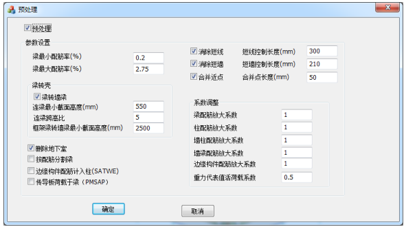

**1、 打开软件 PKPM**

如图 8-3 所示，选择“ SAUSAGE”项，设置当前

工作目录，点击“应用”

**2、检查模型**

点击菜单项“ 分析”→“检查模型”，弹出“检查模型” 对话框

**3、参数设置**

对于导入的 SAUSAGE 模型无须对本节参数进行设置，本节参数设置仅

对 SAUSAGE 中的新建模型起作用。

项目参数设置：点击菜单栏“建模编辑‖→“ 总信息‖，设置项目参数

楼层参数设置：点击菜单栏“建模编辑”→“定义楼层”查看和校核楼层信息

结构板信息，钢筋为 HRB400，混凝土等级为 C35；面筋配筋率和底筋

配筋率均统一取为 0.5%，钢筋方向按默认值选取。

结构墙及墙梁信息（两者参数信息设置相同），钢筋为 HRB400，混凝土

等级： 1~15 层为 C50、 16~30 层为 C45、 31~顶层为 C40；钢材为 Q345；水

平及竖向分布筋配筋率： 1~6 层为 0.6%， 7~顶层为 0.4%。钢筋方向按默认值

选取。

**4、生成剪力墙边缘构件**

如果从 PKPM 导入模型，模型数据中已经包含边缘构件信息，请略过本步骤。

**5、设置施工模拟加载**

**6、划分有限元网格**

**7、依次进行初始模态分析、最大频率分析、竖向荷载加载分析**

**8、选择地震动**

**9、动力时程分析**