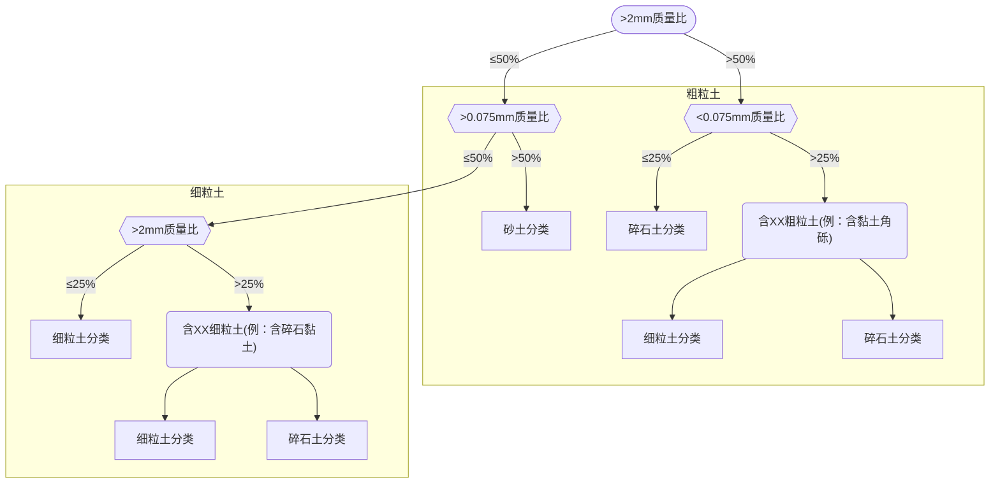

```mermaid
flowchart TB
%% 图的方向说明
%% LR：从左到图，RL：从右到左，TB：从上到下，BT：从下到上

%% 连续连接
START([>2mm质量比]) --> |">50%"|stone{{<0.075mm质量比}}
START([>2mm质量比]) --> |"≤50%"|sand{{>0.075mm质量比}}

subgraph 粗粒土
stone --> |">25%"|mix1("含XX粗粒土(例：含黏土角砾)")
mix1 --> mixcu[碎石土分类]
mix1 --> mixxi[细粒土分类]
stone --> |"≤25%"|stone1[碎石土分类]
%% subgraph 碎石土分类
%%  stone2[碎石土分类] --> |">200mm质量比>50%"|stone3("漂石、块石")
%%  stone2 --> |">20mm质量比>50%"|stone4("卵石、碎石")
%%  stone2 --> |">2mm质量比>50%"|stone5("原砾、角砾")
%% end 
sand --> |">50%"|sand1[砂土分类]
%% subgraph 砂土分类
%%  sand2[砂土分类] --> |">2mm质量比25~50%"|sand3("砾砂")
%%  sand2 --> |">0.5mm质量比>50%"|sand4("粗砂")
%%  sand2 --> |">0.25mm质量比>50%"|sand5("中砂")
%%  sand2 --> |">0.075mm质量比>85%"|sand6("细砂")
%%  sand2 --> |">0.075mm质量比>50%"|sand7("粉砂")
%% end 
end

subgraph 细粒土
sand --> |"≤50%"|mix2{{>2mm质量比}}
mix2 --> |">25%"|mix3("含XX细粒土(例：含碎石黏土)")
mix2 --> |"≤25%"|mixxi3[细粒土分类]
mix3 --> mixcu2[碎石土分类]
mix3 --> mixxi2[细粒土分类]
%% subgraph 细粒土分类
%%  xili[细粒土分类] --> |"Ip≤10"|fentu("粉土")
%%  xili[细粒土分类] --> |"Ip>17"|niantu1("黏土")
%%  xili[细粒土分类] --> |"10<Ip≤17"|niantu2("粉质黏土")
%% end 
end
```

