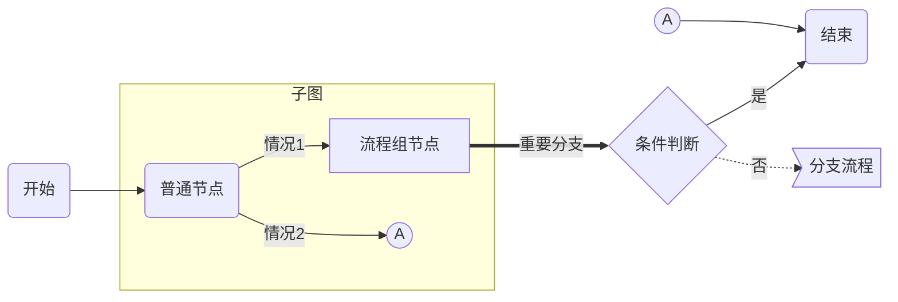
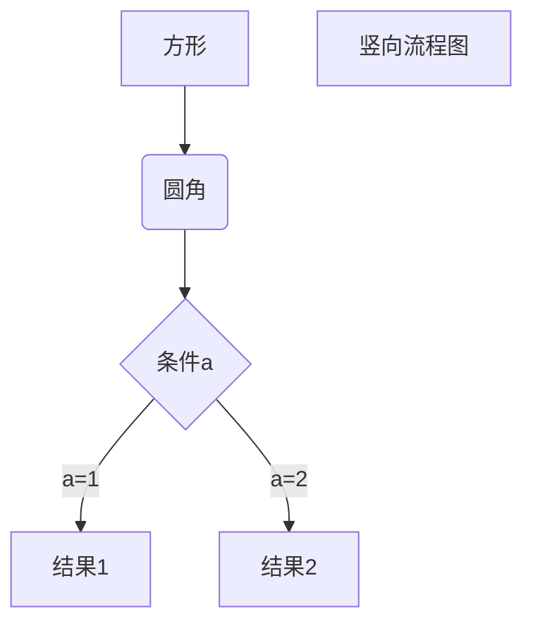
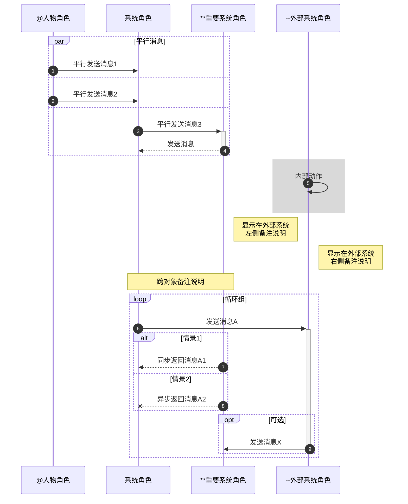
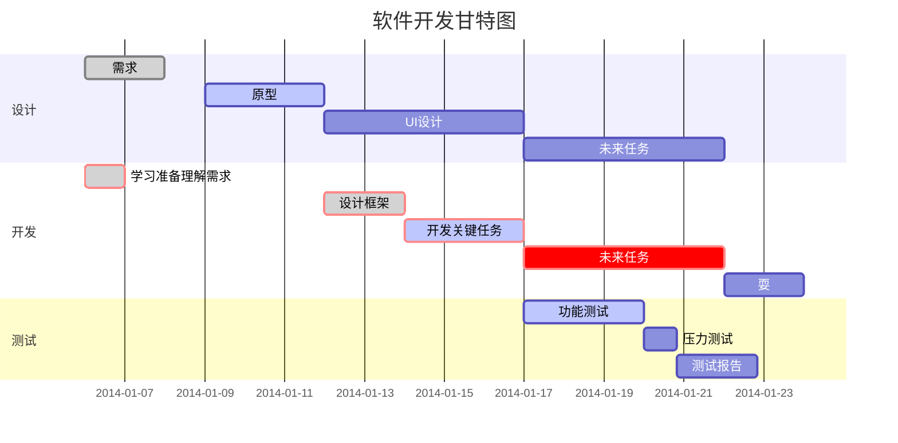
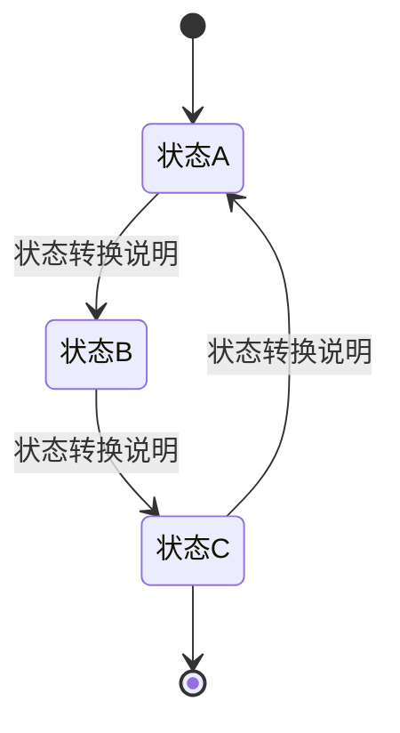
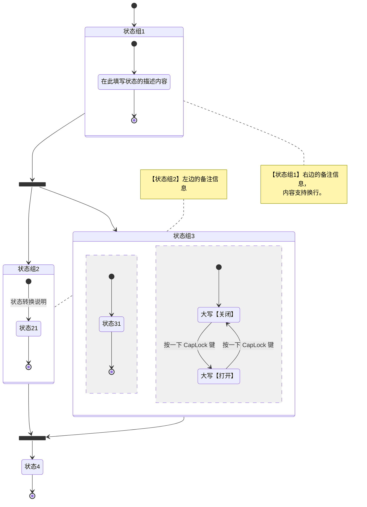
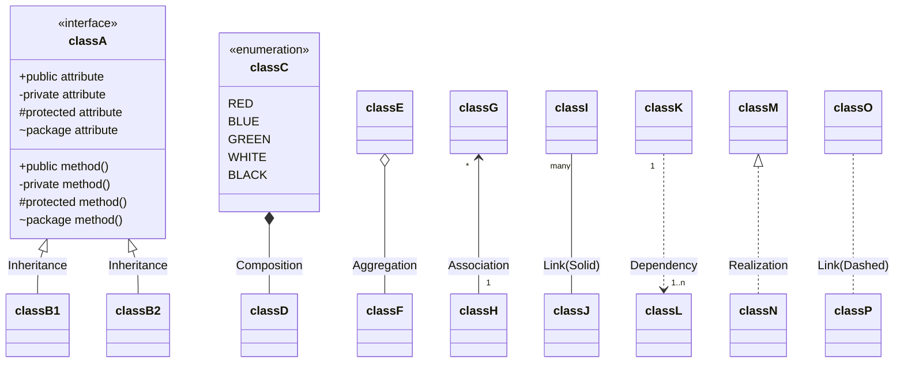
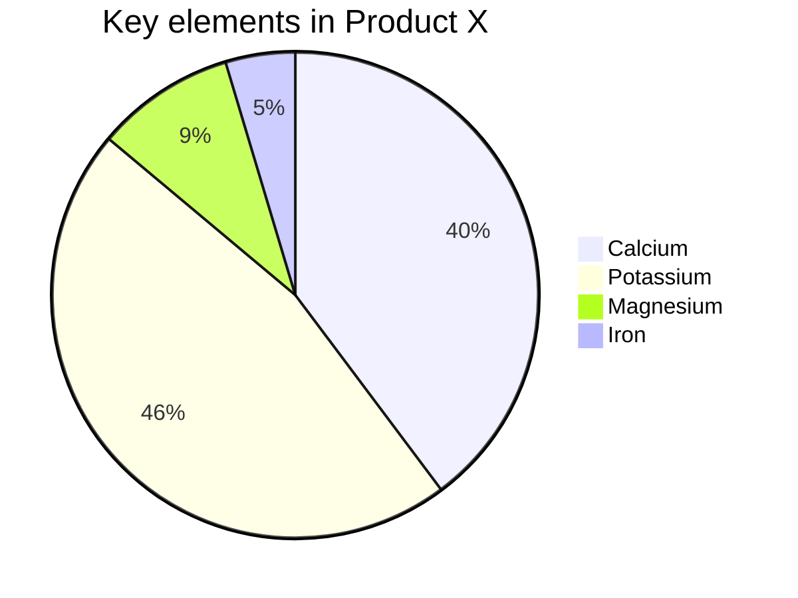
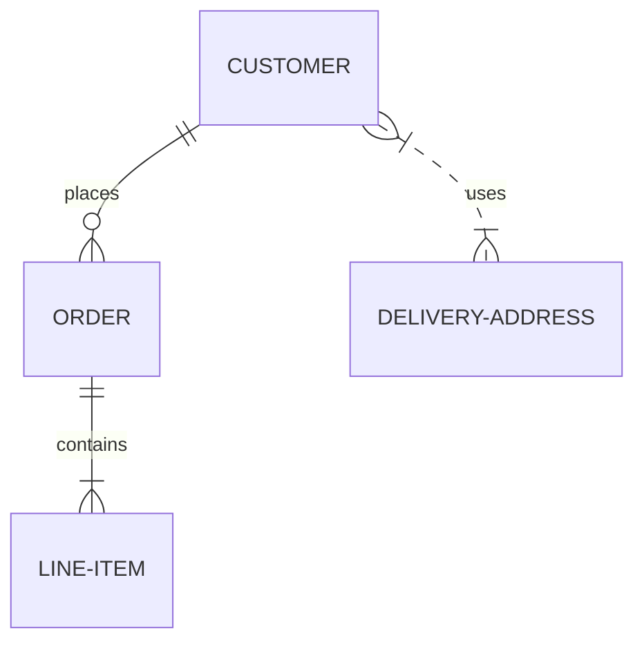
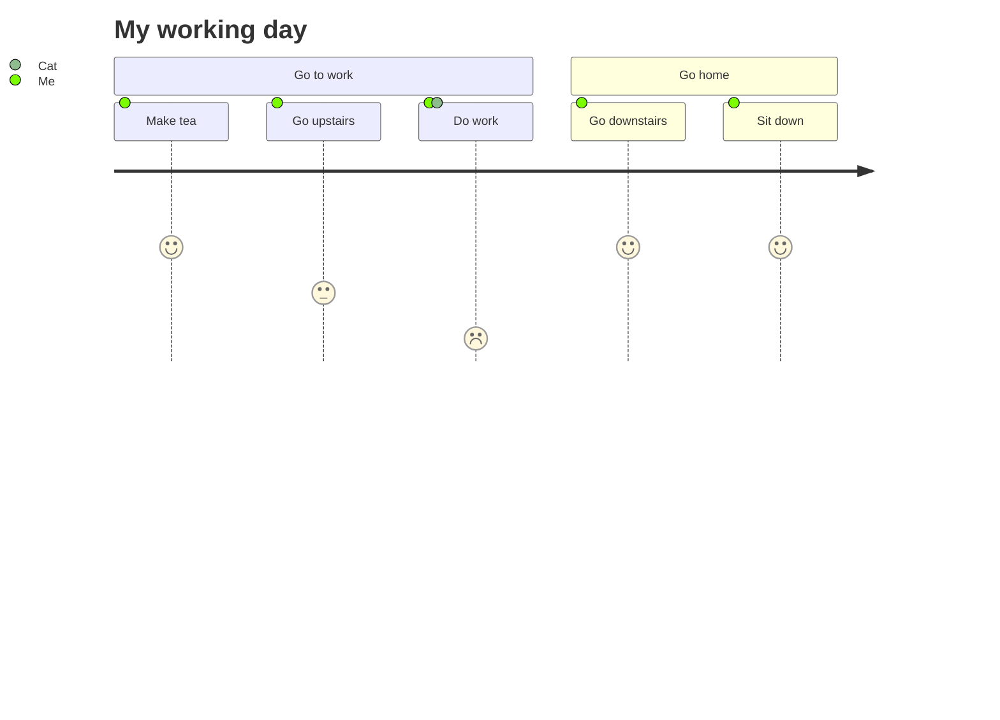

[toc]

# 段落格式

字体

```
*斜体文本*
_斜体文本_
**粗体文本**
__粗体文本__
***粗斜体文本***
___粗斜体文本___
<font face="黑体">我是黑体字</font>
<font face="微软雅黑">我是微软雅黑</font>
<font face="STCAIYUN">我是华文彩云</font>
<font color=red>我是红色</font>
<font color=#008000>我是绿色</font>
<font color=Blue>我是蓝色</font>
<font size=5>我是尺寸</font>
<font face="黑体" color=green size=5>我是黑体，绿色，尺寸为5</font>
```

分割线

```
***
* * *
*****
---
----------
```

删除线

```
~~BAIDU.COM~~
```

下划线

```
<u>带下划线文本</u>
```

脚注

```
[^要注明的文本]
```

# 区块


```
> 最外层
> > 第一层嵌套
> > > 第二层嵌套
```

# 表格

**HTML版**

<table>
    <tr>
        <th rowspan="2">建筑类别</th><th colspan="4">地震作用计算（设防3.0.3）</th>
    </tr>
    <tr>
        <th>6度</th><th>7度</th><th>8度</th><th>9度</th>
    </tr>
    <tr>
        <td>甲类</td><td colspan="4">高于本地区设防烈度，按批准确定</td>
    </tr>
    <tr>
        <td>乙、丙、丁类</td><td>6</td><td>7</td><td>8</td><td>9</td>
    </tr>
</table>

# 图片

```

```

# HTML元素

## 特殊字符

使用 <kbd>Ctrl</kbd>+<kbd>Alt</kbd>+<kbd>Del</kbd> 重启电脑

```
使用 <kbd>Ctrl</kbd>+<kbd>Alt</kbd>+<kbd>Del</kbd> 重启电脑
```

| 符号 | 说明     | 对应编码  | 符号 | 说明           | 对应编码  |
| ---- | -------- | --------- | ---- | -------------- | --------- |
| &    | AND符号  | &amp；    | ⇐    | 双线左箭头     | &lArr；   |
| <    | 小于     | &lt；     | ⇒    | 双线右箭头     | &rArr；   |
| >    | 大于     | &gt；     | ⇑    | 双线上箭头     | &uArr；   |
| _    | 空格     | &nbsp；   | ⇓    | 双线上箭头     | &dArr；   |
| ¿    | 倒问号   | &iquest； | ⇔    | 双线水平双箭头 | &hArr；   |
| ?    | 问号     | &quest；  | ⇕    | 双线竖直箭头   | &vArr；   |
| «    | 左书名号 | &laquo；  | ♠    | 黑桃           | &spades； |
| »    | 右书名号 | &raquo；  | ♥    | 红桃           | &hearts； |
| “”   | 引号     | &quot；   | ♣    | 梅花           | &clubs；  |
| ‘    | 左单引号 | &lsquo；  | ♦    | 方块           | &diams；  |
| ’    | 右单引号 | &rsquo；  | ©    | 版权           | &copy；   |
| “    | 左双引号 | &ldquo；  | ®    | 注册商标       | &reg；    |
| ”    | 右双引号 | &rdquo；  | ™    | 商标           | &trade；  |
| ¶    | 段落符号 | &para；   | ¥    | 人民币         | &yen；    |
| §    | 章节符   | &sect；   | €    | 欧元           | &euro；   |
| ×    | 乘号     | &times；  | ¢    | 美分           | &cent；   |
| ÷    | 除号     | &divide； | £    | 英磅           | &pound；  |
| ±    | 加减号   | &plusmn； | ⊕    | 圆加号         | &oplus；  |
| ƒ    | function | &fnof；   | ½    | 二分之一       | &frac12； |
| √    | 根号     | &radic；  | ¼    | 四分之一       | &frac14； |
| ∞    | 无穷大   | &infin；  | ‰    | 千分符号       | &permil； |
| °    | 度       | &deg；    | ∴    | 所以           | &there4； |
| ≠    | 不等号   | &ne；     | π    | 圆周率         | &pi；     |
| ≡    | 恒等于   | &equiv；  | ¹    | 商标1          | &sup1；   |
| ≤    | 小于等于 | &le；     | α    | alpha          | &alpha；  |
| ≥    | 大于等于 | &ge；     | β    | beta           | &beta；   |
| ⊥    | 垂直符号 | &perp；   | γ    | gamma          | &gamma；  |
| ←    | 左箭头   | &larr；   | δ    | delta          | &delta；  |
| →    | 右箭头   | &rarr；   | θ    | theta          | &theta；  |
| ↑    | 上箭头   | &uarr；   | λ    | lambda         | &lambda； |
| ↓    | 下箭头   | &darr；   | σ    | sigma          | &sigma；  |
| ↔    | 水平箭头 | &harr；   | τ    | tau            | &tau；    |
| ↕    | 竖直箭头 | &varr；   |      |                |           |

## 转义字符

\*\* 正常显示星号 \*\*

```
\*\* 正常显示星号 \*\*
```

Markdown 支持以下这些符号前面加上反斜杠来帮助插入普通的符号：

```
\   反斜线
`   反引号
*   星号
_   下划线
{}  花括号
[]  方括号
()  小括号
#   井字号
+   加号
-   减号
.   英文句点
!   感叹号
```

## 流程图

https://mermaid-js.github.io/mermaid/#/

### 横向流程图



````

````

###### 支持节点形状/类型

| **节点形状** | 应用建议                   | 说明                                                         |
| ------------ | -------------------------- | ------------------------------------------------------------ |
| 圆角矩形     | 普通流程节点               | 结合别名（如：node1、page2 等，可自由定义），并通过`()`指定，举例：`node1(普通节点)` |
| 菱形         | 条件判断节点               | 结合别名，并通过`{}`指定，举例：`cond1{条件判断}` `注意`「条件判断节点」的别名建议统一以`cond`为前缀 |
| 方角矩形     | 普通流程节点/子流程/状态图 | 不使用别名时的默认样式，也可以通过`[]`来强制指定，举例：`node1[流程组]` |
| 圆形         | 同页标志                   | 结合别名，并通过`(())`指定，举例：`node1((圆形节点)`         |
| 旗形         | 离页标志                   | 结合别名，并通过`>]`指定，举例：`page1>条件判断节点]` `注意`「离页标志节点」的别名必须以`page`为前缀，否则样式会与「菱形」条件判断节点冲突 |

### 纵向流程图



````

````

### 标准流程图

```flow
st=>start: 开始框
op=>operation: 处理框
cond=>condition: 判断框(是或否?)
sub1=>subroutine: 子流程
io=>inputoutput: 输入输出框
e=>end: 结束框
st->op->cond
cond(yes)->io->e
cond(no)->sub1(right)->op
```

````
```flow
st=>start: 开始框
op=>operation: 处理框
cond=>condition: 判断框(是或否?)
sub1=>subroutine: 子流程
io=>inputoutput: 输入输出框
e=>end: 结束框
st->op->cond
cond(yes)->io->e
cond(no)->sub1(right)->op
```
````

#### 标准流程图（横向）

```flow
st=>start: 开始框
op=>operation: 处理框
cond=>condition: 判断框(是或否?)
sub1=>subroutine: 子流程
io=>inputoutput: 输入输出框
e=>end: 结束框
st(right)->op(right)->cond
cond(yes)->io(bottom)->e
cond(no)->sub1(right)->op
```

````
```flow
st=>start: 开始框
op=>operation: 处理框
cond=>condition: 判断框(是或否?)
sub1=>subroutine: 子流程
io=>inputoutput: 输入输出框
e=>end: 结束框
st(right)->op(right)->cond
cond(yes)->io(bottom)->e
cond(no)->sub1(right)->op
```
````

### 时序图（顺序图）

```sequence
对象A->对象B: 对象B你好吗?（请求）
Note right of 对象B: 对象B的描述
Note left of 对象A: 对象A的描述(提示)
对象B-->对象A: 我很好(响应)
对象A->对象B: 你真的好吗？
```

````
```sequence
对象A->对象B: 对象B你好吗?（请求）
Note right of 对象B: 对象B的描述
Note left of 对象A: 对象A的描述(提示)
对象B-->对象A: 我很好(响应)
对象A->对象B: 你真的好吗？
```
````

#### UML时序图

```sequence
Title: 标题：复杂使用
对象A->对象B: 对象B你好吗?（请求）
Note right of 对象B: 对象B的描述
Note left of 对象A: 对象A的描述(提示)
对象B-->对象A: 我很好(响应)
对象B->小三: 你好吗
小三-->>对象A: 对象B找我了
对象A->对象B: 你真的好吗？
Note over 小三,对象B: 我们是朋友
participant C
Note right of C: 没人陪我玩
```

````
```sequence
Title: 标题：复杂使用
对象A->对象B: 对象B你好吗?（请求）
Note right of 对象B: 对象B的描述
Note left of 对象A: 对象A的描述(提示)
对象B-->对象A: 我很好(响应)
对象B->小三: 你好吗
小三-->>对象A: 对象B找我了
对象A->对象B: 你真的好吗？
Note over 小三,对象B: 我们是朋友
participant C
Note right of C: 没人陪我玩
```
````

#### 标准时序图



````

````

角色在标准的一类样式的基础上，增加三类扩展的样式，在输出HTML后应用 [VLOOK™](https://github.com/madmaxchow/VLOOK) 插件后渲染为不同的样式：

- **人物角色**：在角色名称前添加 at 符号`@`，如`@人物角色`
- **重要系统角色**：在角色名称前添加两个星号`**`，如`**后端支撑系统名称`
- **外部系统角色**：在角色名称前添加两个减号`--`，如`--外部系统名称`

### 甘特图



````

````

### 状态图



```text
stateDiagram
[*] --> 状态A
状态A --> 状态B : 状态转换说明
状态B --> 状态C : 状态转换说明
状态C --> 状态A : 状态转换说明
状态C --> [*]
```

#### 状态组



````

````

### 类图



```text
classDiagram
classA <|-- classB1 : Inheritance
classA <|-- classB2 : Inheritance
classC *-- classD : Composition
classE o-- classF : Aggregation
classG "*" <-- "1" classH : Association
classI "many" -- classJ : Link(Solid)
classK "1" ..> "1..n" classL : Dependency
classM <|.. classN : Realization
classO .. classP : Link(Dashed)

class classA~Class~{
    <<interface>>
    +public attribute
    -private attribute
    #protected attribute
    ~package attribute
    +public method()
    -private method()
    #protected method()
    ~package method()
}

class classC{
    <<enumeration>>
    RED
    BLUE
    GREEN
    WHITE
    BLACK
}
```

### 饼图



```text
pie
    title Key elements in Product X
    "Calcium" : 42.96
    "Potassium" : 50.05
    "Magnesium" : 10.01
    "Iron" :  5
```

### 实体关系图



```
erDiagram
    CUSTOMER ||--o{ ORDER : places
    ORDER ||--|{ LINE-ITEM : contains
    CUSTOMER }|..|{ DELIVERY-ADDRESS : uses
```

### 客户旅程地图



```
journey
    title My working day
    section Go to work
      Make tea: 5: Me
      Go upstairs: 3: Me
      Do work: 1: Me, Cat
    section Go home
      Go downstairs: 5: Me
      Sit down: 5: Me
```

# VLOOK

## 表格

###### 单元格合并、列格式、数值、百分数、货币、复选框、分组折叠、重复显示表头

| 列 A 纵向合并`×2` ## | 列 B横向合并`x2` | <<           | ==列 D高亮== | ~~列 E删除线~~ | [ ] 复选框    |       数值列 |            << |
| -------------------- | ---------------- | ------------ | ------------ | -------------- | ------------- | -----------: | ------------: |
| ^^                   | 二级列头         | 二级列头     | ^^           | 二级列头       | 二级列头      | 数字、百分数 |          货币 |
| 纵向合并`×3`         | 普通单元格       | 普通单元格   | 普通单元格   | 纵向合并`×5`   | [ ]留空       |          123 | ￥ +123456.99 |
| ^^                   | 纵向合并`×2`     | 横向合并`×3` | <<           | ^^             | [x]已选择     |       -12345 | CNY 987654.99 |
| ^^                   | ^^               | 普通单元格   | 普通单元格   | ^^             | [-]不确定选择 |     +5678.00 |   HK$ 3456.78 |
| 普通单元格           | 纵向合并`×3`     | 普通单元格   | 普通单元格   | ^^             | ^^            |       88.88% |   HKD 3456.78 |
| 普通单元格           | ^^               | 普通单元格   | 普通单元格   | ^^             | ^^            |      +55.55% |   AU$ +555.38 |
| 普通单元格           | ^^               | 普通单元格   | 普通单元格   | ^^             | ^^            |      -57.30% |     AUD 56789 |
| 普通单元格`×6`       | <<               | <<           | <<           | <<             | <<            |         100% |       USD 555 |
| ==带格式的==分组折叠 |                  |              |              |                |               |              |               |
| > 这是分组1          | 被折叠的行       |              |              |                |               |              |               |
| >> 这是分组2.1       | 被折叠的行       |              |              |                |               |              |               |
| >> 这是分组2.2       | 被折叠的行       |              |              |                |               |              |               |
| >>> 这是分组3        | 被折叠的行       |              |              |                |               |              |               |
| >>>> 这是分组4       | 被折叠的行       |              |              |                |               |              |               |

## 图片

**图片题注**

只要按以 Markdown 的语法添加图片就可以实现，即：``

- **单题注：**以上 `图片标题` 即为题注的内容，如：``
- **双题注：**以上 `可选子标题` 即为第 2 题注的内容，如：``。

**图片显示版式、插图对齐**

###### 图片显示版式、插图对齐

| 版式类型                    | 版式标识   | 应用说明                                                     | 完整语法参考                    |
| :-------------------------- | ---------- | ------------------------------------------------------------ | ------------------------------- |
| 插图版式<br/>（默认，独排） | figure     | 强制指定为插图，主要用于一行多图的情况，<br/>对于独占一行的图片默认为插图，无须指定 | ``  |
| ^^                          | left       | 插图左对齐（默认的对齐方式）                                 | ``   |
| ^^                          | center     | 居中对齐                                                     | `` |
| ^^                          | right      | 右对齐                                                       | ``  |
| logo版式<br/>（环绕排版）   | logo       | 不调整图片大小，且不为作「插图」<br/>主要用于展示图片的原始大小和样式 | ``    |
| ^^                          | logol      | 在 `logo` 基础上，支持文字环绕排版（图片**左**对齐）         | ``   |
| ^^                          | logor      | 在 `logo` 基础上，支持文字环绕排版（图片**右**对齐）         | ``   |
| 画框版式<br/>（环绕排版）   | frame      | 与 `logo` 模式类似，但增加了边框                             | ``   |
| ^^                          | frame**l** | 在 `frame` 基础上，支持文字环绕排版（图片**左**对齐）        | ``  |
| ^^                          | frame**r** | 在 `frame` 基础上，支持文字环绕排版（图片**右**对齐）        | ``  |
| 图标版式<br/>（并排）       | icon       | 缩小为与单行正文高度适配的小图标 主要用于与正文内容进行混排  | ``    |
| ^^                          | icon**2x** | 比 `icon` 尺寸增大 60%                                       | ``  |

**一行多图**

> 对于图片版式为 **`logo / frame`**的情况（不包括默认的`figure`版式，

在「图片 URL」中添加 VLOOK™ 规范的参数的方式来启用这一特性：

- URL 参数：`inline=true`（暂不支持「插图」的应用场景）
- 参数示例：``

**图片颜色替换**

> 对于图片版式为 **`icon / logo`**的情况（不包括默认的`figure`版式，

在「图片 URL」中添加 VLOOK™ 规范的参数的方式来启用这一特性：

- URL 参数：`fill=xxx`

###### 图片颜色替换的 URL 参数（fill）的取值及用法

| 对齐方式 | 说明                                                         | 完整语法参考                   |
| -------- | ------------------------------------------------------------ | ------------------------------ |
| text     | 替换为所在段落文字的颜色（会自动适配 Dark Mode 和链接的样式） | ``   |
| theme1   | 替换为主题的主色                                             | `` |
| theme2   | 替换为主题的辅助色                                           | `` |

**图片网格背景**

>  支持针对透明背景的图片（如 PNG、SVG 格式图片），添加指定的网格背景

在「图片 URL」中添加 VLOOK™ 规范的参数的方式来启用这一特性：

- 参数：`grid=xxx`

######  图片网格背景的 URL 参数（grid）的取值及用法

| 网络背景风格 | 说明                   | 完整语法参考                  |
| ------------ | ---------------------- | ----------------------------- |
| line         | 添加线条风格的网格背景 | ``  |
| block        | 添加方块风格的网格背景 | `` |

**图片边缘留白**

可在「图片 URL」中添加 VLOOK™ 规范的参数来启用这一特性：

- 参数：`padding=true`，默认给插图的四边添加 `20px` 的留白
- 参数示例：``

## 标签与徽章

### 彩虹标签

- **语法：**

```
`#标签#(颜色)`
```

- 其中，

  - `标签`：徽章内容，前后由 `#` 符号包裹

  - `颜色`：可选。指定标签显示对应的预置颜色标识，不指定则默认为 `gray`

###### 彩虹标签预置颜色标识及示例

| 预置颜色标识 | 语法示例                  | 应用场景建议                 | 渲染效果                |
| ------------ | ------------------------- | ---------------------------- | ----------------------- |
| 预置颜色标识 | 语法示例                    | 应用场景建议                 | 渲染效果                  |
| red          | \`#标签 red#(red)\`         | 警告、危险、关键事项、删除   | `#标签 red#(red)`         |
| orange       | \`#标签 orange#(orange)\`   | 提醒、注意、修复             | `#标签 orange#(orange)`   |
| yellow       | \`#标签 yellow#(yellow)\`   | 关注、优化、备忘、说明       | `#标签 yellow#(yellow)`   |
| lime         | \`#标签 lime#(lime)\`       | 提示、参考、新增             | `#标签 lime#(lime)`       |
| green        | \`#标签 green#(green)\`     | ^^                           | `#标签 green#(green)`     |
| aqua         | \`#标签 aqua#(aqua)\`       | 引用、公告                   | `#标签 aqua#(aqua)`       |
| cyan         | \`#标签 cyan#(cyan)\`       | ^^                           | `#标签 cyan#(cyan)`       |
| blue         | \`#标签 blue#(blue)\`       | 信息、资讯                   | `#标签 blue#(blue)`       |
| sea          | \`#标签 sea#(sea)\`         | ^^                           | `#标签 sea#(sea)`         |
| purple       | \`#标签 purple#(purple)\`   | 延伸、扩展、保留、备用       | `#标签 purple#(purple)`   |
| magenta      | \`#标签 magenta#(magenta)\` | 年轻、个性、女性             | `#标签 magenta#(magenta)` |
| pink         | \`#标签 pink#(pink)\`       | ^^                           | `#标签 pink#(pink)`       |
| gold         | \`#标签 gold#(gold)\`       | 稳定、金融、工程             | `#标签 gold#(gold)`       |
| brown        | \`#标签 brown#(brown)\`     | ^^                           | `#标签 brown#(brown)`     |
| gray         | \`#标签 gray#(gray)\`       | 无效、暂缓、停用、结束       | `#标签 gray#(gray)`       |
| black        | \`#标签 black#(black)\`     | 黑白、高对比                 | `#标签 black#(black)`     |
| theme1       | \`#标签 theme1#(theme1)\`   | 使用当前 VLOOK™ 主题的主色   | `#标签 theme1#(theme1)`   |
| theme2       | \`#标签 theme2#(theme2)\`   | 使用当前 VLOOK™ 主题的辅助色 | `#标签 theme2#(theme2)`   |

### 彩虹徽章

- **语法：**

```
`#徽章标题|徽章内容#(颜色)`
```

- 与彩虹标签名语法基本一致，徽章名称与内容由 `#` 包裹，并以英文竖线符号 `|` 作为分隔。其中：
  - `徽章标题`：为徽章名称
  - `徽章内容`：为徽章内容。内容可支持变量标识 `{{变量}}` `%变量%` `${变量}`，会通过样式突出显示
  - `颜色`：可选。指定标签显示对应的预置颜色标识，不指定则默认为 `(gray)`。颜色标识后添加 `!` 则使用强调样式

######  彩虹徽章预置颜色及示例

| 预置颜色标识 | 语法示例                                         | 应用场景建议               | 渲染效果                                      |
| :----------: | ------------------------------------------------ | -------------------------- | --------------------------------------------- |
|     red      | \`#徽章名称\|徽章内容 {{变量标识 1}}#(red)\`     | 警告、危险、关键事项、删除 | `#徽章名称|徽章内容 {{变量标识 1}}#(red)`     |
|    orange    | \`#徽章名称\|徽章内容 %变量标识 2%#(orange)\`    | 提醒、注意、修复           | `#徽章名称|徽章内容 %变量标识 2%#(orange)`    |
|    yellow    | \`#徽章名称\|徽章内容 ${变量标识 3}#(yellow)\`   | 关注、优化、备忘、说明     | `#徽章名称|徽章内容 ${变量标识 3}#(yellow)`   |
|     lime     | \`#徽章名称\|徽章内容 {{变量标识 1}}#(lime)\`    | 提示、备忘、参考、新增     | `#徽章名称|徽章内容 {{变量标识 1}}#(lime)`    |
|    green     | \`#徽章名称\|徽章内容 {{变量标识 1}}#(green)\`   | ^^                         | `#徽章名称|徽章内容 {{变量标识 1}}#(green)`   |
|     aqua     | \`#徽章名称\|徽章内容 {{变量标识 1}}#(aqua)\`    | 引用、公告                 | `#徽章名称|徽章内容 {{变量标识 1}}#(aqua)`    |
|     cyan     | \`#徽章名称\|徽章内容 {{变量标识 1}}#(cyan)\`    | ^^                         | `#徽章名称|徽章内容 {{变量标识 1}}#(cyan)`    |
|     blue     | \`#徽章名称\|徽章内容 {{变量标识 1}}#(blue)\`    | 信息、资讯                 | `#徽章名称|徽章内容 {{变量标识 1}}#(blue)`    |
|     sea      | \`#徽章名称\|徽章内容 {{变量标识 1}}#(sea)\`     | ^^                         | `#徽章名称|徽章内容 {{变量标识 1}}#(sea)`     |
|    purple    | \`#徽章名称\|徽章内容 {{变量标识 1}}#(purple)\`  | 延伸、扩展、保留、备用     | `#徽章名称|徽章内容 {{变量标识 1}}#(purple)`  |
|   magenta    | \`#徽章名称\|徽章内容 {{变量标识 1}}#(magenta)\` | 年轻、个性、女性           | `#徽章名称|徽章内容 {{变量标识 1}}#(magenta)` |
|     pink     | \`#徽章名称\|徽章内容 {{变量标识 1}}#(pink)\`    | ^^                         | `#徽章名称|徽章内容 {{变量标识 1}}#(pink)`    |
|     gold     | \`#徽章名称\|徽章内容 {{变量标识 1}}#(gold)\`    | 稳定、金融、工程           | `#徽章名称|徽章内容 {{变量标识 1}}#(gold)`    |
|    brown     | \`#徽章名称\|徽章内容 {{变量标识 1}}#(brown)\`   | ^^                         | `#徽章名称|徽章内容 {{变量标识 1}}#(brown)`   |
|     gray     | \`#徽章名称\|徽章内容 {{变量标识 1}}#(gray)\`    | 常规、无效、暂缓、停用     | `#徽章名称|徽章内容 {{变量标识 1}}#(gray)`    |
|    black     | \`#徽章名称\|徽章内容 {{变量标识 1}}#(black)\`   | 黑白、高对比               | `#徽章名称|徽章内容 {{变量标识 1}}#(black)`   |
|    theme1    | \`#徽章名称\|徽章内容 {{变量标识 1}}#(theme1)\`  | 当前 VLOOK™ 主题的主色     | `#徽章名称|徽章内容 {{变量标识 1}}#(theme1)`  |
|    theme2    | \`#徽章名称\|徽章内容 {{变量标识 1}}#(theme2)\`  | 当前 VLOOK™ 主题的辅助色   | `#徽章名称|徽章内容 {{变量标识 1}}#(theme2)`  |

###### 彩虹徽章预置颜色（强调）及示例

| 预置颜色标识 | 语法示例                          | 应用场景建议               | 渲染效果           |
| :----------: | --------------------------------- | -------------------------- | ------------------ |
|     red!     | \`#徽章名称\|强调样式#(red!)\`     | 警告、危险、关键事项、删除 | `#徽章名称|强调样式#(red!)` |
|   orange!    | \`#徽章名称\|强调样式(orange!)\`   | 提醒、注意、修复           | `#徽章名称|强调样式#(orange!)` |
|   yellow!    | \`#徽章名称\|强调样式#(yellow!)\`  | 关注、优化、备忘、说明     | `#徽章名称|强调样式#(yellow!)` |
|    lime!     | \`#徽章名称\|强调样式#(lime!)\`    | 提示、备忘、参考、新增     | `#徽章名称|强调样式#(lime!)` |
|    green!    | \`#徽章名称\|强调样式#(green!)\`   | ^^                         | `#徽章名称|强调样式#(green!)` |
|    aqua!     | \`#徽章名称\|强调样式#(aqua!)\`    | 引用、公告                 | `#徽章名称|强调样式#(aqua!)` |
|    cyan!     | \`#徽章名称\|强调样式#(cyan!)\`    | ^^                         | `#徽章名称|强调样式#(cyan!)` |
|    blue!     | \`#徽章名称\|强调样式#(blue!)\`    | 信息、资讯                 | `#徽章名称|强调样式#(blue!)` |
|     sea!     | \`#徽章名称\|强调样式#(sea!)\`     | ^^                         | `#徽章名称|强调样式#(sea!)` |
|   purple!    | \`#徽章名称\|强调样式#(purple!!)\` | 延伸、扩展、保留、备用     | `#徽章名称|强调样式#(purple!)` |
|   magenta    | \`#徽章名称\|强调样式#(magenta!)\` | 年轻、个性、女性           | `#徽章名称|强调样式#(magenta!)` |
|    pink!     | \`#徽章名称\|强调样式#(pink!)\`    | ^^                         | `#徽章名称|强调样式#(pink!)` |
|    gold!     | \`#徽章名称\|强调样式#(gold!)\`    | 稳定、金融、工程           | `#徽章名称|强调样式#(gold!)` |
|    brown!    | \`#徽章名称\|强调样式#(brown!)\`   | ^^                         | `#徽章名称|强调样式#(brown!)` |
|    gray!     | \`#徽章名称\|强调样式#(gray!)\`    | 常规、无效、暂缓、停用     | `#徽章名称|强调样式#(gray!)` |
|    black!    | \`#徽章名称\|强调样式#(black!)\`   | 黑白、高对比               | `#徽章名称|强调样式#(black!)` |
|   theme1!    | \`#徽章名称\|强调样式#(theme1!)\`  | 当前 VLOOK™ 主题的主色     | `#徽章名称|强调样式#(theme1!)` |
|   theme2!    | \`#徽章名称\|强调样式#(theme2!)\`  | 当前 VLOOK™ 主题的辅助色   | `#徽章名称|强调样式#(theme2!)` |

## 引用

**彩虹引用**

- **语法：**

```
`>(color)`，须添加到引用中，具体位置不限（如：首行、末尾）
同时，颜色标识支持添加 `!` 启用强调样式
```

- 其中：

  - `color`：指定标签显示对应的预置颜色标识，预置颜色标识与「[彩虹标签](#彩虹标签)」的颜色标识保持一致
- **示例：**

> ###### 彩虹引用6级标题
>
> 这是一个彩虹引用，使用的颜色标识为：`red` 
>
> `>(red)`

> ###### 彩虹引用6级标题
>
> 这是一个彩虹引用强调样式，使用的颜色标识为：`red!` 
>
> `>(red!)`

- 这是列表项，以下为列表项内的彩虹标签：

  > ######  彩虹引用 6 级标题
  >
  > 这是一个彩虹引用，使用的颜色标识为：`theme2`
  >
  > `>(theme2)`

**分栏引用**

- **语法：**在「引用」前一段落添加「水平分割线」`---` 
- 其中，添加**一条**水平分割表示双栏，**两条**表示三栏，**三条**表示四栏

---

---

>  分栏 1
>
> `>(red)`

> 分栏 2
>
> `>(yellow)`

> 分栏 3
>
> `>(blue)`

> **引用嵌套分栏引用**
>
> ---
>
> > 嵌套的分栏1
>
> >嵌套的分栏2

**折叠引用**

- **语法：**`> [folder] title`，即在正常的引用语法的首行内容前，添加折叠引子

- 其中，

  - `[folder]`：折叠引子，`[+]` - 默认为折叠，`[-]` - 默认为展开

  - `title`：折叠引子的标题，与折叠引子以「英文空格」进行分隔

- **示例：**

> [+] 默认为折叠的引用的标题
>
> > 折叠的内容

## 音频

语法与 Mardown 的插入图片完全一致！

- **语法：**``

- **语法示例：**``

- **支持的音频格式：**MP3 (.mp3)、Ogg (.ogg)、Wav (.wav)、M4a (.m4a)

- Mini控件：
  - 通过在「音频 URL」中添加 VLOOK™ 规范的参数实现：
    - URL 参数：`controls=mini`
    - 参数示例：`media/whistle.mp3?controls=mini`
  
###### 音频控制高级应用说明

  | **可定制特性**                               | VLOOK™ 规范的 URL 参数                              |
  | -------------------------------------------- | --------------------------------------------------- |
  | 启用 Mini 模式的播放控件                     | `controls=mini`                                     |
  | 启用 播放/暂时 模式 **（默认为 播放/结束）** | `pause=true`<br/>`#注意#` **仅 Mini 模式下有效**    |
  | 显示音频时长                                 | `duration=true`<br/> `#注意#`**仅 Mini 模式下有效** |
  | 开启自动播放                                 | `autoplay=true`                                     |
  | 开启循环播放                                 | `loop=true`                                         |
  | 开启预加载                                   | `preload=true`                                      |

  ## 视频

  语法与 Mardown 的插入图片完全一致！

  - **语法：**``
  - **语法示例：**``
  - **支持的音频格式：**Ogg (.ogv)、MPEG4 (.mp4)、WebM (.webm)

###### 视频控制高级应用说明

| 可定制特性   | URL 参数        |
| ------------ | --------------- |
| 开启自动播放 | `autoplay=true` |
| 开启循环播放 | `loop=true`     |
| 开启预加载   | `preload=true`  |
| 指定视频宽度 | `width=xxx`     |
| 指定视频高度 | `height=xxx`    |

## 注音

- **语法：**`{text}(symbol)`
  - `text`：要添加「注音、拼音、注释」的文字
  - `symbol`：text 对应的注音、拼音符号，或注释内容

- **示例：**

| 多语种的注音应用 |                                                   |                                             |
| ---------------- | ------------------------------------------------- | ------------------------------------------- |
| 分类             | 语法示例                                          | 应用效果                                    |
| 注音             | \`{道}(ㄉㄠˋ)\` \`{德}(ㄉㄜˊ)\` \`{经}(ㄐㄧㄥˉ)\` | `{道}(ㄉㄠˋ)` `{德}(ㄉㄜˊ)` `{经}(ㄐㄧㄥˉ)` |
| 普通话           | \`{道}(dào)\` \`{德}(dé)\` \`{经}(jīng)\`         | `{道}(dào)` `{德}(dé)` `{经}(jīng)`         |
| 粤语             | \`{道德经}(dou däk gïng)\`                        | `{道德经}(dou däk gïng)`                    |
| 日文片假名       | \`{鳥山}(とりやま)\` \`{明}(あきら)\`             | `{鳥山}(とりやま)` `{明}(あきら)`           |
| 韩文             | \`{대 한 민 국}(Dae Han Min Gug)\`                | `{대 한 민 국}(Dae Han Min Gug)`            |
| 中英             | \`{道德经}(The Scripture of Ethics)\`             | `{道德经}(The Scripture of Ethics)`         |
| 英中 1           | \`{The Scripture}(经)\` of \`{Ethics}(道德)\`     | `{The Scripture}(经)` of `{Ethics}(道德)`   |
| 英中 2           | \`{The Scripture of Ethics}(道德经)\`             | `{The Scripture of Ethics}(道德经)`         |

## 任务列表

- [ ] 这是`部分完成`的一级任务列表项 1
  - [ ]   这是二级任务列表项 1.1
  - [ ]   这是`部分完成`的二级任务列表项 1.2
    - [x]   这是`已完成`的三级任务列表项 1.2.1
      - [x]   这是`已完成`的四级任务列表项 1.2.1.1
      - [x]   这是`已完成`的四级任务列表项 1.2.1.2
    - [ ]   这是三级任务列表项 1.2.2
  - [x]   这是`已完成`的二级任务列表项 1.2
- [ ] 这是`部分完成`的一级任务列表项 2
  - [x]   这是二级任务列表项 2.1
  - [ ]   这是二级任务列表项 2.2
- [ ] 这是一级任务列表项 3

## 字体

###### 小清新_选用的字体及应用

| 字体的应用                                                | 字体名称                           | 字重        | <<         | <<       | <<        |
| --------------------------------------------------------- | ---------------------------------- | ----------- | ---------- | -------- | --------- |
| ^^                                                        | ^^                                 | [ ] Regular | [ ] Medium | [ ] Bold | [ ] Black |
| 封面、标题、正文(CJK)、<br/> 链接、表头、题注、彩虹标签等 | Noto Sans CJK SC<br/> （思源黑体） | [x]         | [ ]        | [x]      | [x]       |
| 正文(非CJK)、链接、代码等                                 | Noto Sans Mono                     | [x]         | [x]        | [x]      | [x]       |
| 表格列格式(数值/百分数/货币) …                            | DIN                                | [x]         | [ ]        | [x]      | [ ]       |

###### 文艺范_选用的字体及应用

| 字体的应用                                         | 字体名称                            | 字重        | <<         | <<       | <<        |
| -------------------------------------------------- | ----------------------------------- | ----------- | ---------- | -------- | --------- |
| ^^                                                 | ^^                                  | [ ] Regular | [ ] Medium | [ ] Bold | [ ] Black |
| 封面大标题、章节标题、 正文(CJK)等                 | Noto Serif CJK SC <br/>（思源宋体） | [ ]         | [x]        | [ ]      | [x]       |
| 封面小标题、表头、题注、 <br/>彩虹标签、加粗文本等 | Noto Sans CJK SC <br/>（思源黑体）  | [x]         | [ ]        | [x]      | [x]       |
| 正文（非CJK）                                      | Luxi Mono                           | [x]         | [ ]        | [x]      | [ ]       |
| 链接、代码等                                       | Noto Sans Mono                      | [x]         | [x]        | [x]      | [x]       |
| 表格列格式(数值/百分数/货币) …                     | DIN                                 | [x]         | [ ]        | [x]      | [ ]       |

# emoji

- 完整的编码 [emoji-sequences.txt](https://unicode.org/Public/emoji/13.0/emoji-sequences.txt)

- 格式为：`ODE;`，其中，`CODE` 部分可以由上表查得 (别忘了末尾的分号，半角模式)。
  
  **例子：** 查到了 表情对应的 `CODE` 为 `1F34E`，则对应的完整表情代码为 `🍎`

- 汇总呈现：https://www.webfx.com/tools/emoji-cheat-sheet/
- 分类呈现：https://www.cnblogs.com/minghaiJ/p/10685965.html
- 这里有 Emoji unicode 的 Table: https://apps.timwhitlock.info/emoji/tables/unicode
- 各类编码查询：[Unicode 14 Character Code Charts](http://www.unicode.org/charts/)。表情类，可以拖到 「**Emoji & Pictographs**」] 部分查看。

## emoji 支持

---

---

---

>###### 表情
>
>😀 😁 😂 😃 😄 😅 😆 😉 😊 😋 😎 😍 😘 😗 😙 😚 ☺ 🙂 🤗 😇 🤓 🤔 😐 😑 😶 🙄 😏 😣 😥 😮 🤐 😯 😪 😫 😴 😌 😛 😜 😝 😒 😓 😔 😕 🙃 🤑 😲 😷 🤒 🤕 🙁 😖 😞 😟 😤 😢 😭 😦 😧 😨 😩 😬 😰 😱 😳 😡 😠

> ###### 动物
>
> 🐱 😺 😸 😹 😻 😼 😽 🙀 😿 😾 🙈 🙉 🙊 🐵 🐒 🐕 🐩 🐺 🐱 🐈 🦁 🐯 🦄 🐂 🐃 🐄 🐷 🐖 🐗 🐽 🐏 🐑 🐐 🐪 🐫 🐘 🐭 🐁 🐀 🐹 🐰 🐇 🐿 🐨 🐼 🐾 🦃 🐓 🐣 🐤 🐥 🐦 🐧 🕊 🐸 🐊 🐍 🐲 🐉 🐳 🐋 🐬 🐟 🐡 🐙 🐚 🦀 🐌 🐜 🐝 🐞 🕷 🦂 🕸

> ###### 办公
>
> 📱 📲 ☎ 📞 📟 📠 🔋 🔌 💻 💽 💾 💿 📀 🎥 📺 📷 📹 📼 🔍 🔎 🔬 🔭 📡 📔 📕 📖 📗 📘 📙 📚 📓 📃 📜 📄 📰 📑 🔖 💳 ✉ 📧 📨 📩 📤 📥 📦 📫 📪 📬 📭 📮 ✏ ✒ 📝 📁 📂 📅 📆 📇 📈 📉 📊 📋 📍 📎 📏 📐 ✂ 🔒 🔓 🔏 🔐 🔑

>###### 饮食
>
>🍇 🍈 🍉 🍊 🍋 🍌 🍍 🍎 🍏 🍑 🍒 🍓 🍅 🍆 🌽 🍄 🌰 🍞 🍖 🍗 🍔 🍟 🍕 🍳 🍲 🍱 🍘 🍙 🍚 🍛 🍜 🍝 🍠 🍢 🍣 🍤 🍥 🍡 🍦 🍧 🍨 🍩 🍪 🎂 🍰 🍫 🍬 🍭 🍮 🍯 🍼 ☕ 🍵 🍶 🍷 🍸 🍹 🍴

---

---

---

> ###### 身体
>
> 👂 👣 👀 👁 👁 🗨 👅 👄

> ###### 手机
>
> 📱 📲 📶 📳 📴 ☎ 📞 📟 📠

> ###### 恐怖
>
> 😈 👿 👹 👺 💀 ☠ 👻 👽 👾 💣

> ###### 星座
>
> ♈ ♉ ♊ ♋ ♌ ♍ ♎ ♏ ♐ ♑ ♒ ♓ ⛎

---

---

---

> ###### 公共
>
> ♻ 🏧 🚮 🚰 ♿ 🚹 🚺 🚻 🚼 🚾 ⚠ 🚸 ⛔ 🚫 🚳 🚭 🚯 🚱 🚷 🔞 💈©️ ®️ ™️ 

> ###### 建筑
>
> 🏠 🏡 🏢 🏣 🏤 🏥 🏦 🏨 🏩 🏪 🏫 🏬 🏭 🏯 🏰 💒 🗽 ⛪ 🌆 🌇 🌉

>###### 植物
>
>💐 🌸 💮 🏵 🌹 🌺 🌻 🌼 🌷 🌱 🌲 🌳 🌴 🌵 🌾 🌿 ☘ 🍀 🍁 🍂 🍃

> ###### 心形
>
> 💘 ❤ 💓 💔 💕 💖 💗 💙 💚 💛 💜 💝 💞 💟 ❣

---

---

---

> ###### 自然
>
> 🌍 🌎 🌏 🌐 🌑 🌒 🌓 🌔 🌕 🌖 🌗 🌘 🌙 🌚 🌛 🌜 ☀ 🌝 🌞 ⭐ 🌟 🌠 ☁ ⛅ ☔ ⚡ ❄ 💧 🌊

>###### 文体
>
>🎪 🎭 🎨 🎰 🚣 🛀 🎫 🏆 ⚾ 🏈 🏉 🎾 🎱 🎳 ⛳ 🎣 🎽 🎿 🏂 🏄 🏇 🏊 🚴 🚵 🎯 🎮 🎲 🎷 🎸 🎺 🎻 🎬

> ###### 时钟
>
> 🕛 🕧 🕐 🕜 🕑 🕝 🕒 🕞 🕓 🕟 🕔 🕠 🕕 🕡 🕖 🕢 🕗 🕣 🕘 🕤 🕙 🕥 🕚 🕦 ⌛ ⏳ ⌚ ⏰ ⏱ ⏲ 🕰

> ###### 手势
>
> 💪 👈 👉 ☝ 👆 🖕 👇 ✌ 🖖 🤘 🖐 ✋ 👌 👍 👎 ✊ 👊 👏 👐 ✍ 💅

---

---

---

>###### 标志
>
>♠ ♥ ♦ ♣ 🀄 🎴 🔇 🔈 🔉 🔊 📢 📣 💤 💢 💬 💭 ♨ 🌀 🔔 🔕 ✡ ✝ 🔯 📛 🔰 🔱 ⭕ ✅ ☑ ✔ ✖ ❌ ❎ ➕ ➖ ➗ ➰ ➿ 〽 ✳ ✴ ❇ ‼ ⁉ ❓ ❔ ❕ ❗ © ® ™ 🎦 🔅 🔆 💯 🔠 🔡 🔢 🔣 🔤 🅰 🆎 🅱 🆑 🆒 🆓 ℹ 🆔 Ⓜ 🆕 🆖 🅾 🆗 🅿 🆘 🆙 🆚 🈁 🈂 🈷 🈶 🈯 🉐 🈹 🈚 🈲 🉑 🈸 🈴 🈳 ㊗ ㊙ 🈺 🈵 ▪ ▫ ◻ ◼ ◽ ◾ ⬛ ⬜ 🔶 🔷 🔸 🔹 🔺 🔻 💠 🔲 🔳 ⚪ ⚫ 🔴 🔵 ⬆ ↗ ➡ ↘ ⬇ ↙ ⬅ ↖ ↕ ↔ ↩ ↪ ⤴ ⤵ 🔃 🔄 🔙 🔚 🔛 🔜 🔝◀️ ⬇️ ▶️  ⏬ ⏫ ⤵️ ⤴️ ↩️ ↪️ ↔️ ↕️ ⏪ ⏩ ℹ️

> ###### 物品
>
> 💌 💎 🔪 💈 🚪 🚽 🚿 🛁 ⌛ ⏳ ⌚ ⏰ 🎈 🎉 🎊 🎎 🎏 🎐 🎀 🎁 📯 📻 📱 📲 ☎ 📞 📟 📠 🔋 🔌 💻 💽 💾 💿 📀 🎥 📺 📷 📹 📼 🔍 🔎 🔬 🔭 📡 💡 🔦 🏮 📔 📕 📖 📗 📘 📙 📚 📓 📃 📜 📄 📰 📑 🔖 💰 💴 💵 💶 💷 💸 💳 ✉ 📧 📨 📩 📤 📥 📦 📫 📪 📬 📭 📮 ✏ ✒ 📝 📁 📂 📅 📆 📇 📈 📉 📊 📋 📍 📎 📏 📐 ✂ 🔒 🔓 🔏 🔐 🔑 🔫 🔧 🔩 🔗 💊 🚬 🔮 🚩 🎌 💦 💨

>###### 人物
>
>👦 👧 👨 👩 👴 👵 👶 👱 👮 👲 👳 👷 ⛑ 👸 💂 🕵 🎅 👰 👼 💆 💇 🙍 🙎 🙅 🙆 💁 🙋 🙇 🙌 🙏 🗣 👤 👥 🚶 🏃 👯 💃 🕴 👫 👬 👭 💏 💑 👪 👨‍ 👩‍ 👧 👨‍ 👩‍ 👧‍ 👦 👨‍ 👩‍ 👦‍ 👦 👨‍ 👩‍ 👧‍ 👧 👩‍ 👩‍ 👦 👩‍ 👩‍ 👧 👨 👩 👦 👨 👩 👧 👨 👩 👧 👦 👨 👩 👦 👦 👨 👩 👧 👧 👨 👨 👦 👨 👨 👧 👨 👨 👧 👦 👨 👨 👦 👦 👨 👨 👧 👧 👩 👩 👦 👩 👩 👧 👩 👩 👧 👦 👩 👩 👦 👦 👩 👩 👧 👧

>###### 交通
>
>🚂 🚃 🚄 🚅 🚆 🚇 🚈 🚉 🚊 🚝 🚞 🚋 🚌 🚍 🚎 🚏 🚐 🚑 🚒 🚓 🚔 🚕 🚖 🚗 🚘 🚚 🚛 🚜 🚲 ⛽ 🚨 🚥 🚦 🚧 ⚓ ⛵ 🚣 🚤 🚢 ✈ 💺 🚁 🚟 🚠 🚡 🚀

---

> ###### 数字
>
> 1️⃣ 2️⃣ 3️⃣ 4️⃣ 5️⃣ 6️⃣ 7️⃣ 8️⃣ 9️⃣ 0️⃣ #️⃣

> ###### 旗帜
>
> 🏁🚩🎌🏴🏳️🏳️‍🌈🏳️‍⚧️🏴‍☠️

