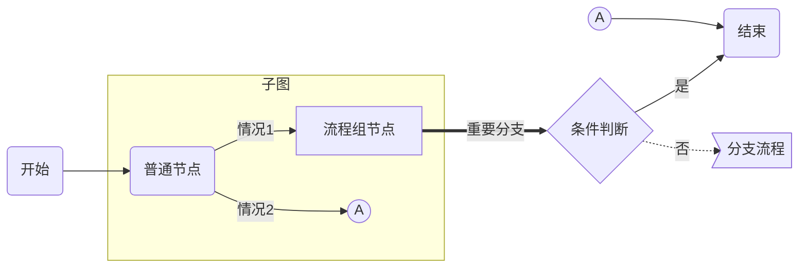
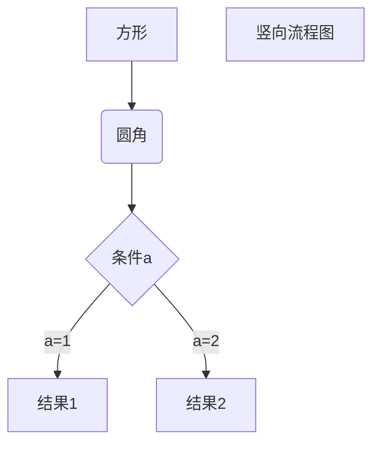
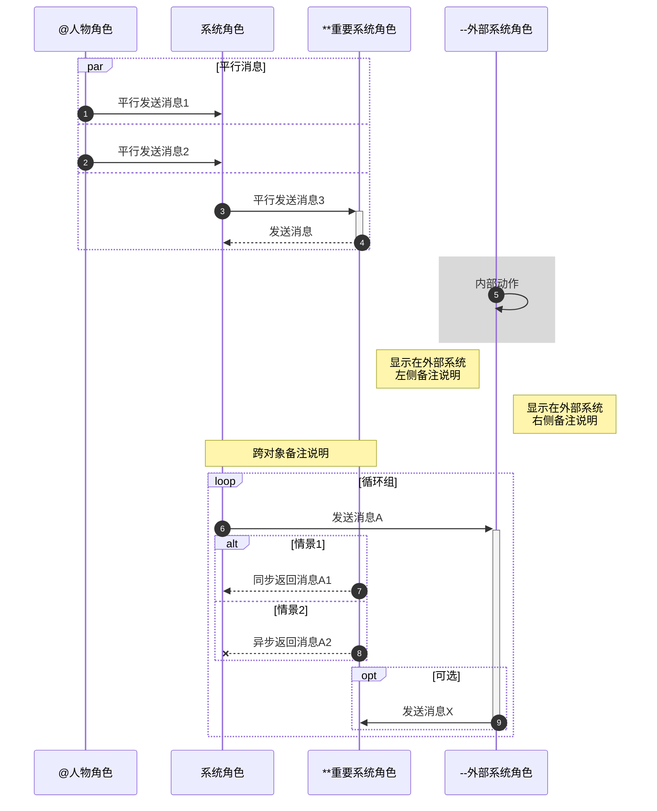
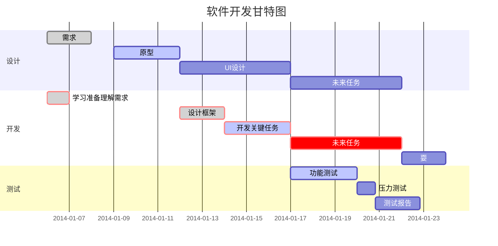
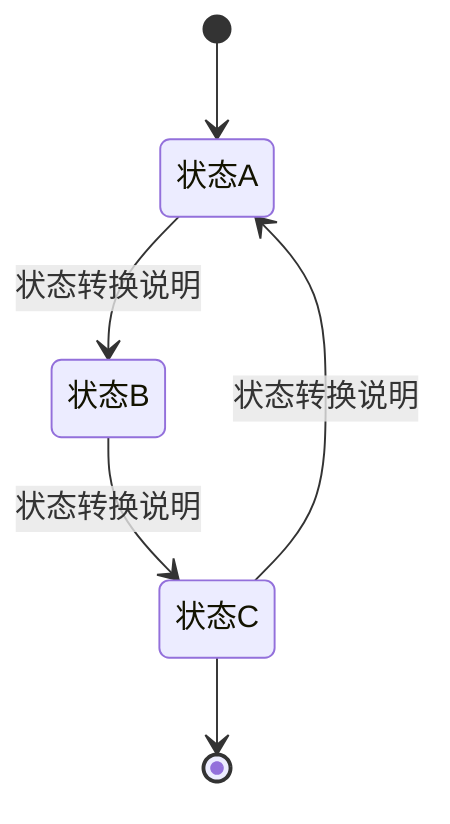
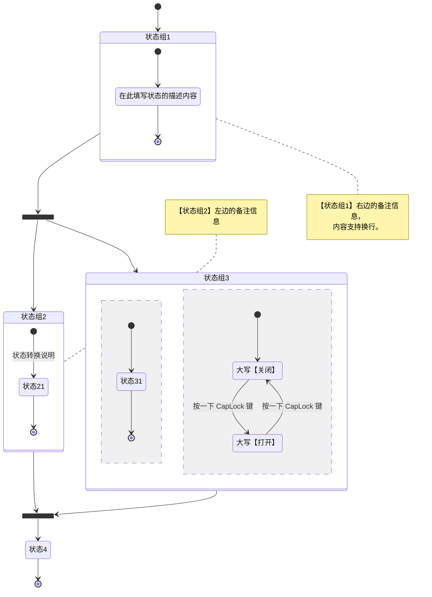
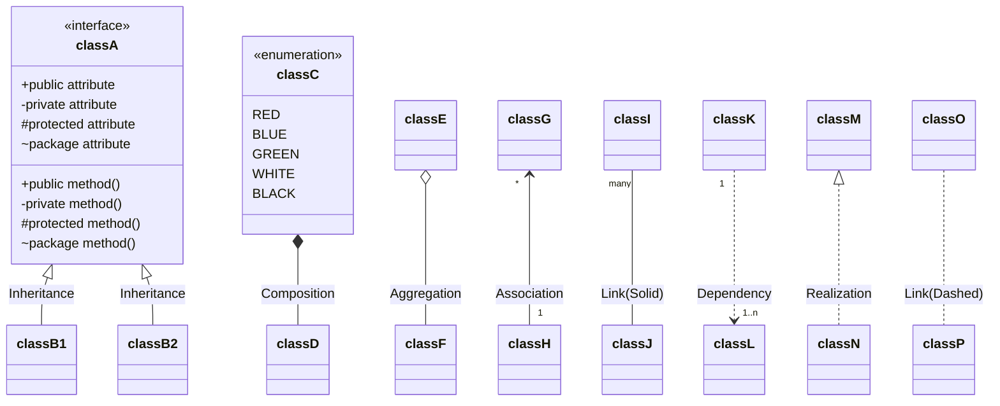
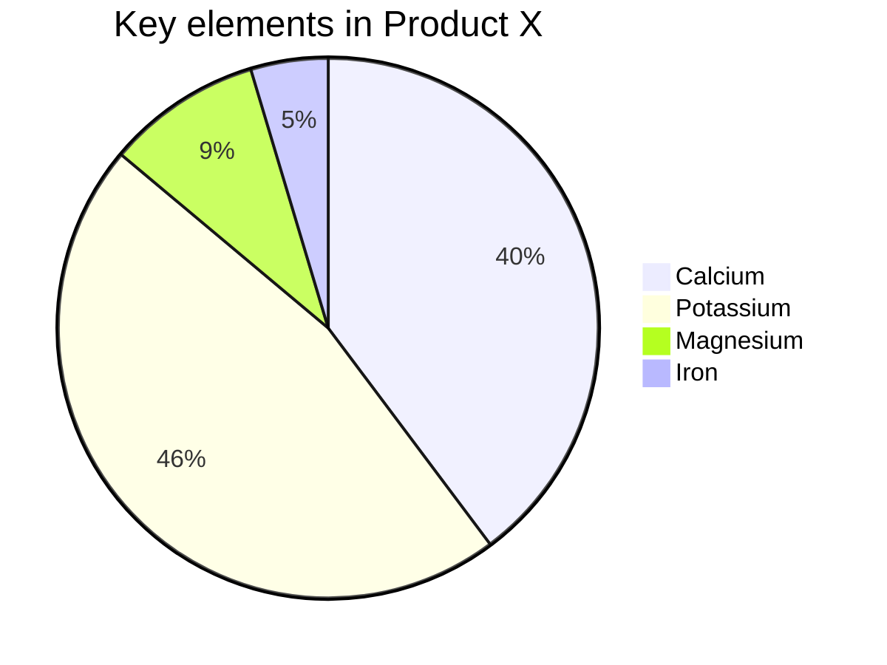
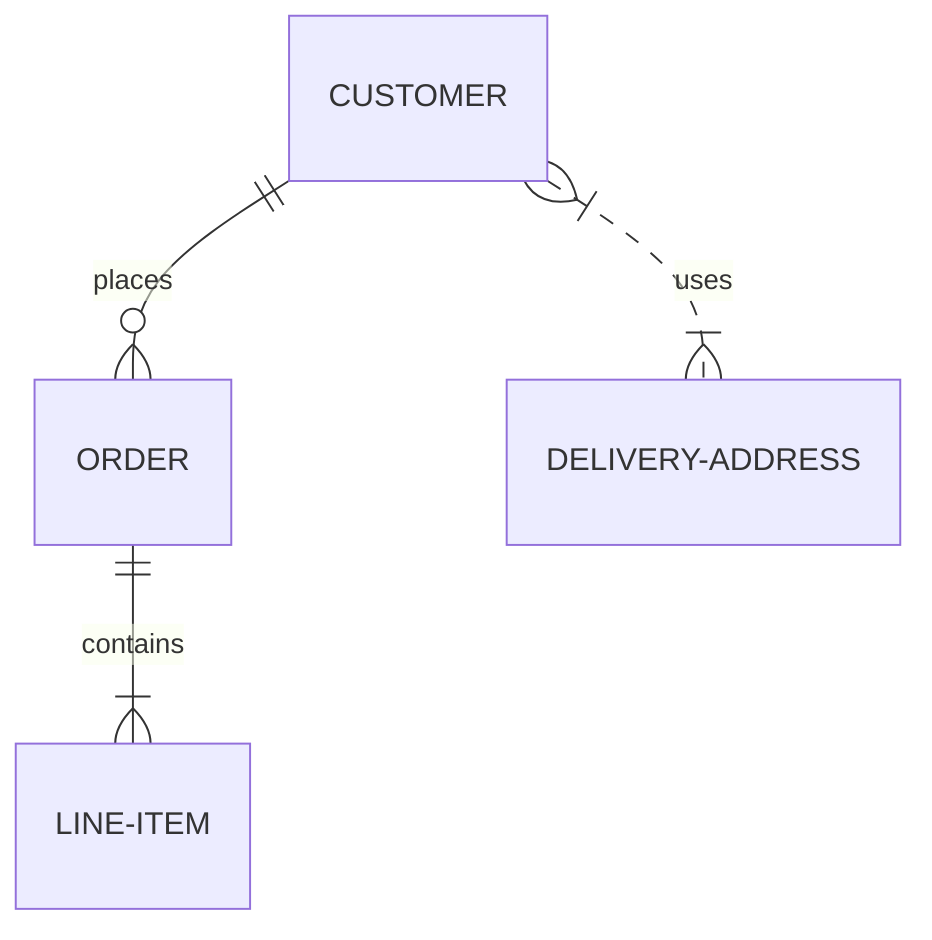
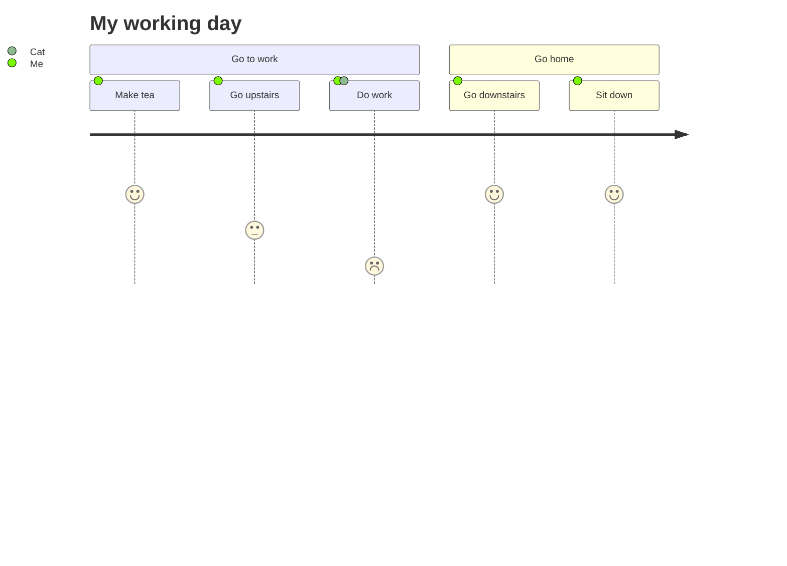

# Markdown

[toc]

## 段落格式

字体

```
*斜体文本*
_斜体文本_
**粗体文本**
__粗体文本__
***粗斜体文本***
___粗斜体文本___
<font face="黑体">我是黑体字</font>
<font face="微软雅黑">我是微软雅黑</font>
<font face="STCAIYUN">我是华文彩云</font>
<font color=red>我是红色</font>
<font color=#008000>我是绿色</font>
<font color=Blue>我是蓝色</font>
<font size=5>我是尺寸</font>
<font face="黑体" color=green size=5>我是黑体，绿色，尺寸为5</font>
```

分割线

```
***
* * *
*****
---
----------
```

删除线

```
~~BAIDU.COM~~
```

下划线

```
<u>带下划线文本</u>
```

脚注

```
[^要注明的文本]
```

## 区块


```
> 最外层
> > 第一层嵌套
> > > 第二层嵌套
```

###### 折叠文本

```markdown
<details>
  <summary>折叠时展示的文字</summary>
  展开内容。可以嵌套 markdown 语法。
</details>
```

<details>
  <summary>折叠时展示的文字</summary>
  展开内容。可以嵌套 markdown 语法。
</details>

## 表格

**HTML版**

<table>
    <tr>
        <th rowspan="2">建筑类别</th><th colspan="4">地震作用计算（设防3.0.3）</th>
    </tr>
    <tr>
        <th>6度</th><th>7度</th><th>8度</th><th>9度</th>
    </tr>
    <tr>
        <td>甲类</td><td colspan="4">高于本地区设防烈度，按批准确定</td>
    </tr>
    <tr>
        <td>乙、丙、丁类</td><td>6</td><td>7</td><td>8</td><td>9</td>
    </tr>
</table>

## 图片

```

```

## HTML元素

### 特殊字符

使用<kbd>Ctrl</kbd>+<kbd>Alt</kbd>+<kbd>Del</kbd> 重启电脑

```
使用 <kbd>Ctrl</kbd>+<kbd>Alt</kbd>+<kbd>Del</kbd> 重启电脑
```

| 符号 | 说明     | 对应编码  | 符号 | 说明           | 对应编码  |
| ---- | -------- | --------- | ---- | -------------- | --------- |
| &    | AND符号  | &amp；    | ⇐    | 双线左箭头     | &lArr；   |
| <    | 小于     | &lt；     | ⇒    | 双线右箭头     | &rArr；   |
| >    | 大于     | &gt；     | ⇑    | 双线上箭头     | &uArr；   |
| _    | 空格     | &nbsp；   | ⇓    | 双线上箭头     | &dArr；   |
| ¿    | 倒问号   | &iquest； | ⇔    | 双线水平双箭头 | &hArr；   |
| ?    | 问号     | &quest；  | ⇕    | 双线竖直箭头   | &vArr；   |
| «    | 左书名号 | &laquo；  | ♠    | 黑桃           | &spades； |
| »    | 右书名号 | &raquo；  | ♥    | 红桃           | &hearts； |
| “”   | 引号     | &quot；   | ♣    | 梅花           | &clubs；  |
| ‘    | 左单引号 | &lsquo；  | ♦    | 方块           | &diams；  |
| ’    | 右单引号 | &rsquo；  | ©    | 版权           | &copy；   |
| “    | 左双引号 | &ldquo；  | ®    | 注册商标       | &reg；    |
| ”    | 右双引号 | &rdquo；  | ™    | 商标           | &trade；  |
| ¶    | 段落符号 | &para；   | ¥    | 人民币         | &yen；    |
| §    | 章节符   | &sect；   | €    | 欧元           | &euro；   |
| ×    | 乘号     | &times；  | ¢    | 美分           | &cent；   |
| ÷    | 除号     | &divide； | £    | 英磅           | &pound；  |
| ±    | 加减号   | &plusmn； | ⊕    | 圆加号         | &oplus；  |
| ƒ    | function | &fnof；   | ½    | 二分之一       | &frac12； |
| √    | 根号     | &radic；  | ¼    | 四分之一       | &frac14； |
| ∞    | 无穷大   | &infin；  | ‰    | 千分符号       | &permil； |
| °    | 度       | &deg；    | ∴    | 所以           | &there4； |
| ≠    | 不等号   | &ne；     | π    | 圆周率         | &pi；     |
| ≡    | 恒等于   | &equiv；  | ¹    | 商标1          | &sup1；   |
| ≤    | 小于等于 | &le；     | α    | alpha          | &alpha；  |
| ≥    | 大于等于 | &ge；     | β    | beta           | &beta；   |
| ⊥    | 垂直符号 | &perp；   | γ    | gamma          | &gamma；  |
| ←    | 左箭头   | &larr；   | δ    | delta          | &delta；  |
| →    | 右箭头   | &rarr；   | θ    | theta          | &theta；  |
| ↑    | 上箭头   | &uarr；   | λ    | lambda         | &lambda； |
| ↓    | 下箭头   | &darr；   | σ    | sigma          | &sigma；  |
| ↔    | 水平箭头 | &harr；   | τ    | tau            | &tau；    |
| ↕    | 竖直箭头 | &varr；   |      |                |           |

### 转义字符

\*\* 正常显示星号 \*\*

```
\*\* 正常显示星号 \*\*
```

Markdown 支持以下这些符号前面加上反斜杠来帮助插入普通的符号：

```
\   反斜线
`   反引号
*   星号
_   下划线
{}  花括号
[]  方括号
()  小括号
##   井字号
+   加号
-   减号
.   英文句点
!   感叹号
```

### 流程图

https://mermaid-js.github.io/mermaid/#/

#### 横向流程图


```mermaid
graph LR
START(开始) --> node1(普通节点)
subgraph 子图
  node1 --> |情况1|groud1[流程组节点]
  node1 --> |情况2|A1((A))
end
%% this is a comment
groud1 ==> |重要分支|cond1{条件判断}
cond1 --> |是|END
cond1 -.-> |否|page2>分支流程]
A2((A)) --> END
END(结束)
```

````

```mermaid
graph LR
START(开始) --> node1(普通节点)
subgraph 子图
  node1 --> |情况1|groud1[流程组节点]
  node1 --> |情况2|A1((A))
end
%% this is a comment
groud1 ==> |重要分支|cond1{条件判断}
cond1 --> |是|END
cond1 -.-> |否|page2>分支流程]
A2((A)) --> END
END(结束)
```
````

###### 支持节点形状/类型

| **节点形状** | 应用建议                   | 说明                                                         |
| ------------ | -------------------------- | ------------------------------------------------------------ |
| 圆角矩形     | 普通流程节点               | 结合别名（如：node1、page2 等，可自由定义），并通过`()`指定，举例：`node1(普通节点)` |
| 菱形         | 条件判断节点               | 结合别名，并通过`{}`指定，举例：`cond1{条件判断}` `注意`「条件判断节点」的别名建议统一以`cond`为前缀 |
| 方角矩形     | 普通流程节点/子流程/状态图 | 不使用别名时的默认样式，也可以通过`[]`来强制指定，举例：`node1[流程组]` |
| 圆形         | 同页标志                   | 结合别名，并通过`(())`指定，举例：`node1((圆形节点)`         |
| 旗形         | 离页标志                   | 结合别名，并通过`>]`指定，举例：`page1>条件判断节点]` `注意`「离页标志节点」的别名必须以`page`为前缀，否则样式会与「菱形」条件判断节点冲突 |

#### 纵向流程图


```mermaid
graph TD
A[方形] --> B(圆角)
    B --> C{条件a}
    C --> |a=1| D[结果1]
    C --> |a=2| E[结果2]
    F[竖向流程图]
```

````

```mermaid
graph TD
A[方形] --> B(圆角)
    B --> C{条件a}
    C --> |a=1| D[结果1]
    C --> |a=2| E[结果2]
    F[竖向流程图]
```
````

#### 标准流程图

```flow
st=>start: 开始框
op=>operation: 处理框
cond=>condition: 判断框(是或否?)
sub1=>subroutine: 子流程
io=>inputoutput: 输入输出框
e=>end: 结束框
st->op->cond
cond(yes)->io->e
cond(no)->sub1(right)->op
```

````
```flow
st=>start: 开始框
op=>operation: 处理框
cond=>condition: 判断框(是或否?)
sub1=>subroutine: 子流程
io=>inputoutput: 输入输出框
e=>end: 结束框
st->op->cond
cond(yes)->io->e
cond(no)->sub1(right)->op
```
````

##### 标准流程图（横向）

```flow
st=>start: 开始框
op=>operation: 处理框
cond=>condition: 判断框(是或否?)
sub1=>subroutine: 子流程
io=>inputoutput: 输入输出框
e=>end: 结束框
st(right)->op(right)->cond
cond(yes)->io(bottom)->e
cond(no)->sub1(right)->op
```

````
```flow
st=>start: 开始框
op=>operation: 处理框
cond=>condition: 判断框(是或否?)
sub1=>subroutine: 子流程
io=>inputoutput: 输入输出框
e=>end: 结束框
st(right)->op(right)->cond
cond(yes)->io(bottom)->e
cond(no)->sub1(right)->op
```
````

#### 时序图（顺序图）

```sequence
对象A->对象B: 对象B你好吗?（请求）
Note right of 对象B: 对象B的描述
Note left of 对象A: 对象A的描述(提示)
对象B-->对象A: 我很好(响应)
对象A->对象B: 你真的好吗？
```

````
```sequence
对象A->对象B: 对象B你好吗?（请求）
Note right of 对象B: 对象B的描述
Note left of 对象A: 对象A的描述(提示)
对象B-->对象A: 我很好(响应)
对象A->对象B: 你真的好吗？
```
````

##### UML时序图

```sequence
Title: 标题：复杂使用
对象A->对象B: 对象B你好吗?（请求）
Note right of 对象B: 对象B的描述
Note left of 对象A: 对象A的描述(提示)
对象B-->对象A: 我很好(响应)
对象B->小三: 你好吗
小三-->>对象A: 对象B找我了
对象A->对象B: 你真的好吗？
Note over 小三,对象B: 我们是朋友
participant C
Note right of C: 没人陪我玩
```

````
```sequence
Title: 标题：复杂使用
对象A->对象B: 对象B你好吗?（请求）
Note right of 对象B: 对象B的描述
Note left of 对象A: 对象A的描述(提示)
对象B-->对象A: 我很好(响应)
对象B->小三: 你好吗
小三-->>对象A: 对象B找我了
对象A->对象B: 你真的好吗？
Note over 小三,对象B: 我们是朋友
participant C
Note right of C: 没人陪我玩
```
````

##### 标准时序图


```mermaid
sequenceDiagram
%% 设置显示消息的自动编号
autonumber

participant User as @人物角色
participant Client as 系统角色
participant Server as **重要系统角色
participant Extend as --外部系统角色

par 平行消息
  User ->> Client: 平行发送消息1
and
  User ->> Client: 平行发送消息2
and
  Client ->>+ Server: 平行发送消息3
  Server -->>- Client: 发送消息
end

%% 设置区域高亮
rect rgba(128, 128, 128, 0.3)
  Extend ->> Extend: 内部动作
end

Note left of Extend: 显示在外部系统<br />左侧备注说明
Note right of Extend: 显示在外部系统<br />右侧备注说明
Note over Client,Server: 跨对象备注说明
loop 循环组
  Client ->>+ Extend: 发送消息A
  alt 情景1
    Server -->> Client: 同步返回消息A1
  else 情景2
    Server --X Client: 异步返回消息A2
  end
  opt 可选
    Extend ->>- Server: 发送消息X
  end
end
```

````

```mermaid
sequenceDiagram
%% 设置显示消息的自动编号
autonumber

participant User as @人物角色
participant Client as 系统角色
participant Server as **重要系统角色
participant Extend as --外部系统角色

par 平行消息
  User ->> Client: 平行发送消息1
and
  User ->> Client: 平行发送消息2
and
  Client ->>+ Server: 平行发送消息3
  Server -->>- Client: 发送消息
end

%% 设置区域高亮
rect rgba(128, 128, 128, 0.3)
  Extend ->> Extend: 内部动作
end

Note left of Extend: 显示在外部系统<br />左侧备注说明
Note right of Extend: 显示在外部系统<br />右侧备注说明
Note over Client,Server: 跨对象备注说明
loop 循环组
  Client ->>+ Extend: 发送消息A
  alt 情景1
    Server -->> Client: 同步返回消息A1
  else 情景2
    Server --X Client: 异步返回消息A2
  end
  opt 可选
    Extend ->>- Server: 发送消息X
  end
end
```
````

角色在标准的一类样式的基础上，增加三类扩展的样式，在输出HTML后应用 [VLOOK™](https://github.com/madmaxchow/VLOOK) 插件后渲染为不同的样式：

- **人物角色**：在角色名称前添加 at 符号`@`，如`@人物角色`
- **重要系统角色**：在角色名称前添加两个星号`**`，如`**后端支撑系统名称`
- **外部系统角色**：在角色名称前添加两个减号`--`，如`--外部系统名称`

#### 甘特图


```mermaid
%% 语法示例
        gantt
        dateFormat  YYYY-MM-DD
        title 软件开发甘特图
        section 设计
        需求                      :done,    des1, 2014-01-06,2014-01-08
        原型                      :active,  des2, 2014-01-09, 3d
        UI设计                     :         des3, after des2, 5d
    未来任务                     :         des4, after des3, 5d
        section 开发
        学习准备理解需求                      :crit, done, 2014-01-06,24h
        设计框架                             :crit, done, after des2, 2d
        开发关键任务                           :crit, active, 3d
        未来任务                              :crit, 5d
        耍                                   :2d
        section 测试
        功能测试                              :active, a1, after des3, 3d
        压力测试                               :after a1  , 20h
        测试报告                               : 48h
```

````

```mermaid
%% 语法示例
        gantt
        dateFormat  YYYY-MM-DD
        title 软件开发甘特图
        section 设计
        需求                      :done,    des1, 2014-01-06,2014-01-08
        原型                      :active,  des2, 2014-01-09, 3d
        UI设计                     :         des3, after des2, 5d
    未来任务                     :         des4, after des3, 5d
        section 开发
        学习准备理解需求                      :crit, done, 2014-01-06,24h
        设计框架                             :crit, done, after des2, 2d
        开发关键任务                           :crit, active, 3d
        未来任务                              :crit, 5d
        耍                                   :2d
        section 测试
        功能测试                              :active, a1, after des3, 3d
        压力测试                               :after a1  , 20h
        测试报告                               : 48h
```
````

#### 状态图


```mermaid
stateDiagram
[*] --> 状态A
状态A --> 状态B : 状态转换说明
状态B --> 状态C : 状态转换说明
状态C --> 状态A : 状态转换说明
状态C --> [*]
```

```text
stateDiagram
[*] --> 状态A
状态A --> 状态B : 状态转换说明
状态B --> 状态C : 状态转换说明
状态C --> 状态A : 状态转换说明
状态C --> [*]
```

##### 状态组


```mermaid
stateDiagram
state fork_state <<fork>>


[*] --> 状态组1
状态组1 --> fork_state
fork_state --> 状态组2
fork_state --> 状态组3


note right of 状态组1
    【状态组1】右边的备注信息，
    内容支持换行。
end note
state 状态组1 {
    状态11 : 在此填写状态的描述内容
    [*] --> 状态11
    状态11 --> [*]
}


note left of 状态组2 : 【状态组2】左边的备注信息
state 状态组2 {
    [*] --> 状态21: 状态转换说明
    状态21 --> [*]
}


%% 可以编写注释（以两个英文百分号开头)
state 状态组3 {
    [*] --> 状态31
    状态31 --> [*]
    --
    [*] --> 大写【关闭】
    大写【关闭】 --> 大写【打开】 : 按一下 CapLock 键
    大写【打开】 --> 大写【关闭】 : 按一下 CapLock 键
}


state join_state <<join>>


状态组2 --> join_state
状态组3 --> join_state
join_state --> 状态4
状态4 --> [*]
```

````

```mermaid
stateDiagram
state fork_state <<fork>>


[*] --> 状态组1
状态组1 --> fork_state
fork_state --> 状态组2
fork_state --> 状态组3


note right of 状态组1
    【状态组1】右边的备注信息，
    内容支持换行。
end note
state 状态组1 {
    状态11 : 在此填写状态的描述内容
    [*] --> 状态11
    状态11 --> [*]
}


note left of 状态组2 : 【状态组2】左边的备注信息
state 状态组2 {
    [*] --> 状态21: 状态转换说明
    状态21 --> [*]
}


%% 可以编写注释（以两个英文百分号开头)
state 状态组3 {
    [*] --> 状态31
    状态31 --> [*]
    --
    [*] --> 大写【关闭】
    大写【关闭】 --> 大写【打开】 : 按一下 CapLock 键
    大写【打开】 --> 大写【关闭】 : 按一下 CapLock 键
}


state join_state <<join>>


状态组2 --> join_state
状态组3 --> join_state
join_state --> 状态4
状态4 --> [*]

```
````

#### 类图


```mermaid
classDiagram
classA <|-- classB1 : Inheritance
classA <|-- classB2 : Inheritance
classC *-- classD : Composition
classE o-- classF : Aggregation
classG "*" <-- "1" classH : Association
classI "many" -- classJ : Link(Solid)
classK "1" ..> "1..n" classL : Dependency
classM <|.. classN : Realization
classO .. classP : Link(Dashed)

class classA~Class~{
    <<interface>>
    +public attribute
    -private attribute
    #protected attribute
    ~package attribute
    +public method()
    -private method()
    #protected method()
    ~package method()
}

class classC{
    <<enumeration>>
    RED
    BLUE
    GREEN
    WHITE
    BLACK
}
```

```text
classDiagram
classA <|-- classB1 : Inheritance
classA <|-- classB2 : Inheritance
classC *-- classD : Composition
classE o-- classF : Aggregation
classG "*" <-- "1" classH : Association
classI "many" -- classJ : Link(Solid)
classK "1" ..> "1..n" classL : Dependency
classM <|.. classN : Realization
classO .. classP : Link(Dashed)

class classA~Class~{
    <<interface>>
    +public attribute
    -private attribute
    #protected attribute
    ~package attribute
    +public method()
    -private method()
    #protected method()
    ~package method()
}

class classC{
    <<enumeration>>
    RED
    BLUE
    GREEN
    WHITE
    BLACK
}
```

#### 饼图


```mermaid
pie
    title Key elements in Product X
    "Calcium" : 42.96
    "Potassium" : 50.05
    "Magnesium" : 10.01
    "Iron" :  5
```

```text
pie
    title Key elements in Product X
    "Calcium" : 42.96
    "Potassium" : 50.05
    "Magnesium" : 10.01
    "Iron" :  5
```

#### 实体关系图


```mermaid
erDiagram
    CUSTOMER ||--o{ ORDER : places
    ORDER ||--|{ LINE-ITEM : contains
    CUSTOMER }|..|{ DELIVERY-ADDRESS : uses
```

```
erDiagram
    CUSTOMER ||--o{ ORDER : places
    ORDER ||--|{ LINE-ITEM : contains
    CUSTOMER }|..|{ DELIVERY-ADDRESS : uses
```

#### 客户旅程地图


```mermaid
journey
    title My working day
    section Go to work
      Make tea: 5: Me
      Go upstairs: 3: Me
      Do work: 1: Me, Cat
    section Go home
      Go downstairs: 5: Me
      Sit down: 5: Me
```

```
journey
    title My working day
    section Go to work
      Make tea: 5: Me
      Go upstairs: 3: Me
      Do work: 1: Me, Cat
    section Go home
      Go downstairs: 5: Me
      Sit down: 5: Me
```

## emoji

- 完整的编码 [emoji-sequences.txt](https://unicode.org/Public/emoji/13.0/emoji-sequences.txt)

- 格式为：`ODE;`，其中，`CODE` 部分可以由上表查得 (别忘了末尾的分号，半角模式)。
  
  **例子：** 查到了 表情对应的 `CODE` 为 `1F34E`，则对应的完整表情代码为 `🍎`

- 汇总呈现：https://www.webfx.com/tools/emoji-cheat-sheet/
- 分类呈现：https://www.cnblogs.com/minghaiJ/p/10685965.html
- 这里有 Emoji unicode 的 Table: https://apps.timwhitlock.info/emoji/tables/unicode
- 各类编码查询：[Unicode 14 Character Code Charts](http://www.unicode.org/charts/)。表情类，可以拖到 「**Emoji & Pictographs**」] 部分查看。

### emoji 支持

---

---

---

>###### 表情
>
>😀 😁 😂 😃 😄 😅 😆 😉 😊 😋 😎 😍 😘 😗 😙 😚 ☺ 🙂 🤗 😇 🤓 🤔 😐 😑 😶 🙄 😏 😣 😥 😮 🤐 😯 😪 😫 😴 😌 😛 😜 😝 😒 😓 😔 😕 🙃 🤑 😲 😷 🤒 🤕 🙁 😖 😞 😟 😤 😢 😭 😦 😧 😨 😩 😬 😰 😱 😳 😡 😠

> ###### 动物
>
> 🐱 😺 😸 😹 😻 😼 😽 🙀 😿 😾 🙈 🙉 🙊 🐵 🐒 🐕 🐩 🐺 🐱 🐈 🦁 🐯 🦄 🐂 🐃 🐄 🐷 🐖 🐗 🐽 🐏 🐑 🐐 🐪 🐫 🐘 🐭 🐁 🐀 🐹 🐰 🐇 🐿 🐨 🐼 🐾 🦃 🐓 🐣 🐤 🐥 🐦 🐧 🕊 🐸 🐊 🐍 🐲 🐉 🐳 🐋 🐬 🐟 🐡 🐙 🐚 🦀 🐌 🐜 🐝 🐞 🕷 🦂 🕸

> ###### 办公
>
> 📱 📲 ☎ 📞 📟 📠 🔋 🔌 💻 💽 💾 💿 📀 🎥 📺 📷 📹 📼 🔍 🔎 🔬 🔭 📡 📔 📕 📖 📗 📘 📙 📚 📓 📃 📜 📄 📰 📑 🔖 💳 ✉ 📧 📨 📩 📤 📥 📦 📫 📪 📬 📭 📮 ✏ ✒ 📝 📁 📂 📅 📆 📇 📈 📉 📊 📋 📍 📎 📏 📐 ✂ 🔒 🔓 🔏 🔐 🔑

>###### 饮食
>
>🍇 🍈 🍉 🍊 🍋 🍌 🍍 🍎 🍏 🍑 🍒 🍓 🍅 🍆 🌽 🍄 🌰 🍞 🍖 🍗 🍔 🍟 🍕 🍳 🍲 🍱 🍘 🍙 🍚 🍛 🍜 🍝 🍠 🍢 🍣 🍤 🍥 🍡 🍦 🍧 🍨 🍩 🍪 🎂 🍰 🍫 🍬 🍭 🍮 🍯 🍼 ☕ 🍵 🍶 🍷 🍸 🍹 🍴

---

---

---

> ###### 身体
>
> 👂 👣 👀 👁 👁 🗨 👅 👄

> ###### 手机
>
> 📱 📲 📶 📳 📴 ☎ 📞 📟 📠

> ###### 恐怖
>
> 😈 👿 👹 👺 💀 ☠ 👻 👽 👾 💣

> ###### 星座
>
> ♈ ♉ ♊ ♋ ♌ ♍ ♎ ♏ ♐ ♑ ♒ ♓ ⛎

---

---

---

> ###### 公共
>
> ♻ 🏧 🚮 🚰 ♿ 🚹 🚺 🚻 🚼 🚾 ⚠ 🚸 ⛔ 🚫 🚳 🚭 🚯 🚱 🚷 🔞 💈©️ ®️ ™️ 

> ###### 建筑
>
> 🏠 🏡 🏢 🏣 🏤 🏥 🏦 🏨 🏩 🏪 🏫 🏬 🏭 🏯 🏰 💒 🗽 ⛪ 🌆 🌇 🌉

>###### 植物
>
>💐 🌸 💮 🏵 🌹 🌺 🌻 🌼 🌷 🌱 🌲 🌳 🌴 🌵 🌾 🌿 ☘ 🍀 🍁 🍂 🍃

> ###### 心形
>
> 💘 ❤ 💓 💔 💕 💖 💗 💙 💚 💛 💜 💝 💞 💟 ❣

---

---

---

> ###### 自然
>
> 🌍 🌎 🌏 🌐 🌑 🌒 🌓 🌔 🌕 🌖 🌗 🌘 🌙 🌚 🌛 🌜 ☀ 🌝 🌞 ⭐ 🌟 🌠 ☁ ⛅ ☔ ⚡ ❄ 💧 🌊

>###### 文体
>
>🎪 🎭 🎨 🎰 🚣 🛀 🎫 🏆 ⚾ 🏈 🏉 🎾 🎱 🎳 ⛳ 🎣 🎽 🎿 🏂 🏄 🏇 🏊 🚴 🚵 🎯 🎮 🎲 🎷 🎸 🎺 🎻 🎬

> ###### 时钟
>
> 🕛 🕧 🕐 🕜 🕑 🕝 🕒 🕞 🕓 🕟 🕔 🕠 🕕 🕡 🕖 🕢 🕗 🕣 🕘 🕤 🕙 🕥 🕚 🕦 ⌛ ⏳ ⌚ ⏰ ⏱ ⏲ 🕰

> ###### 手势
>
> 💪 👈 👉 ☝ 👆 🖕 👇 ✌ 🖖 🤘 🖐 ✋ 👌 👍 👎 ✊ 👊 👏 👐 ✍ 💅

---

---

---

>###### 标志
>
>♠ ♥ ♦ ♣ 🀄 🎴 🔇 🔈 🔉 🔊 📢 📣 💤 💢 💬 💭 ♨ 🌀 🔔 🔕 ✡ ✝ 🔯 📛 🔰 🔱 ⭕ ✅ ☑ ✔ ✖ ❌ ❎ ➕ ➖ ➗ ➰ ➿ 〽 ✳ ✴ ❇ ‼ ⁉ ❓ ❔ ❕ ❗ © ® ™ 🎦 🔅 🔆 💯 🔠 🔡 🔢 🔣 🔤 🅰 🆎 🅱 🆑 🆒 🆓 ℹ 🆔 Ⓜ 🆕 🆖 🅾 🆗 🅿 🆘 🆙 🆚 🈁 🈂 🈷 🈶 🈯 🉐 🈹 🈚 🈲 🉑 🈸 🈴 🈳 ㊗ ㊙ 🈺 🈵 ▪ ▫ ◻ ◼ ◽ ◾ ⬛ ⬜ 🔶 🔷 🔸 🔹 🔺 🔻 💠 🔲 🔳 ⚪ ⚫ 🔴 🔵 ⬆ ↗ ➡ ↘ ⬇ ↙ ⬅ ↖ ↕ ↔ ↩ ↪ ⤴ ⤵ 🔃 🔄 🔙 🔚 🔛 🔜 🔝◀️ ⬇️ ▶️  ⏬ ⏫ ⤵️ ⤴️ ↩️ ↪️ ↔️ ↕️ ⏪ ⏩ ℹ️

> ###### 物品
>
> 💌 💎 🔪 💈 🚪 🚽 🚿 🛁 ⌛ ⏳ ⌚ ⏰ 🎈 🎉 🎊 🎎 🎏 🎐 🎀 🎁 📯 📻 📱 📲 ☎ 📞 📟 📠 🔋 🔌 💻 💽 💾 💿 📀 🎥 📺 📷 📹 📼 🔍 🔎 🔬 🔭 📡 💡 🔦 🏮 📔 📕 📖 📗 📘 📙 📚 📓 📃 📜 📄 📰 📑 🔖 💰 💴 💵 💶 💷 💸 💳 ✉ 📧 📨 📩 📤 📥 📦 📫 📪 📬 📭 📮 ✏ ✒ 📝 📁 📂 📅 📆 📇 📈 📉 📊 📋 📍 📎 📏 📐 ✂ 🔒 🔓 🔏 🔐 🔑 🔫 🔧 🔩 🔗 💊 🚬 🔮 🚩 🎌 💦 💨

>###### 人物
>
>👦 👧 👨 👩 👴 👵 👶 👱 👮 👲 👳 👷 ⛑ 👸 💂 🕵 🎅 👰 👼 💆 💇 🙍 🙎 🙅 🙆 💁 🙋 🙇 🙌 🙏 🗣 👤 👥 🚶 🏃 👯 💃 🕴 👫 👬 👭 💏 💑 👪 👨‍ 👩‍ 👧 👨‍ 👩‍ 👧‍ 👦 👨‍ 👩‍ 👦‍ 👦 👨‍ 👩‍ 👧‍ 👧 👩‍ 👩‍ 👦 👩‍ 👩‍ 👧 👨 👩 👦 👨 👩 👧 👨 👩 👧 👦 👨 👩 👦 👦 👨 👩 👧 👧 👨 👨 👦 👨 👨 👧 👨 👨 👧 👦 👨 👨 👦 👦 👨 👨 👧 👧 👩 👩 👦 👩 👩 👧 👩 👩 👧 👦 👩 👩 👦 👦 👩 👩 👧 👧

>###### 交通
>
>🚂 🚃 🚄 🚅 🚆 🚇 🚈 🚉 🚊 🚝 🚞 🚋 🚌 🚍 🚎 🚏 🚐 🚑 🚒 🚓 🚔 🚕 🚖 🚗 🚘 🚚 🚛 🚜 🚲 ⛽ 🚨 🚥 🚦 🚧 ⚓ ⛵ 🚣 🚤 🚢 ✈ 💺 🚁 🚟 🚠 🚡 🚀

---

> ###### 数字
>
> 1️⃣ 2️⃣ 3️⃣ 4️⃣ 5️⃣ 6️⃣ 7️⃣ 8️⃣ 9️⃣ 0️⃣ #️⃣

> ###### 旗帜
>
> 🏁🚩🎌🏴🏳️🏳️‍🌈🏳️‍⚧️🏴‍☠️

