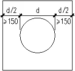
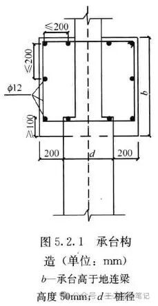
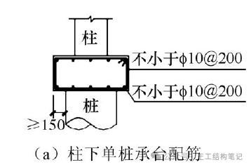
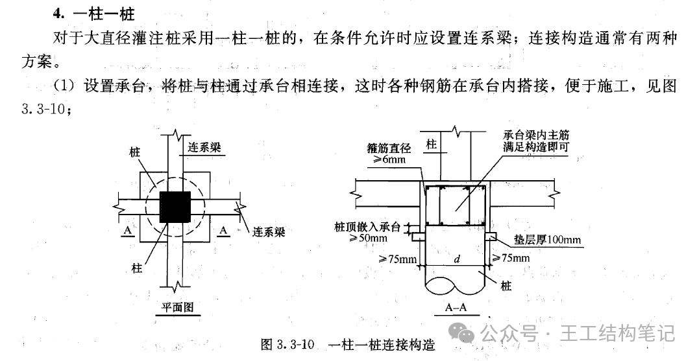
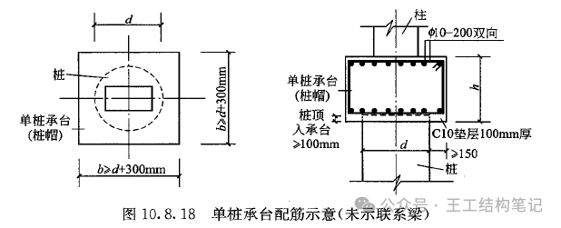
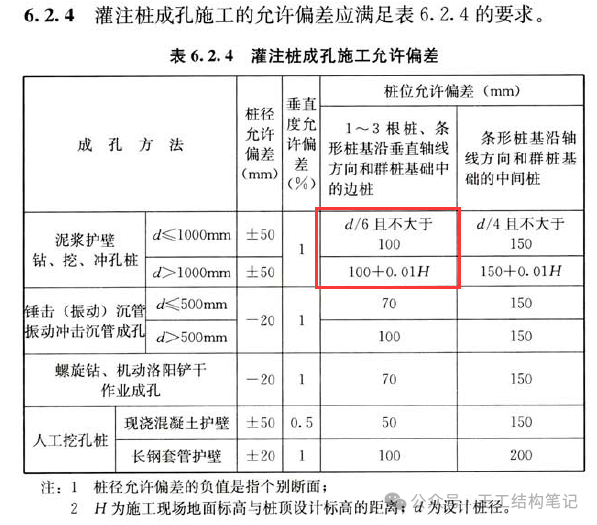

# 单桩承台的平面尺寸取值及配筋
王冲锋 王工结构笔记 *2024年4月1日 07:20*

**《桩基规范》和《地基规范》虽然明确了承台的构造尺寸及配筋要求，但大家认为一柱一桩承台受力并不同于多桩承台，因此关于一柱一桩承台的尺寸及配筋常有争议，笔者查了一些资料对此进行总结。**

**《建筑地基基础设计规范》GB50007-2011**

8.5.17-1 承台的宽度不应小于500mm ，边桩中心至承台边缘的距离 **不宜** 小于桩的直径或边长，且桩的外边缘至承台边缘的距离不小于150mm。

8.5.17-3 承台的配筋，对于矩形承台，其钢筋应按双向均匀通长布置，钢筋直径不宜小于10mm，间距不宜大于200mm，......柱下独立桩基承台的最小配筋率不应小于0.15%

**《建筑桩基技术规范》JGJ94-2008**

4.2.1-1 柱下独立桩基承台的最小宽度不应小于500mm，边桩中心至承台边缘的距离 **不应** 小于桩的直径或边长，且桩的外边缘至承台边缘的距离不应小于150mm。

4.2.3-1 柱下独立桩基承台钢筋应通长配置。......承台纵向受力钢筋的直径不应小于12mm，间距不应大于200mm。柱下独立桩基承台的最小配筋率不应小于0.15%。

按以上两本常用规范从严考虑，一柱一桩承台平面尺寸取值如上图所示；配筋有如下规定：直径不小于12mm，间距不大于200mm，配筋率不小于0.15%；此种做法也比较常见，有的项目审图也要求按此执行。

规范对承台尺寸的构造要求主要是考虑嵌固和抗冲切、抗剪切要求，对于一柱一桩承台，即使桩和柱存在偏心，但一般也不会超出各自投影范围，因此没有弯、剪、扭、冲切受力问题，过大加大承台尺寸也对嵌固无改善，承台主要受到柱和桩的局压作用，起到衔接桩与柱的作用，基于以上原因按《桩基规范》和《地基规范》构造要求去控制一柱一桩承台是否有必要？以下看一下查到的一些资料。

**《大直径扩底灌注桩技术规程》JGJ-T225-2010**

5.2.1-5 一柱一桩的承台宜按本规程图5.2.1配置受力钢筋，且不宜小于Φ12@200mm。

按上图可知，一柱一桩承台， **平面尺寸每侧大于桩边200mm，配筋Φ12@200** 。

**《贵州省建筑桩基设计与施工技术规程》DBJ52/T088-2018**

4.2.1-2 大直径桩承台的最小厚度不应小于600mm，且应大于连系梁的高50mm，边桩外边缘中心至承台边缘的距离不应小于200mm；一柱一桩设置单桩承台时厚度不宜小于1000mm，上下宜各配不少于Φ12@150 的双向分布筋,承台上下纵向受力钢筋及高度范围内的水平分布筋宜形成封闭箍筋；

**《重庆市建筑地基基础设计规范》DBJ50-047-2016**

8.7.14-2 柱下单桩承台，宜在承台顶部配置Φ12@100 的钢筋网片；单柱单桩的承台宽度可适当减小，桩的外边缘至承台边缘的距离不应小于100mm ，当柱全断面落于桩钢筋笼范围时，可不做承台；

**《北京地区建筑地基基础勘察设计规范》DBJ11-501-2009**

9.4.16-1 柱下单桩承台，承台厚度不宜小于300mm，承台宽度不宜小于500mm ，且承台边缘至桩外边缘的距离不宜小于150mm。

9.4.16-2 承台的钢筋配置除满足计算要求外，尚应符合下列规定：

1）柱下独立桩基承台受力钢筋应通长配置，如图9.4.16， 最小配筋率不应小于0.15%，且不宜小于小Φ10@200mm。

**刘金砺《建筑桩基技术规范应用手册》**

本书作者为桩基规范主编，有权威性，承台平面尺寸每侧大于桩边不小于75mm，但A-A剖面可能有误，其更像是承台梁，与单桩承台不匹配。

**《混凝土结构构造手册》（第五版）**

本书应用广泛，承台平面尺寸每侧大于桩边150mm，配筋10@200双向。

**湖南省房屋建筑和市政基础设施工程施工图设计文件审查要点(2023年版)**

23\. 单桩桩帽仅做为桩与主体竖向构件过渡连接用途时，是否需要满足最小配筋率，还是按构造配筋即可？

答：可以不满足0.15%配筋率的要求。

24\. 对大直径旋挖桩的承台，在满足计算的情况下，是否可以不满足建筑《建筑桩基础技术规范》JGJ94-2008第4.2.1条“边桩中心至承台边缘的距离不应小于桩的直径或边长”？

答：无地下室底板时，除单桩承台和条形承台梁外，其他承台的桩外边缘距离需满足《建筑桩基础技术规范》JGJ94-2008 第4.2.1 条规定；有地下室底板时，承台在满足嵌固及抗冲切、抗剪切的情况下，一般可不满足桩基规范第4.2.1 条“边桩中心至承台边缘的距离不应小于桩的直径或边长”的要求，建议边缘边距不小于200mm。

**综上，查到的有明确规定的资料中对于一柱一桩承台平面尺寸偏向于不按多桩承台的构造控制，承台平面尺寸大** **于桩边150~200mm，建议项目中承台尺寸取值适当考虑《桩基规范》6.2.4对桩位偏差的规定，避免承台尺寸过小与桩难以连接；对于配筋，除了北京地标明确单桩承台配筋率不应小于0.15%外，其余资料均无此规定，其中重庆地标要求桩顶宜布置Φ12@100钢筋网，这主要是为了解决柱对桩的局压问题；配筋形式上，单桩承台宜设置三向环箍使承台内混凝土处于三向约束状态，可更好的起到提高混凝土局压承载力并加强锚固效果的作用。**

