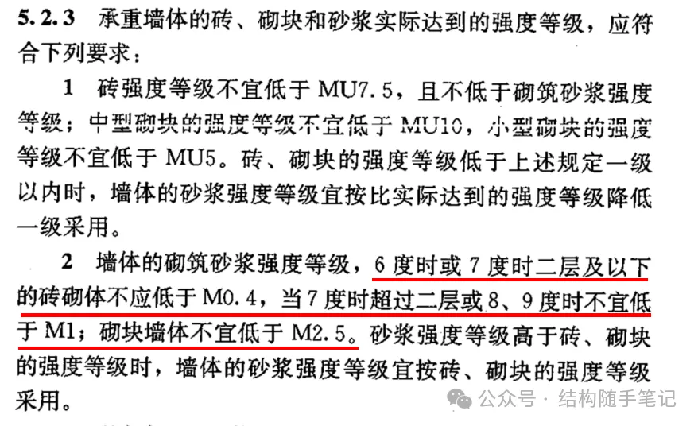

****01 引言****

在砌体结构加固过程中，相关规范或规程对原砌体砂浆强度有明确要求。本文汇总了这些规定，分析了受剪承载力不够时，采用钢筋网砂浆面层加固时，为何原砌筑砂浆强度等级不能高于M2.5；探讨了当砂浆强度低于M0.4时，采用钢筋网砂浆面层加固时需要采取的措施。

****02 采用******板墙面层加固时，墙体的砂浆强度等级要求**

采用混凝土板墙加固墙体时，《砌体结构加固设计规范》GB50702和《既有建筑鉴定与加固通用规范》GB55021中没有砌筑砂浆强度的要求，而《建筑抗震鉴定标准》GB50023及《建筑抗震加固技术规程》JGJ116则有砂浆强度等级的相关规定。

**1）《建筑抗震鉴定标准》GB50023中第5.2.3条是对A类砌体房屋砂浆强度的要求，第5.3.4条是**对B类砌体房屋砂浆强度的要求**。**

**2)《**建筑抗震加固技术规程**》JGJ116-2009中第5.3.8.2条，墙段增强系数取值与砌筑砂浆强度有关。**  

**理解：**

《建筑抗震鉴定标准》GB50023与《建筑抗震加固技术规程》JGJ116是抗震鉴定与加固设计配套的工程标准，所以抗震加固设计时，墙体砂浆强度也要满足《建筑抗震鉴定标准》GB50023中规定的A、B类建筑的最低要求限值。以A类建筑为例，加固时，原砌筑砂浆强度**不宜**（7度时超过二层或8、9度时）小于M1，**不应**（6度时或7度二层及以下）小于M0.4。

****03**** **采用钢筋网砂浆面层加固时，墙体的砂浆强度等级要求**

采用水泥砂浆面层或钢筋网砂浆面层加固墙体时，《建筑抗震鉴定标准》GB50023、《建筑抗震加固技术规程》JGJ116、《砌体结构加固设计规范》GB50702及《既有建筑鉴定与加固通用规范》GB55021均对墙体砌筑砂浆的强度等级提出了明确要求。

**1)《建筑抗震鉴定标准》GB50023-2009中第5.2.3是对A类建筑的要求，5.3.4是对B类建筑的要求。**

**2)《建筑抗震加固技术规程》JGJ 116-2009第5.3.2条，规定原砌筑砂浆强度等级不宜高于M2.5。**

**3 )****《砌体结构加固设计规范》GB 50702-2011的第6.1.2条，明确规定了受压构件和受剪构件的砂浆强度的最低要求。**

**4）《既有建筑鉴定与加固通用规范》GB55021-2021第6.7.3条 ，与**《砌体结构加固设计规范》GB 50702-2011规定相同，**规定了受压构件有砂浆强度的最低要求。**

**对于《建筑抗震加固技术规程》JGJ 116-2009 第 5.3.2 条规定的砌筑砂浆强度等级不宜高于 M2.5，而《砌体结构加固设计规范》GB 50702-2011第6.1.2 条规定砌筑砂浆强度等级不应低于 M2.5，如何理解？**

《山东省施工图审查常见问题解答》中有具体解答，解答如下：

1 当现行各工程建设标准规定不一致时，首先满足通用规范相关要求，其它推荐性标准建议按大管小、新管旧、专门管一般的原则。因此，砌体结构加固应执行《既有建筑鉴定与加固通用规范》GB55021-2021。《砌体结构加固设计规范》GB50702-2011实施后，《建筑抗震加固技术规程》JGJ 116-2009中砌体加固的有关内容也可作为设计参考。《既有建筑鉴定与加固通用规范》GB55021-2021第 6.7.3-1条沿用了《砌体结构加固设计规范》第 6.1.2-1 条的规定，且提升为强制性条文。

2 按结构概念理解,《建筑抗震加固技术规程》JGJ116-2009 注重加固的效率，原砌体的砌筑砂浆强度等级高于M2.5时，这种加固方法效果较差，本规程的抗震加固承载力计算公式只适用于不大于M2.5情况。《砌体结构加固设计规范》GB 50702-2011注重工程质量和安全，本规范6.1.2 条规定了采用这种加固方法加固砌体时，原砌筑砂浆的强度等级最小要求，并且采用钢筋网砂浆面层的方法加固墙体时，采用了与JGJ116不同的计算方法。以上两本标准，按国家标准化法，通用规范实施后，都是现行推荐性标准，具体工程的结构设计师有判定是否采用的权责。

结论建议如下：当采用钢筋网水泥砂浆面层加固法加固砌体构件：用于受压承载力加固时，原砌筑砂浆强度等级不应低于M2.5（《既有建筑鉴定与加固通用规范》GB55021-2021 第 6.7.3-1 强条）；当受压承载力满足要求，仅用于受剪承载力加固时，可按《砌体结构加固设计规范》GB 50702-2011第 6.3 节、6.4 节进行受剪承载力验算，并符合本规范相关规定要求【6.1.2 条：对砖砌体受剪构件，原砌筑砂浆强度等级不宜低于M1，若为低层房屋，允许不低于M0.4；但对砌块砌体，其原砌筑砂浆强度等级不应低于 M2.5（《既有建筑鉴定与加固通 用规范》GB55021-2021 第 6.7.3-1 强条）】；当受压承载力满足要求，仅用于受剪承载力加固时，当满足以上原砌筑砂浆最低要求，且不大于 M2.5 时，也可按《建筑抗震加固技术规程》JGJ 116-2009 进行砌体抗震加固设计。

**《建筑抗震加固技术规程》**JGJ 116-2009（以下简称规程）**与《砌体结构加固设计规范》**GB 50702-2011（以下简称规范），**在加固后墙体的计算方法上存在差异： 规程采用的是增强系数法，而规范则采用受剪承****载力计算法。**

规程中表5.3.2-1详细列出了单面加固与双面加固时的基准增强系数。从该表格可以观察到，无论是单面加固还是双面加固，随着砂浆强度等级的提升，基准增强系数均呈现逐渐减小的趋势。

规程第5.3.2条文解释也说明了原因：当砌筑砂浆的强度等级超过M2.5时，面层加固的效果变得不显著，此时的增强系数接近于1.0。这与表5.3.2-1中显示的增强系数随砂浆强度提高而逐渐减小的趋势是一致的。

规范采用的是受剪承载力计算法，砌体受剪承载力与原墙体砌筑砂浆强度等级、钢筋网水泥面层的厚度以及竖向压应力等因素相关。**那么，规范的计算方法是否也呈现出与规程相似的变化规律呢？**

将规范中用于抗震受剪承载力的计算方法转换为增强系数法。规范6.3.1规定砌体墙内剪力设计值等于原砌体受剪承载力加钢筋网水泥砂浆面层受剪承载力。

规范6.3.2条给出了采用手工抹压施工的钢筋网水泥砂浆面层加固的受剪承载力计算公式。

规范6.4.2 条给出了钢筋网水泥砂浆面层加固砌体墙的抗震受剪承载力计算公式。

'%20fill='%23FFFFFF'%3E%3Crect%20x='249'%20y='126'%20width='1'%20height='1'%3E%3C/rect%3E%3C/g%3E%3C/g%3E%3C/svg%3E)

假设普通烧结砖砌体墙，墙厚tw=240mm，竖向压应力0.3MPa,采用钢筋网水泥砂浆面层加固，砂浆强度等级M10(f=3.4MPa,表6.2.1)，水平分布钢筋为6@200（HPB300），fy=270N/mm2, As =28.3mm2（单面加固）,A s =56.6mm2(双面加固)。

'%20fill='%23FFFFFF'%3E%3Crect%20x='249'%20y='126'%20width='1'%20height='1'%3E%3C/rect%3E%3C/g%3E%3C/g%3E%3C/svg%3E)

原砌体抗震受剪承载力：VME \= fve \* A/γRE，γRE \=1,A=tw\*h

VME\= fve\*tw\*h

砌体加固受剪承载力转化为增强系数：η=（VME +Vsj/γRE）/VME =1+Vsj/(0.9\* Vme)

\=1+(0.02\*f\*b\*h+0.2\* fy\* As\*(h/s))/ (0.9\*fve\*tw\*h )   式1

对于单面砂浆面层加固：

η=1+(0.076\*b+8.49)/(fve\*tw)  式2

对于双面砂浆面层加固：

η =1 +(0.076\*b+16.98 ) /( fve\*tw)  式3

依据式2和式3，计算了面层厚度为20mm（无配筋）、30mm（有配筋）及40mm（有配筋）时的增强系数，并将结果统计如下：

'%20fill='%23FFFFFF'%3E%3Crect%20x='249'%20y='126'%20width='1'%20height='1'%3E%3C/rect%3E%3C/g%3E%3C/g%3E%3C/svg%3E)

'%20fill='%23FFFFFF'%3E%3Crect%20x='249'%20y='126'%20width='1'%20height='1'%3E%3C/rect%3E%3C/g%3E%3C/g%3E%3C/svg%3E)

从式1可以得知，增强系数受原砖墙砌筑砂浆强度等级、钢筋网水泥砂浆面层厚度、竖向压应力以及原砌体墙厚度等因素的影响。本文仅针通过原砖墙砌筑砂浆强度等级的变化，分析增强系数的变化趋势，来阐释规程中关于受剪加固时原砌筑砂浆强度最高限值的规定。

从表1可知，在保持其他参数不变的情况下，原砌筑砂浆强度等级的越高，增强系数相应越小，这一变化规律与规程中直接给出的基准增强系数变化规律相吻合。当原砌筑砂浆强度等级高于M2.5时，加固并非无效，而是其效果变得相对有限，增强系数趋近于1.0。

以上内容参考了刘培、程绍革、白雪霜所撰写的《钢筋网水泥砂浆面层加固砖墙承载力增强系数的研究》一文。

### ****04**** **采用高延性混凝土面层加固时，墙体的砂浆强度**等级**要求**

高延性混凝土面层加固法作为一种新型加固技术，未在《建筑抗震鉴定标准》GB50023、《建筑抗震加固技术规程》JGJ116、《砌体结构加固设计规范》GB 50702及《既有建筑鉴定与加固通用规范》GB55021等规范中被提及，而仅在地方或团体标准中有所涉及。全国已有多地发布实施了相关标准。

**2016年**

陕西《高延性混凝土应用技术规程》 DBJ61/T112-2021

陕西《高延性混凝土加固砌体结构图集》 陕16J12

**2018年**

陕西《农村危房改造高延性混凝土加固应用技术导则》

**2019年**

甘肃《高延性混凝土应用技术标准》 DB62/T3159-2019

甘肃《高延性混凝土加固砌体结构构造》甘19G01

云南《高延性混凝土加固技术导则》

**2020年**

山西《高延性混凝土加固技术规程》 DBJ04/T397-2019

宁夏《高延性混凝土加固技术规程》DB64/T 1746-2020

河南《高延性混凝土加固农房技术标准》DBJ41/T236-2020

安徽《高延性混凝土应用技术规程》DB34∕T 3469-2019 

**2021年**

天津《高延性混凝土加固农村住房应用技术导则》

新疆《高延性混凝土加固技术标准》XXJ135-2021

山东《高延性混凝土加固技术规程》DB37/T5191-2021

宁夏《高延性混凝土加固砌体结构图集》

河北《高延性混凝土加固砌体结构技术标准》DB13(J)/T8394-2020

辽宁《高延性混凝土加固技术规程》 DB21/T 3353-2020

**2022年**

云南《既有房屋建筑抗震加固技术导则》

CECS《高韧性混凝土加固砌体结构技术规程》 T/CECS997-2022

江苏《高延性混凝土加固技术规程》T/JSTJH 5-2022

陕西《陕西省城乡居民自建房安全隐患排查技术导则》

西安《西安市城乡居民自建房加固技术导则》

安徽《高延性混凝土加固砖砌体结构构造》

陕西《钢筋桁架高延性混凝土楼承板标准图集》

新疆《高延性混凝土加固砌体结构图集》

江西《高延性混凝土加固技术标准》

**2023年**  

山西《农村房屋高延性混凝土加固技术规程》DBJ04/T 438-2023

西安《城镇既有建筑抗震隐患排查技术规程》DB 6101/T 3154—2023

北京《砌体结构高延性混凝土加固技术规程》T/BECS 0001—2022

**在标准****中有一条关于原墙体砂浆强度低于1.0MPa时的规定，以山东《高延性混凝土加固技术规程》DB37/T5191-2021为例：**

'%20fill='%23FFFFFF'%3E%3Crect%20x='249'%20y='126'%20width='1'%20height='1'%3E%3C/rect%3E%3C/g%3E%3C/g%3E%3C/svg%3E)

本条特别指出，当原砌筑砂浆强度低于M1.0时，需对墙体实施嵌缝处理，这表明高延性混凝土面层加固技术可用于原砌筑砂浆强度低于M1.0的砌体房屋，其适用范围相较于《建筑抗震鉴定标准》GB50023中对A、B类建筑所设定的最低要求限值更为宽泛。

**为何高延性混凝土面层加固可以用于原砌筑砂浆强度低于M1.0的情况？**

以下内容节选自《建筑结构》公众号，西安建筑科技大学教授、博士生导师邓明科关于高延性混凝土的几条问题答复。  

**问题一：采用抹高延性混凝土加固砌体结构,没有在加固混凝土与砖墙之间设置拉结筋等增强共同受力的措施,加固混凝土面层时间久了有无脱落风险? 特别是采用黄土代替普通砂浆****的,粘接性不是很好,时间久了混凝土层会脱层吗?**

答复：通过粘结试验，高延性混凝土与基材粘结并标准养护28d后，与基材烧结砖的正拉粘结强度不应小于0.6MPa，或破坏形式为基材砖内聚破坏，试验方法应符合国家标准《砌体结构加固设计规范》（GB 50702-2011）中附录B的有关规定。

高延性混凝土与基材混凝土28d标准养护龄期的正拉粘结强度不应小于1.5MPa，或破坏形式为基材混凝土内聚破坏，试验方法应符合国家标准《建筑结构加固工程施工质量验收规范》（GB 50550-2010）中附录E的有关规定。

加固砖墙时，采用嵌缝、抗剪件和水平短钢筋三选一的方式增强面层和砖墙的粘结作用，加固混凝土墙时通过对原混凝土墙进行凿毛的方式来保证加固面层与混凝土墙体的粘结。对于黄土替代砂浆的建筑通过去年的宁夏振动台试验已经完全验证了高韧性混凝土的加固效果，在实际工程中对于界面和灰缝需要做一些处理以增强粘结强度。

**问题二：高延性复合材料可以用于多层砌体结构的加固吗？是否有用于混凝土空心砌块结构的案例呢？有相关的试验资料介绍吗？**  

答复：该技术已经由西安建筑科技大学从材料到构件，从构件到结构，从试验研究到工程应用，系统、全面地开展了相关研究和实践应用工作。主要从以下几个方面开展了大量的试验及理论研究。

通过对高延性混凝土的力学性能研究、加固砌体结构研究、加固混凝土结构研究、加固砌体结构振动台试验验证等一系列研究工作，确定了高延性混凝土在解决材料脆性引起的工程问题及提高建筑物抗震性能及耐损伤能力方面有明显优势。

其加固砌体结构计算原理及计算方法与《建筑抗震加固技术规程》（JGJ 116-2009）现浇钢筋混凝土板墙、钢筋网水泥砂浆面层相似；利用材料的性能优势代替了传统抗震加固中钢筋的作用。

**问题三：70-80年代的两层砌体结构，检测砂浆强度只有M1.0，可以采用这种加固模式吗？需要双面还是单面加固？**  

答复：可以。原砌筑砂浆抗压强度检测推定值低于1.0MPa时，高延性混凝土面层与墙体之间宜采用局部嵌缝等方式进行处理，嵌缝深度宜为10mm~15mm。局部嵌缝采用梅花状布置，嵌缝净间距不应大于600mm。宜采用双面。

**高延性混凝土除了有较高的强度与延性外，从问题一答复中也可以看出与基材也有较好的粘结作用。**

**《建筑抗震鉴定标准》GB50023中规定了砖、砂浆的最低强度要求，笔者对其的理解是若基材强度太低，砂浆或者混凝土面层与基材之间的粘结作用很弱，在承受荷载时可能会发生横向变形剥离。而高延性混凝土与基材有很好的粘结作用，****并且采用嵌缝等方式增强面层和砖墙的粘结作用，****因此可以适用于砂浆强度更低的情况。**  

### **05 砌筑砂浆强度等级太低，超出规范限值要求，如何加固？**

根据《建筑抗震鉴定标准》GB50023、《建筑抗震加固技术规程》JGJ116、《砌体结构加固设计规范》GB 50702及《既有建筑鉴定与加固通用规范》GB55021对砌体砌筑砂浆的规定，砌体结构加固时原砌体砌筑砂浆的须满足如下要求：

以A类7度时的砌体房屋为例，墙体的砂浆强度要求如下：  

砌体受压满足要求，受剪不满足要求：M1≤砂浆强度≤M2.5（超过二层）；M0.4≤砂浆强度≤M2.5（二层及以下）砌体受剪满足要求，受压不满足要求：砂浆强度≥M2.5

以下几种情况不能采用水泥砂浆面层或钢筋网砂浆面层加固墙体：

砂浆强度M＞2.5受剪不满足要求、砂浆强度M＜2.5受压不满足要求、砂浆强度（A类7度时）M＜M1（M0.4）受剪及受压都不满足要求，不能直接采用水泥砂浆面层或钢筋网砂浆面层加固墙体。

### **假如某项目受当时建造条件限制，砌筑砂浆风化严重，砂浆强度低于0.4MPa，按规范要求是不能****采用钢筋网砂浆面层加固法****的，但很多项目又不得不采用该加固法，此时该如何处理？**

笔者认为此种情况需要先进行置换砂浆加固处理，把砌体结构中的部分低强度砂浆用高性能砂浆置换，形成新旧两种砂浆组成的砌体结构，即大家熟悉的勾缝，加固后提高了砌体结构抗剪承载力，同时也满足规范对砌体砂浆强度等级的要求。

'%20fill='%23FFFFFF'%3E%3Crect%20x='249'%20y='126'%20width='1'%20height='1'%3E%3C/rect%3E%3C/g%3E%3C/g%3E%3C/svg%3E)

**置换砂浆加固后，有新旧两部分砂浆，砂浆的抗剪强度如何取值？**

要确定砂浆置换后抗剪强度取多少，首先理解《砌体结构设计规范》GB50003-2011中表3.2.1-1以及表3.2.2中的砌体抗压强度、抗剪强度设计值是如何得出的。

'%20fill='%23FFFFFF'%3E%3Crect%20x='249'%20y='126'%20width='1'%20height='1'%3E%3C/rect%3E%3C/g%3E%3C/g%3E%3C/svg%3E)

'%20fill='%23FFFFFF'%3E%3Crect%20x='249'%20y='126'%20width='1'%20height='1'%3E%3C/rect%3E%3C/g%3E%3C/g%3E%3C/svg%3E)

**1) 砌体抗压强度设计值是如何得出的？**

根据《砌体结构设计规范》GB50003-2011附录B各类砌体强度平均值的计算公式和强度标准值。砌体轴心抗压强度平均值fm\=k1\*f1a\*(1+0.07\*f2)\*k2  

'%20fill='%23FFFFFF'%3E%3Crect%20x='249'%20y='126'%20width='1'%20height='1'%3E%3C/rect%3E%3C/g%3E%3C/g%3E%3C/svg%3E)

根据《砌体结构通用规范》GB55007-2021第2.0.2条条文解释,砌体强度标准值fk\=(1\-1.645\*δf)\*fm

'%20fill='%23FFFFFF'%3E%3Crect%20x='249'%20y='126'%20width='1'%20height='1'%3E%3C/rect%3E%3C/g%3E%3C/g%3E%3C/svg%3E)

根据《砌体结构通用规范》GB55007-2021第2.0.3条，砌体抗压时，强度变异系数δf\=0.17。

'%20fill='%23FFFFFF'%3E%3Crect%20x='249'%20y='126'%20width='1'%20height='1'%3E%3C/rect%3E%3C/g%3E%3C/g%3E%3C/svg%3E)

根据《砌体结构通用规范》GB55007-2021第2.0.4条，施工质量控制等级为B级时，材料分项系数γf\=1.6，f=fk/γf。

'%20fill='%23FFFFFF'%3E%3Crect%20x='249'%20y='126'%20width='1'%20height='1'%3E%3C/rect%3E%3C/g%3E%3C/g%3E%3C/svg%3E)

以烧结普通砖强度等级MU10，砂浆强度等级M2.5为例，验证表3.2.1-1中砌体抗压强度设计值。  

fm\=k1\*f1a\*(1+0.07\*f2)\*k2\=0.78\*100.5\*（1+0.07\*2.5）\*1=2.898MPa

fk\=(1\-1.645\*δf)\*fm\=(1\-1.645\*0.17)\*2.898=2.088MPa

f=fk/γf\=2.088/1.6=1.305MPa,与表格数值相符。  

'%20fill='%23FFFFFF'%3E%3Crect%20x='249'%20y='126'%20width='1'%20height='1'%3E%3C/rect%3E%3C/g%3E%3C/g%3E%3C/svg%3E)

**2) 砌体抗剪强度设计值如何得出的？**

根据《砌体结构设计规范》GB50003-2011附录B各类砌体强度平均值的计算公式和强度标准值。砌体抗剪强度平均值fv,m\=k5\*√f2。

'%20fill='%23FFFFFF'%3E%3Crect%20x='249'%20y='126'%20width='1'%20height='1'%3E%3C/rect%3E%3C/g%3E%3C/g%3E%3C/svg%3E)

根据《砌体结构通用规范》GB55007-2021第2.0.3条，砌体抗剪时，强度变异系数δf\=0.20。

'%20fill='%23FFFFFF'%3E%3Crect%20x='249'%20y='126'%20width='1'%20height='1'%3E%3C/rect%3E%3C/g%3E%3C/g%3E%3C/svg%3E)

以砂浆强度等级M2.5为例，验证表3.2.2中砌体抗剪强度设计值。  

fv,m\=k5\*√f2\=0.125\*√2.5\=0.198MPa

fv,k\=(1\-1.645\*δf)\*fv,m\=(1\-1.645\*0.2)\*0.198\=0.133MPa

fv\=fk/γf\=0.133/1.6=0.083MPa,与表格中的数值相符。

'%20fill='%23FFFFFF'%3E%3Crect%20x='249'%20y='126'%20width='1'%20height='1'%3E%3C/rect%3E%3C/g%3E%3C/g%3E%3C/svg%3E)

**3) 任意强度等级的块体及砂浆的砌体抗压、砌体抗剪强度设计值如何计算？**

以烧结普通砖强度等级为MU10,砂浆强度等级为M0.9为例，计算砌体的抗压强度及抗剪强度设计值。

**砌体抗压强度设计值：**

fm\=k1\*f1a\*(1+0.07\*f2)/k2\=0.78\*100.5\*（1+0.07\*0.9）\*0.96=2.5MPa

fk\=(1\-1.645\*δf)\*fm\=(1\-1.645\*0.17)\*2.5\=1.81MPa

f=fk/γf\=1.81/1.6=1.13MPa。

**砌体抗剪强度设计值：**

fv,m\=k5\*√f2\=0.125\*√0.9\=0.119MPa

fv,k\=(1\-1.645\*δf)\*fv,m\=(1\-1.645\*0.2)\*0.119\=0.08MPa

fv\=fk/γf\=0.08/1.6=0.05MPa。

**了解了任意强度等级的块体和砂浆的砌体抗压、抗剪强度设计值的计算方法后，计算置换砂浆（勾缝）加固后，砌体的等效抗压及抗剪强度设计值。此外，在使用软件进行加固验算时，需输入砖与砂浆的强度等级以计算砌体的抗压及抗剪强度设计值，在已知**等效抗压及抗剪强度设计值**后，应如何反推对应的砖和砂浆强度等级？**

**04) **砂浆（勾缝）加固后，**砌体的等效抗压强度及抗剪强度设计值如何计算？**

根据《置换砂浆加固砌体结构技术规程》T/CECS 1369-2023中的公式，可以计算出勾缝后砌体的等效抗压强度及抗剪强度设计值。规定如下：

5.2.1砌体抗压强度设计值应根据砂浆和块体的强度等级按表5.2.1采用。

'%20fill='%23FFFFFF'%3E%3Crect%20x='249'%20y='126'%20width='1'%20height='1'%3E%3C/rect%3E%3C/g%3E%3C/g%3E%3C/svg%3E)

5.2.2 置换砂浆加固砌体的等效抗压强度设计值应按下式计算：

'%20fill='%23FFFFFF'%3E%3Crect%20x='249'%20y='126'%20width='1'%20height='1'%3E%3C/rect%3E%3C/g%3E%3C/g%3E%3C/svg%3E)

5.2.3砌体延通缝抗剪强度设计值应根据原砂浆和置换砂浆砌体沿通缝的抗剪强度按表5.2.3采用。

'%20fill='%23FFFFFF'%3E%3Crect%20x='249'%20y='126'%20width='1'%20height='1'%3E%3C/rect%3E%3C/g%3E%3C/g%3E%3C/svg%3E)

5.2.4 置换砂浆加固砌体沿通缝的等效抗剪强度设计值应按下式计算：

'%20fill='%23FFFFFF'%3E%3Crect%20x='249'%20y='126'%20width='1'%20height='1'%3E%3C/rect%3E%3C/g%3E%3C/g%3E%3C/svg%3E)

5.2.5砌体沿阶梯形截面破坏时，受剪构件的承载力应满足下式要求：

'%20fill='%23FFFFFF'%3E%3Crect%20x='249'%20y='126'%20width='1'%20height='1'%3E%3C/rect%3E%3C/g%3E%3C/g%3E%3C/svg%3E)

5.2.6置换砂浆加固砌体沿阶梯形截面破坏的抗震抗剪强度设计值应按下式计算：

'%20fill='%23FFFFFF'%3E%3Crect%20x='249'%20y='126'%20width='1'%20height='1'%3E%3C/rect%3E%3C/g%3E%3C/g%3E%3C/svg%3E)

'%20fill='%23FFFFFF'%3E%3Crect%20x='249'%20y='126'%20width='1'%20height='1'%3E%3C/rect%3E%3C/g%3E%3C/g%3E%3C/svg%3E)

5.2.7砌体沿阶梯形截面破坏时，受剪构件的抗震承载力应满足下式要求：

'%20fill='%23FFFFFF'%3E%3Crect%20x='249'%20y='126'%20width='1'%20height='1'%3E%3C/rect%3E%3C/g%3E%3C/g%3E%3C/svg%3E)

'%20fill='%23FFFFFF'%3E%3Crect%20x='249'%20y='126'%20width='1'%20height='1'%3E%3C/rect%3E%3C/g%3E%3C/g%3E%3C/svg%3E)

'%20fill='%23FFFFFF'%3E%3Crect%20x='249'%20y='126'%20width='1'%20height='1'%3E%3C/rect%3E%3C/g%3E%3C/g%3E%3C/svg%3E)

'%20fill='%23FFFFFF'%3E%3Crect%20x='249'%20y='126'%20width='1'%20height='1'%3E%3C/rect%3E%3C/g%3E%3C/g%3E%3C/svg%3E)

'%20fill='%23FFFFFF'%3E%3Crect%20x='249'%20y='126'%20width='1'%20height='1'%3E%3C/rect%3E%3C/g%3E%3C/g%3E%3C/svg%3E)

'%20fill='%23FFFFFF'%3E%3Crect%20x='249'%20y='126'%20width='1'%20height='1'%3E%3C/rect%3E%3C/g%3E%3C/g%3E%3C/svg%3E)

'%20fill='%23FFFFFF'%3E%3Crect%20x='249'%20y='126'%20width='1'%20height='1'%3E%3C/rect%3E%3C/g%3E%3C/g%3E%3C/svg%3E)

'%20fill='%23FFFFFF'%3E%3Crect%20x='249'%20y='126'%20width='1'%20height='1'%3E%3C/rect%3E%3C/g%3E%3C/g%3E%3C/svg%3E)

'%20fill='%23FFFFFF'%3E%3Crect%20x='249'%20y='126'%20width='1'%20height='1'%3E%3C/rect%3E%3C/g%3E%3C/g%3E%3C/svg%3E)

****05）知道勾缝后的等效砌体抗压强度及抗剪强度设计值，如何反推等效砖及砂浆的强度等级？****

墙厚240mm，烧结普通砖实测强度等级MU10,砂浆强度等级M0.9为例，采用M7.5砂浆置换加固，双侧置换深度60mm。

**求原砌体的抗压强度设计值及抗剪强度设计值：**

原砌体抗压强度设计值f=1.13MPa，原砌体抗剪强度设计值fv\=0.05MPa。

**求置换砂浆部分砌体的抗压强度设计值及抗剪强度设计值：**

fmr=k1\*f1a\*(1+0.07\*f2)/k2=0.78\*100.5\*（1+0.07\*7.5）\*1=3.76MPa

fkr=(1-1.645\*δf)\*fm=(1-1.645\*0.17)\*3.76=2.71MPa

fr=fkr/γf=2.71/1.6=1.69MPa

置换砂浆部分砌体的抗剪强度设计值:fvr=0.14MPa（砌体规范表3.2.2）

'%20fill='%23FFFFFF'%3E%3Crect%20x='249'%20y='126'%20width='1'%20height='1'%3E%3C/rect%3E%3C/g%3E%3C/g%3E%3C/svg%3E)

**求砌体的等效抗压强度设计值及抗剪强度设计值：**

根据式5.2.2，置换砂浆加固砌体的等效抗压强度设计值：

fr0=（f\*b1+fr\*b2）/b=(1.1\*180+1.69\*60)/240=1.25MPa

根据式5.2.4，置换砂浆加固砌体沿通缝的等效抗剪强度设计值：

fv0=（fv\*b1+fvr\*b2）/b=(0.05\*180+0.14\*60)/240=0.07MPa

**求砂浆的等效强度等级：**

根据fv0=fv,k/γf

fv,k=fv0\*γf=0.07\*1.6=0.11MPa

根据fv,k=(1-1.645\*δf)\*fv,m

fv,m=0.11/(1-1.645\*0.2)=0.16MPa

根据fv,m=k5\* √f2

f2=1.64MPa，砂浆的强度等级为M1.64。

**求砖的等效强度等级：**

根据fr0=fk/γf

fk=fr0\*γf=1.25\*1.6=2.0MPa

根据fk=(1-1.645\*δf)\*fm

fm=fk/(1-1.645\*δf)=2.0/(1-1.645\*0.17)=2.78MPa

根据fm=k1\*f1a\*(1+0.07\*f2)\*k2

f1=10.2MPa，烧结普通砖强度等级为MU10.2。

**采用置换砂浆加固后，软件中烧结普通砖强度等级输入MU10.2，砂浆强度等级输入M1.6。**

采用置换砂浆加固时，还须满足以下构造要求，以下内容也来自于《置换砂浆加固砌体结构技术规程》T/CECS1369-2023。

3.0.4 置换砂浆加固墙体宜采用双侧置换，块材的强度等级不宜低于MU10，不应低于MU7.5。置换砂浆的单侧置换深度不宜大于60mm，不应小于30mm。当灰缝厚度不小于8mm时，不宜采用置换砂浆加固。

5.1.3 水平灰缝和竖向灰缝应同时进行砂浆置换。置换砂浆的强度等级不应高于块体的强度等级，置换深度和强度等级应按计算确定，置换深度应满足构造要求。

5.1.8置换砂浆加固后墙体抗剪承载力提高幅度不应超过30%，需进一步提高承载力时，可附加钢板网砂浆面层加固。置换砂浆和附加钢筋网砂浆面层加固后墙体抗剪承载力提高幅度不应超过40%。钢板网砂浆面层加固砌体结构应符合本规程附录A的规定

END