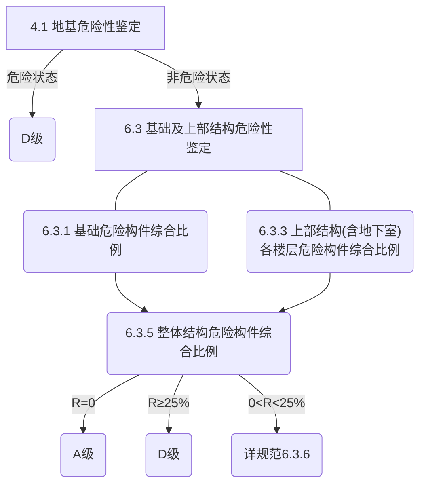

# 长沙市房屋安全管理条例

## 主体结构

**第十一条 房屋安全使用责任人不得擅自实施下列影响房屋安全的行为：**

（一）拆改房屋承重梁、柱、板和基础结构；

（二）拆除房屋承重墙或者在承重墙上开挖壁柜、门窗等洞口；

（三）超过房屋设计标准,增加房屋使用荷载；

（四）在房屋楼面结构层开凿洞口或者扩大洞口；

（五）开挖房屋地面和地下室；

（六）拆改具有房屋抗震、防火整体功能的非承重结构；

（七）其他影响房屋安全的行为。

　　确需实施上述行为的，房屋安全使用责任人应当委托原设计单位或者具有相应资质等级的设计单位提出设计方案、施工图，并根据设计方案、施工图组织施工；依法需要办理相关建设手续的，应当按照相关规定办理。

**第十八条 有下列情形之一的，应当进行房屋安全鉴定：**

（一）房屋达到设计使用年限仍需继续使用的；

（二）房屋地基基础、墙体或者其他承重构件出现明显下沉、裂缝、变形、腐蚀等情形的；

（三）进行地下设施、管线、爆破、桩基、深基坑、高边坡和高护坡等工程施工，造成房屋损坏的；

（四）其他可能影响房屋安全使用的。

　　因自然灾害或者爆炸、火灾等事故导致一定区域内大量房屋受损的，区县（市）人民政府及其房屋安全主管部门应当组织房屋安全鉴定单位对受损房屋进行安全鉴定。

## 幕墙

**第十九条 建筑幕墙自竣工验收交付使用后，一般每十年进行一次安全鉴定。有下列情形之一的，应当进行安全鉴定：**

　　（一）面板、连接构件或者局部墙面等出现异常变形、脱落、爆裂现象的；

　　（二）遭受风暴、地震、雷击、火灾、爆炸等自然灾害或者突发事件造成损坏的；

　　（三）与建筑幕墙相关的建筑主体结构经鉴定存在安全隐患的；

　　（四）其他可能影响公共安全的。

## 房屋安全鉴定单位

**第二十三条** 房屋安全鉴定单位在房屋安全鉴定报告出具后三个工作日内，应当将鉴定报告报送房屋所在地的区县（市）房屋安全主管部门备案，其中鉴定为危险房屋的，应当在24小时内报告区县（市）房屋安全主管部门。区县（市）房屋安全主管部门应当将危险房屋的相关信息在危险房屋所在地域公示。

**第二十四条** 对房屋安全鉴定单位的鉴定结论有异议的，鉴定委托人或者利害关系人可以自房屋安全鉴定报告公示之日起十个工作日内委托重新鉴定。委托重新鉴定涉及多个利害关系人的，房屋安全鉴定单位的确定等事宜可以由相关方自行协商。

# 建筑结构检测技术标准

# 危险房屋鉴定标准

## 鉴定方法

3.2.1 房屋危险性鉴定两个阶段：（1）地基危险性鉴定；（2）基础及上部结构危险性鉴定

3.2.2 基础及上部结构危险性鉴定三层次：（1）构件危险性；（2）楼层危险性；（3）房屋危险性  

## 地基危险性鉴定

4.1.1 地基的危险性鉴定包括地基承载能力、 地基沉降、 土体位移等内容  

## 构件危险性鉴定

**5.1.2 结构构件抗力与效应之比调整**

结构构件承载力验算时应按现行设计规范的计算方法进行 ，计算时可不计入地震作用  

**5.1.1 构件划分**

1 基础应包括下列内容：  

1)独立基础以一个基础为一个构件；
2)柱下条形基础以一个柱间的一轴线为一个构件；
3)墙下条形基础以一个自 然间的一轴线为一个构件；
4)带壁柱墙下条形基础按计算单元的划分确定；
5)单桩以一根为一个构件；
6)群柱以一个承台及其所含的基桩为一个构件；
7)筏形基础和箱形基础以一个计算单元为一个构件。

2 墙体应包括下列内容：
1)砌筑的横墙以一层高、 一自然间的一轴线为一个构件；
2)砌筑的纵墙(不带壁柱） 以一层高、 一自然间的一轴线为一个构件；
3)带壁柱的墙按计算单元的划分确定;
4)剪力墙按计算单元的划分确定。

3 柱应包括下列内容：
1)整截面柱以一层、 一根为一个构件；
2)组合柱以层、 整根(即含所有柱肢和缀板） 为一个构件。

4 梁式构件应以一跨、 一根为一个构件； 若为连续梁时， 可取一整根为一个构件。

5 杆(包括支撑)应以仅承受拉力或压力的一根杆为一个构件。

6 板应包括下列内容：
1)现浇板按计算单元的划分确定：
2)预制板以梁、 墙、 屋架等主要构件围合的一个区域为一个构件：
3)木楼板以一开间为一个构件。

7 桁架、 拱架应以一榀为一个构件。

8 网架、 折板和壳应以一个计算单元为一个构件。

9 柔性构件应以两个节点间仅承受拉力的一根连续的索、 杆等为一个构件。  

**基础构件**

5.2.1 基础构件的危险性鉴定应包括基础构件的承载能力、 构造与连接、 裂缝和变形等内容  

**砌体结构构件**

5.3.1 砌体结构构件的危险性鉴定应包括承载能力、 构造与连接、 裂缝和变形等内容

**混凝土结构构件**

5.4.1 混凝土结构构件的危险性鉴定应包括承载能力、 构造与连接、 裂缝和变形等内容  

**木结构构件**

5.5.1 木结构构件的危险性鉴定应包括承载能力、 构造与连接、 裂缝和变形等内容  

**钢结构构件**

5.6.1 钢结构构件的危险性鉴定应包括承载能力、 构造和连接、 变形等内容  

**围护结构承重构件**

5.7.2 围护结构承重构件的危险性鉴定应包括承载能力、 构造和连接、 变形等内容  

## 房屋危险性鉴定

**房屋结构的危险性等级**

