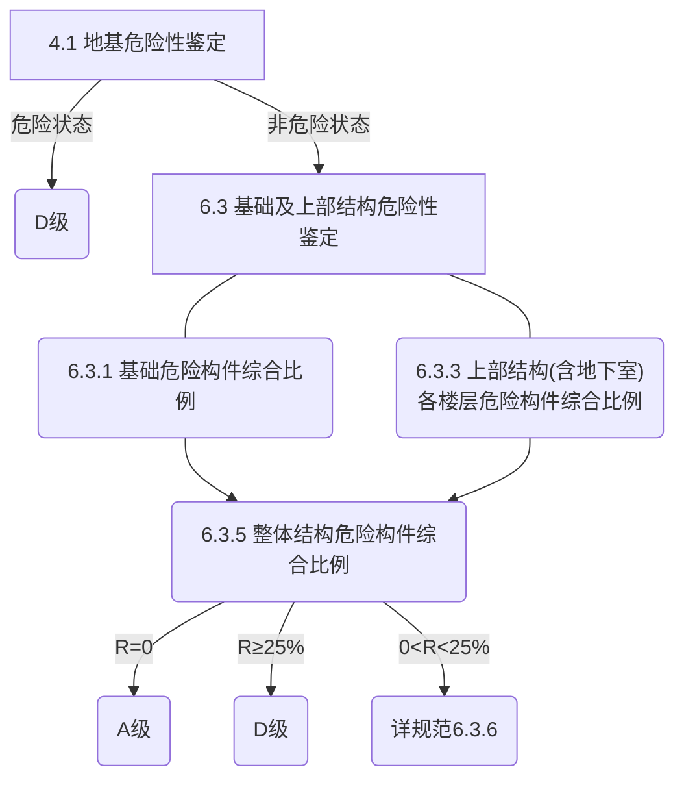

# 检测、鉴定依据

## 检测依据

**通用部分**

《建筑结构检测技术标准》GB/T 50344-2019；

《建筑变形测量规范》JGJ 8-2016；

**砌体结构**

《砌体工程现场检测技术标准》GB/T 50315-2011；

《砌体结构工程施工质量验收规范》GB 50203-2011；

**混凝土结构**

《混凝土结构现场检测技术标准》GB/T 50784-2013；

《回弹法检测混凝土抗压强度技术规程》JGJ/T 23-2011；

《混凝土中钢筋检测技术标准》JGJ/T 152-2019；

## 鉴定依据

**通用部分**

《工程结构通用规范》GB 55001-2021；

《既有建筑鉴定与加固通用规范》GB 55021-2021；

《建筑结构荷载规范》GB 50009-2012；

《建筑地基基础设计规范》GB 50007-2011；

《危险房屋鉴定标准》JGJ 125-2016；

《民用建筑可靠性鉴定标准》GB 50292-2015；

**砌体结构**

《砌体结构通用规范》GB 55007-2021；

《砌体结构设计规范》GB 50003-2011；

《砌体结构工程施工质量验收规范》GB 50203-2011；

**混凝土结构**

《混凝土结构通用规范》GB 55008-2021；

《混凝土结构设计规范》GB 50010-2010（2015年版）；

《混凝土结构工程施工质量验收规范》GB 50204-2015；

## 规范选择

**《危险房屋鉴定标准》JGJ 125-2016**

5.1.2-2：结构构件承载力验算时应按现行设计规范的计算方法进行， 计算时可不计入地震作用， 且根据不同建造年代的房屋， 其抗力与效应之比的调整系数 4 应按表 5.1.2 取用 

5.1.3-1：当原设计文件有效， 且不怀疑结构有严重的性能退化或设计、 施工偏差时， 可采用原设计的标准值  

**《民用建筑可靠性鉴定标准》GB 50292-2015**

5.1.2-1：结构构件验算采用的结构分析方法， 应符合国家现行设计规范的规定

5.1.2-4：作用的组合、 作用的分项系数及组合值系数， 应按现行国家标准《 建筑结构荷载规范 》 GB 50009 的规定执行

5.1.2-5：当原设计文件有效， 且不怀疑结构有严重的性能退化或设计、 施丁偏差时， 可采用原设计的标准值

5.1.2-6：结构或构件的几何参数应采用实测值， 并应计入锈蚀、腐蚀、 腐朽、 虫蛀、 风化、 裂缝、 缺陷、 损伤以及施工偏差等的影响

**《既有建筑鉴定与加固通用规范》GB 55021-2021**

4.2.2-1：当为鉴定原结构、 构件在剩余设计工作年限内的安全性时， 应按不低于原建造时的荷载规范和设计规范进行验算； 如原结构、 构件岀现过与永久荷载和可变荷载相关的较大变形或损伤， 则相关性能指标应按现行规范与标准的规定进行验算  

4.2.2-2：当为结构加固、改变用途或延长工作年限的目的而鉴定原结构、构件的安全性时，应在调查结构上实际作用的荷载及拟新增荷载的基础上，按现行规范与标准的规定进行验算。

4.2.2-3：采用的计算模型，应符合结构的实际受力和构造状况；结构上的作用（荷载）应经现场调查或检测核算；材料强度的标准值，应根据构件的实际状况、设计文件与现场检测综合确定；应计入由温度和变形产生的附加内力；结构或构件的几何参数应取实测值，并应计入相关不利影响。

# 检验批数量

## 鉴定

**《建筑结构检测技术标准》GB/T 50344-2019**

**《混凝土结构现场检测技术标准》GB/T 50784-2013**

**《砌体工程现场检测技术标准》GB/T 50315-2011**

3.3.2：每一检测单元内，不宜少于6个测区，应将单个构件(单片墙体、柱)作为一个测区。当一个检测单元不足6个构件时，应将每个构件作为一个测区。

## 主体检测

**《混凝土结构工程施工质量验收规范》GB 50204-2015**

10.1.1：对涉及混凝土结构安全的有代表性的部位应进行结构实体检验。结构实体检验应包括**混凝土强度、钢筋保护层厚度、结构位置与尺寸偏差**以及合同约定的项目；必要时可检验其他项目。
  结构实体检验应由监理单位组织施工单位实施，并见证实施过程。施工单位应制定结构实体检验专项方案，并经监理单位审核批准后实施。除结构位置与尺寸偏差外的结构实体检验项目，应由具有相应资质的检测机构完成。

**现浇混凝土构件强度回弹/抽芯**

不宜抽取截面高度小于300mm的梁和边长小于300mm的柱

**现浇混凝土楼板厚度、楼层净高、构件截面尺寸**

  1 梁、柱应抽取构件数量的1％，且不应少于3个构件；
  2 墙、板应按有代表性的自然间抽取1％，且不应少于3间；
  3  层高应按有代表性的自然间抽查1％，且不应少于3间。

**结构轴线**

应按有代表性的自然间抽查10％，且不应少于3间

**钢筋保护层厚度**

  1 对非悬挑梁板类构件，应各抽取构件数量的2％且不少于5个构件进行检验。
  2  对悬挑梁，应抽取构件数量的5％且不少于10个构件进行检验；当悬挑梁数量少于10个时，应全数检验。
  3  对悬挑板，应抽取构件数量的10％且不少于20个构件进行检验；当悬挑板数量少于20个时，应全数检验。

# 测点数量

## 构件几何尺寸

**《混凝土结构现场检测技术标准》GB/T 50784-2013**

8.2.1-1：对于等截面构件和截面尺寸均匀变化的变截面构件，应分别在构件的中部和两端量取截面尺寸；对于其他变截面构件，应选取构件端部、截面突变的位置量取截面尺寸；

## 混凝土强度

**《回弹法检测混凝土抗压强度技术规程》JGJ/T 23-2011**

4.1.4-1：对于一般构件，测区数不宜少于10个。当受检构件数量大于30个且不需提供单个构件推定强度或受检构件某一方向尺寸不大于4.5m且另一方向尺寸不大于0.3m时，每个构件的测区数量可适当减少，但不应少于5个

**《混凝土结构现场检测技术标准》GB/T 50784-2013**

附A.2.2-1：当需要进行单个构件推定时，每个构件布置的测区数不宜少于10个；当不需要进行单个构件推定时，每个构件布置的测区数可适当减少，但不应少于3个；

**《钻芯法检测混凝土强度技术规程》JGJ/T 384-2016**

6.3.4：钻芯法确定单个构件混凝土抗压强度推定值时，芯样试件的数量不应少于3个；钻芯对构件工作性能影响较大的小尺寸构件，芯样试件的数量不得少于2个。单个构件的混凝土抗压强度推定值不再进行数据的舍弃，而应按芯样试件混凝土抗压强度值中的最小值确定。

5.0.5：在试验前应按下列规定测量芯样试件的尺寸：1  平均直径应用游标卡尺在芯样试件上部、中部和下部相互垂直的两个位置上共测量六次，取测量的算术平均值作为芯样试件的直径，精确至0.5mm；2  芯样试件高度可用钢卷尺或钢板尺进行测量，精确至1.0mm；3  垂直度应用游标量角器测量芯样试件两个端面与母线的夹角，取最大值作为芯样试件的垂直度，精确至0.1°；4  平整度可用钢板尺或角尺紧靠在芯样试件承压面(线)上，一面转动钢板尺，一面用塞尺测量钢板尺与芯样试件承压面(线)之间的缝隙，取最大缝隙为芯样试件的平整度；也可采用其他专用设备测量。

**《高强混凝土强度检测技术规程》JGJ/T 294-2013**

4.1.5：测区布置应符合下列规定：1  检测时应在构件上均匀布置测区，每个构件上的测区数不应少于10个；2  对某一方向尺寸不大于4.5m且另一方向尺寸不大于0.3m的构件，其测区数量可减少，但不应少于5个。

4.2.2：结构或构件上的每一测区应回弹16个测点，或在待测超声波测区的两个相对测试面各回弹8个测点，每一测点的回弹值应精确至1。

#### 碳化深度

**《回弹法检测混凝土抗压强度技术规程》JGJ/T 23-2011**

4.3.1：回弹值测量完毕后，应在有代表性的测区上测量碳化深度值，测点数不应少于构件测区数的30％，应取其平均值作为该构件每个测区的碳化深度值。当碳化深度值极差大于2.0mm时，应在每一测区分别测量碳化深度值。

**《混凝土结构现场检测技术标准》GB/T 50784-2013**

A.2.4：回弹值测量完毕后，应在有代表性的位置测量碳化深度值；测量数不应少于构件测区数的30％，取其平均值作为该构件所有测区的碳化深度值；

## 砌体/砂浆强度

### 烧结砖强度

**《砌体工程现场检测技术标准》GB/T 50315-2011**

14.1.2：每个检测单元中应随机选择10个测区。每个测区的面积不宜小于1.0m2，应在其中随机选择10块条面向外的砖作为10个测位供回弹测试。选择的砖与砖墙边缘的距离应大于250mm。

3.3.3-3：砂浆片剪切法、砂浆回弹法、点荷法、砂浆片局压法、烧结砖回弹法，测点数不应少于5个

### 小砌块强度

**《非烧结砖砌体现场检测技术规程》JGJ/T 371-2015** 

6.2.2：每个测区应随机选择5个测位，测位宜选择在承重墙的可测面上，在每个测位中随机选择1块条面向外的砌块供回弹测试。测试的砌块与墙体边缘的距离宜大于400mm。

6.2.8：在被测小砌块的条面上均匀布置16个弹击点

### 砂浆强度

**《砌体工程现场检测技术标准》GB/T 50315-2011**

12.3.2：每个测位内应均匀布置12个弹击点。选定弹击点应避开砖的边缘、灰缝中的气孔或松动的砂浆。相邻两弹击点的间距不应小于20mm。

**《非烧结砖砌体现场检测技术规程》JGJ/T 371-2015** 

5.3.10：每个测位内应均匀布置12个弹击点。选定弹击点应避开砖的边缘、灰缝中的气孔或松动的砂浆。相邻两弹击点的间距不应小于20mm。

#### 碳化深度

**《砌体工程现场检测技术标准》GB/T 50315-2011**

12.3.4：在每一测位内，应选择3处灰缝，并应采用工具在测区表面打凿出直径约10mm的孔洞，其深度应大于砌筑砂浆的碳化深度，应清除孔洞中的粉末和碎屑，且不得用水擦洗，然后采用浓度为1％～2％的酚酞酒精溶液滴在孔洞内壁边缘处，当已碳化与未碳化界限清晰时，应采用碳化深度测定仪或游标卡尺测量已碳化与未碳化砂浆交界面到灰缝表面的垂直距离。

## 钢筋

### 钢筋数量和间距

**《混凝土结构现场检测技术标准》GB/T 50784-2013**

**（1）梁、柱类构件**

9.2.3-2：应将构件测试面一侧所有主筋逐一检出，并在构件表面标注出每个检出钢筋的相应位置；

9.2.5：梁、柱类构件的箍筋可按本标准第9.2.4条检测，当存在箍筋加密区时，宜将加密区内箍筋全部测出。

**（2）墙、板类构件**

9.2.4-2：在每个测试部位连续检出7根钢筋，少于7根钢筋时应全部检出，并宜在构件表面标注出每个检出钢筋的相应位置；

9.2.6  单个构件的符合性判定应符合下列规定：

   1  梁、柱类构件主筋实测根数少于设计根数时，该构件配筋应判定为不符合设计要求；

   2  梁、柱类构件主筋的平均间距与设计要求的偏差大于相关标准规定的允许偏差时，该构件配筋应判定为不符合设计要求；

   3  墙、板类构件钢筋的平均间距与设计要求的偏差大于相关标准规定的允许偏差时，该构件配筋应判定为不符合设计要求；

   4  梁、柱类构件的箍筋可按墙、板类构件钢筋进行判定。

9.2.8  对检验批符合性判定应符合下列规定：

   1  根据检验批中受检构件的数量和其中不符合构件的数量应按本标准表3.4.5—1进行检验批符合性判定；

   2  对于梁、柱类构件，检验批中一个构件的主筋实测根数少于设计根数，该批应直接判为不符合设计要求；

   3  对于墙、板类构件，当出现受检构件的钢筋间距偏差大于偏差允许值1.5倍时，该批应直接判为不符合设计要求；

   4  对于判定为符合设计要求的检验批，可建议采用设计的钢筋数量和间距进行结构性能评定；对于判定为不符合设计要求的检验批，宜细分检验批后重新检测或进行全数检测。当不能进行重新检测或全数检测时，可建议采用最不利检测值进行结构性能评定。

### 混凝土保护层厚度

**《混凝土结构现场检测技术标准》GB/T 50784-2013**

9.3.3：在已测定保护层厚度的钢筋上进行剔凿验证，验证点数不应少于本标准表3.4.4中B类且不应少于3点；构件上能直接量测混凝土保护层厚度的点可计为验证点；

9.3.5：随机抽取构件，对于梁、柱类应对全部纵向受力钢筋混凝土保护层厚度进行检测；对于墙、板类应抽取不少于6根钢筋(少于6根钢筋时应全检)，进行混凝土保护层厚度检测；

> **《混凝土结构工程施工质量验收规范》GB 50204-2015**
>
> 附E.0.1：对梁、板类构件，应各抽取构件数量的 2%且不少于 5 个构件进行检验
>
> 

### 钢筋直径

**《混凝土结构现场检测技术标准》GB/T 50784-2013**

9.4.5：检验批钢筋直径检测应符合下列规定：1  检验批应按钢筋进场批次划分；当不能确定钢筋进场批次时，宜将同一楼层或同一施工段中相同规格的钢筋作为一个检验批；2  应随机抽取5个构件，每个构件抽检1根；

**《混凝土中钢筋检测技术标准》JGJ/T 152-2019**

5.2.1：当采用直接法检测钢筋公称直径时，钢筋抽样可按下列规定进行：1  单位工程建筑面积不大于2000m2同牌号同规格的钢筋应作为一个检测批；2  工程质量检测时，每个检测批同牌号同规格的钢筋各抽检不应少于1根；3  结构性能检测时，每个检测批同牌号同规格的钢筋各抽检不应少于2根；当图纸缺失时，选取钢筋应具有代表性。

5.4.2：同一部位应重复测量3次，将3次测量结果的算术平均值作为该测点钢筋直径检测值。

## 层高

**《混凝土结构工程施工质量验收规范》GB50204-2015**

F.0.1：层高应按有代表性的自然间抽查1％，且不应少于3间。

###### 8.3.2 现浇结构位置和尺寸允许偏差及检验方法

## 垂直度

**《建筑变形测量规范》JGJ 8-2016**

7.3.2：当测定顶部相对于底部的整体倾斜时，应沿同一竖直线分别布设顶部监测点和底部对应点。

7.3.5-1：当从建筑外部进行倾斜观测时，宜采用全站仪投点法、水平角观测法或前方交会法进行观测。当采用投点法时，测站点宜选在与倾斜方向成正交的方向线上距照准目标1.5倍～2.0倍目标高度的固定位置，测站点的数量不宜少于2个；当采用水平角观测法时，应设置好定向点。当观测精度为二等及以上时，测站点和定向点应采用带有强制对中装置的观测墩。

# 平面图绘制要求

一、平面布置按实际情况进行测量绘制，可以有些许误差，但是误差必须控制在合理范围内。
二、门窗洞口可以不标注尺寸，但是门洞的示意位置应与实际符合。
三、砌体房屋四周如有构造柱设置，应在图中填黑标注，如无构造柱，应在记录单上注明
四、底框房屋，底部框架部分应明确标识框架柱，框架梁位置，形成完整水平受力结构
五、轴线轴号能合理表现建筑物的开间、纵深。隔墙也应有与其对应的轴线轴号（木制隔墙、石膏板隔墙除外）隔墙如无轴线，宜标注轴线距。
六、实墙采用双实线绘制，区分12隔墙和24墙，柱采用封闭矩形填黑绘制，梁采用双虚线或加粗单虚线绘制，门洞采用墙体打断留空表示，窗洞口采用封闭矩形加斜线填充绘制，挑板（空调板）采用封闭矩形绘制。

# 现场评估要求

1、经营性房屋：四层及以上房屋、改扩建房屋、加层（含顶棚）房屋均列入鉴定项目
2、地基有明显沉降、裂缝的，房屋承重墙有明显裂缝的按照表格判断相应C、D级
3、客厅等大跨度房间 上层相同位置有较多承重墙，且客厅天花板有明显裂缝的判断C级
4、空斗墙根据业主反馈或无装修墙面进行判断C级
5、底框结构层高按实测量，根据表格判断相应级别
6、Bp级房屋也要记录其判断标准和原因，较小裂缝位置，并按远景近景各一张图片拍照存档

# 检测结果

## 房屋整体倾斜检测

**《建筑地基基础设计规范》GB 50007-2011**

| 变形特征                   | <<       | 地基土类别     | <<         |
| -------------------------- | -------- | -------------- | ---------- |
| ^^                         | ^^       | 中、低压缩性土 | 高压缩性土 |
| 砌体承重结构基础的局部倾斜 | <<       | 0.002          | 0.003      |
| 多层和高层建筑的整体倾斜   | H≤24     | 0.004          | <<         |
| ^^                         | 24<H≤60  | 0.003          | <<         |
| ^^                         | 60<H≤100 | 0.0025         | <<         |
| ^^                         | H>100    | 0.002          | <<         |

## 平面尺寸检测

该房屋建造平面布置未超出正常设计尺寸要求，平面布置合理、受力明确、传力途径合理

该房屋部分楼层平面布置不合理、部分墙体直接砌筑在楼板上，受力不明确、传力途径不合理

混凝土结构构件与砌体结构构件混合承重

## 裂缝检测

民标项目，砼柱、墙、梁一般按≤0.5mm，板一般按≤0.7mm，砖墙一般按≤1.0mm记录为B级状态
危标项目，砼柱、墙、梁一般按≤0.5mm，，板一般按≤1.0mm，砖墙一般按≤1.0mm记录为非危险状态

经现场调查，该房屋四周地势平坦，周边东、南侧其他建筑物毗邻。室外地坪与主体结构之间无明显相对移位，且地面无明显变形、开裂等情况，地基附近上部墙体未发现因地基沉降引起的裂缝。

经现场调查，该房屋室外台阶局区域有开裂现象，但与主体结构之间无明显相对位移。

经现场检查，未发现有因地基变形和基础不均匀沉降而引起的上部结构构件开裂损坏，但室外地面有轻微沉降等现象。由倾斜观测结果得知，该房屋所抽检各竖向构件的倾斜率均满足标准限值要求。
故该房屋地基评定为非危险Bu级。

## 钢结构涂层

室外应为150μm，室内应为125μm，其允许偏差为-25μm

## 建议

对存在缺陷的部位定期维护检查，确保房屋的安全使用

对存在危险的构件应委托具有相应资质的单位进行加固设计及加固处理，确保房屋的安全使用

# 现场检测注意事项

1. 同一面房屋尽量使用一张照片，采用手机的全景模式拍摄，自动合成成一张图

# 检测报告检查要点

1. 房屋属性：城镇房屋、城镇经营性房屋

2. 委托人姓名

3. 不上人平屋面

4. 构造柱位置（填黑），底部4层为框架房屋，结构类型应单独分层注明

5. 倾斜检测只测2点原因说明，测量高度不宜低于房屋高度3/4

6. 柱尺寸“202×600+501×601”应注明为异形柱

7. 检测构件数量满足A类

8. 计算软件版本号在“采用中国建筑科学研究院开发的PKPM系列软件”中注明

9. 计算参数砂浆强度实测<2.0时，计算取1.0，分项系数1.3 1.5

10. 砌体应补充高厚比计算结果、抗剪验算、局压验算结果

11. 保护层厚度根数与纵筋根数对应上

12. 检测鉴定报告有效期一年

13. 危险构件数量计算，楼梯板计入楼面板数量中

    

    ###### 空斗墙

    

 

# 抗震鉴定

## 建筑分类

**《建筑抗震鉴定标准》GB 50023-2009**

1.0.4  现有建筑应根据实际需要和可能，按下列规定选择其后续使用年限： 

1. 在70年代及以前建造经耐久性鉴定可继续使用的现有建筑，其后续使用年限不应少于30年；在80年代建造的现有建筑，宜采用40年或更长，且不得少于30年。 
2. 在90年代(按当时施行的抗震设计规范系列设计)建造的现有建筑，后续使用年限不宜少于40年，条件许可时应采用50年。 
3. 在2001年以后(按当时施行的抗震设计规范系列设计)建造的现有建筑，后续使用年限宜采用50年。 

1.0.5  不同后续使用年限的现有建筑，其抗震鉴定方法应符合下列要求： 

1. 后续使用年限30年的建筑(简称A类建筑)，应采用本标准各章规定的A类建筑抗震鉴定方法。 

2. 后续使用年限40年的建筑(简称B类建筑)，应采用本标准各章规定的B类建筑抗震鉴定方法。 

3. 后续使用年限50年的建筑(简称C类建筑)，应按现行国家标准《建筑抗震设计规范》GB 50011的要求进行抗震鉴定。

## 抗震验算

**水平地震影响系数最大值(《既有建筑鉴定与加固通用规范》GB 55021-2021)**

A类：现行标准αmax × 0.8

B类：现行标准αmax × 0.9

# 长沙市房屋安全管理条例

## 主体结构

**第十一条 房屋安全使用责任人不得擅自实施下列影响房屋安全的行为：**

（一）拆改房屋承重梁、柱、板和基础结构；

（二）拆除房屋承重墙或者在承重墙上开挖壁柜、门窗等洞口；

（三）超过房屋设计标准,增加房屋使用荷载；

（四）在房屋楼面结构层开凿洞口或者扩大洞口；

（五）开挖房屋地面和地下室；

（六）拆改具有房屋抗震、防火整体功能的非承重结构；

（七）其他影响房屋安全的行为。

　　确需实施上述行为的，房屋安全使用责任人应当委托原设计单位或者具有相应资质等级的设计单位提出设计方案、施工图，并根据设计方案、施工图组织施工；依法需要办理相关建设手续的，应当按照相关规定办理。

**第十八条 有下列情形之一的，应当进行房屋安全鉴定：**

（一）房屋达到设计使用年限仍需继续使用的；

（二）房屋地基基础、墙体或者其他承重构件出现明显下沉、裂缝、变形、腐蚀等情形的；

（三）进行地下设施、管线、爆破、桩基、深基坑、高边坡和高护坡等工程施工，造成房屋损坏的；

（四）其他可能影响房屋安全使用的。

　　因自然灾害或者爆炸、火灾等事故导致一定区域内大量房屋受损的，区县（市）人民政府及其房屋安全主管部门应当组织房屋安全鉴定单位对受损房屋进行安全鉴定。

## 幕墙

**第十九条 建筑幕墙自竣工验收交付使用后，一般每十年进行一次安全鉴定。有下列情形之一的，应当进行安全鉴定：**

　　（一）面板、连接构件或者局部墙面等出现异常变形、脱落、爆裂现象的；

　　（二）遭受风暴、地震、雷击、火灾、爆炸等自然灾害或者突发事件造成损坏的；

　　（三）与建筑幕墙相关的建筑主体结构经鉴定存在安全隐患的；

　　（四）其他可能影响公共安全的。

## 房屋安全鉴定单位

**第二十三条** 房屋安全鉴定单位在房屋安全鉴定报告出具后三个工作日内，应当将鉴定报告报送房屋所在地的区县（市）房屋安全主管部门备案，其中鉴定为危险房屋的，应当在24小时内报告区县（市）房屋安全主管部门。区县（市）房屋安全主管部门应当将危险房屋的相关信息在危险房屋所在地域公示。

**第二十四条** 对房屋安全鉴定单位的鉴定结论有异议的，鉴定委托人或者利害关系人可以自房屋安全鉴定报告公示之日起十个工作日内委托重新鉴定。委托重新鉴定涉及多个利害关系人的，房屋安全鉴定单位的确定等事宜可以由相关方自行协商。

# 危险房屋鉴定标准

## 鉴定方法

3.2.1 房屋危险性鉴定两个阶段：（1）地基危险性鉴定；（2）基础及上部结构危险性鉴定

3.2.2 基础及上部结构危险性鉴定三层次：（1）构件危险性；（2）楼层危险性；（3）房屋危险性  

## 地基危险性鉴定

4.1.1 地基的危险性鉴定包括地基承载能力、 地基沉降、 土体位移等内容  

## 构件危险性鉴定

**5.1.2 结构构件抗力与效应之比调整**

结构构件承载力验算时应按现行设计规范的计算方法进行 ，计算时可不计入地震作用  

**5.1.1 构件划分**

1 基础应包括下列内容：  

​	1)独立基础以一个基础为一个构件；
​	2)柱下条形基础以一个柱间的一轴线为一个构件；
​	3)墙下条形基础以一个自 然间的一轴线为一个构件；
​	4)带壁柱墙下条形基础按计算单元的划分确定；
​	5)单桩以一根为一个构件；
​	6)群柱以一个承台及其所含的基桩为一个构件；
​	7)筏形基础和箱形基础以一个计算单元为一个构件。

2 墙体应包括下列内容：
	1)砌筑的横墙以一层高、 一自然间的一轴线为一个构件；
	2)砌筑的纵墙(不带壁柱） 以一层高、 一自然间的一轴线为一个构件；
	3)带壁柱的墙按计算单元的划分确定;
	4)剪力墙按计算单元的划分确定。

3 柱应包括下列内容：
	1)整截面柱以一层、 一根为一个构件；
	2)组合柱以层、 整根(即含所有柱肢和缀板） 为一个构件。

4 梁式构件应以一跨、 一根为一个构件； 若为连续梁时， 可取一整根为一个构件。

5 杆(包括支撑)应以仅承受拉力或压力的一根杆为一个构件。

6 板应包括下列内容：
	1)现浇板按计算单元的划分确定：
	2)预制板以梁、 墙、 屋架等主要构件围合的一个区域为一个构件：
	3)木楼板以一开间为一个构件。

7 桁架、 拱架应以一榀为一个构件。

8 网架、 折板和壳应以一个计算单元为一个构件。

9 柔性构件应以两个节点间仅承受拉力的一根连续的索、 杆等为一个构件。  

**基础构件**

5.2.1 基础构件的危险性鉴定应包括基础构件的承载能力、 构造与连接、 裂缝和变形等内容  

**砌体结构构件**

5.3.1 砌体结构构件的危险性鉴定应包括承载能力、 构造与连接、 裂缝和变形等内容

**混凝土结构构件**

5.4.1 混凝土结构构件的危险性鉴定应包括承载能力、 构造与连接、 裂缝和变形等内容  

**木结构构件**

5.5.1 木结构构件的危险性鉴定应包括承载能力、 构造与连接、 裂缝和变形等内容  

**钢结构构件**

5.6.1 钢结构构件的危险性鉴定应包括承载能力、 构造和连接、 变形等内容  

**围护结构承重构件**

5.7.2 围护结构承重构件的危险性鉴定应包括承载能力、 构造和连接、 变形等内容  

## 房屋危险性鉴定

**房屋结构的危险性等级**

